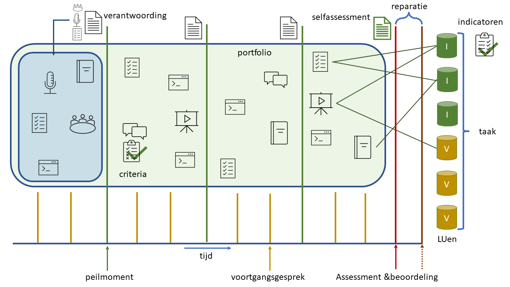

# Semester 2 van Technische Informatica

### Inhoud

- [Semester 2 van Technische Informatica](#semester-2-van-technische-informatica)
    - [Inhoud](#inhoud)
  - [Een introductie](#een-introductie)
  - [Portfolio items](#portfolio-items)

---

**v0.1.0 ** Portfolio items voor Semester 2 TI door HU IICT.

---

## Een introductie

Wat zijn portfolio items? Met portfolio items bedoelen we onderdelen waarmee je kunt laten zien dat je voldoet aan een [leeruitkomst(en)](./README.md#leeruitkomsten). Dat hoeft geen 1 op 1 relatie te zijn. In veel gevallen kan je meerdere leeruitkomsten gebruiken om aan te tonen dat je voldoet aan een leeruitkomst.

Voor dit semester van Technische Informatica dragen we een aantal voorgedefineerde [portfolio items](#portfolio-items) aan. We hebben deze beschreven en geven daarbij ook de beoordelingscriteria. De lijst is niet onuitputtelijk je mag ook, in samenspraak met de docent, eigen portfolio items aandragen. Geef dan een goede beschrijving van dit portfolio item met bijbehorende criteria. Ga hierover in discussie met je docent.

Verschillende portfolio items kunnen bijdragen aan verschillende leeruitkomsten.

Wanneer je een portfolio item gebruikt in je [verantwoordingsdocument](./Verantwoordingsdocument_TI_S2.md) zorg dan dat voor elk portfolio item er altijd is aangeven wat de eigen bijdrage is, welke feedback op dit portfolio item is verkregen (en van wie) en wat er met die feedback is gedaan (uptake van de feedback).

## Portfolio items

Portfolio item | Beschrijving
--- | --- 
Repository | Link naar de repository met alle branches, commits en merges.

Criteria
--- 

* Het is duidelijk voor welke branches je verantwoordelijk bent;
* In 'contributions graphs' is zichtbaar wat je bijdrage is geweest;
* Geen dangling heads;
* Geen commits op verkeerde branches (dus niet op main/master en dev, alleen op feature branches);
* Duidelijke bestandsstructuur;
* Branches zijn upstream gepushed;
* Branches zijn up-to-date gehouden met main/master en dev branches.

---

Portfolio item | Beschrijving
--- | --- 
Commits. Review Feedback op Commits | Feedback van een reviewer waaruit aan de hand van een steekproef blijkt dat de student gestructureerd werkt met een repository. 

Criteria 
--- 

* Items per commit netjes gebundeld voor de taak die ermee samenhangt;
* Duidelijke naamgeving van commits;
* Duidelijke naamgeving van tags.

---

Portfolio item | Beschrijving
--- | --- 
Commits. Gefilterde Commits Reports | Gefilterde commits-reports van de student zelf.

Criteria 
--- 

* Toont gestructureerde, stapwijze werkwijze aan eigen project (commits verspreid in de tijd);
* Toont aanzienlijke bijdrage aan het gemeenschappelijke deel (de integratie van verschillende modules in het centrale kweekkas systeem) aan;
* Toont aan dat de student zijn eigen wijzigingen (een uitzondering daargelaten) zelf heeft gemerged naar de master.

---

Portfolio item | Beschrijving
--- | --- 
Hardwareontwerp | Een document/verslag onder versiebeheer van het deel van de kasapparatuur waar de student voor verantwoordelijk is (de eigen taartpunt van het project), met:
* Electrisch schema;
* Fritzing schema van het initiele prototype;
* Relevant printplaatje (PCB);
* Relevante 3D print;
* Relevant gelasercut object.

Criteria
--- 

* Duidelijke afweging van alternatieven die tot de uiteindelijke componentkeuze en hardwareconfiguratie heeft geleid;
* Duidelijke uitleg hoe de hardwareconfiguratie de doelen optimaal zou moeten behalen;
* Duidelijke uitleg hoe de hardware testbaar is.

---

Portfolio item | Beschrijving
--- | --- 
Electrisch Schema | Een document met een electrisch schema.

Criteria 
---

* Correcte annotaties van de gebruikte componenten;
* Passend bij de toegepaste implementatie;
* Correcte annotaties van spanningen en stromen;
* Juiste wiring, grounding en ontkoppeling;
* Voorzien van een duidelijke uitleg erbij en uitleg waarom je bepaalde keuzes hebt gemaakt.

---

Portfolio item | Beschrijving
--- | --- 
Fritzing Schema van het initiele prototype | Document met een Fritzing schema

Criteria 
---

* Correcte annotaties van de gebruikte componenten;
* Passend bij de toegepaste implementatie;
* Correcte annotaties van spanningen en stromen;
* Juiste wiring, grounding en ontkoppeling;
* Voorzien van een duidelijke uitleg erbij en uitleg waarom je bepaalde keuzes hebt gemaakt.

---

Portfolio item | Beschrijving
--- | --- 
Printplaatje (PCB) | De ontwerptekening van de layout (PCB design). Een foto van de printplaat met de gesoldeerde en/of bestückte componenten.

Criteria 
--- 

* Bevat verwijzing naar het electrische schema waar het van afgeleid is;
* Bevat verwijzing naar tests die laten zien hoe goed het werkt;
* Indien niet alle doelen behaald zijn, bevat aanbevelingen voor hoe dat bij een volgende versie wel zou kunnen;
* Bevat argumentatie voor de ontwerpkeuzes voor de gekozen layout.

---

Portfolio item | Beschrijving
--- | --- 
3D-print | Een afbeelding van je 3D-ontwerp en bijbehorende documenten. Een foto van het resultaat.

Criteria 
--- 

* Bevat toelichting van het toepassingsdoel;
* Bevat argumentatie voor de gemaakte ontwerpkeuzes;
* Bevat evaluatie: Hoe goed doet het wat het doen moest? Zijn er mogelijke verbeteringen voor een volgende versie?

---

Portfolio item | Beschrijving
--- | --- 
Gelasercut Object | Een afbeelding van je 2D-ontwerp inclusief de bijbehorende documenten. Een foto van het resultaat.

Criteria 
--- 

* Bevat toelichting van het toepassingsdoel;
* Bevat argumentatie voor de gemaakte ontwerpkeuzes;
* Bevat evaluatie: Hoe goed doet het wat het doen moest? Zijn er mogelijke verbeteringen voor een volgende versie?

---

Portfolio item | Beschrijving
--- | --- 
Softwareontwerp | Een document/verslag onder versiebeheer van het deel van de kasapparatuur waar de student voor verantwoordelijk is (de eigen taartpunt van het project).

Criteria 
--- 

* Bevat een goed gedocumenteeerd en in correct Nederlands geschreven beschrijving van het softwareontwerp;
* Bevat een klassediagram;
* Bevat uitgevoerde Unittesten inclusief de resultaten.

---

Portfolio item | Beschrijving
--- | --- 
Klassediagram |

Criteria 
--- 

* Een afweging van alternatieven die tot het uiteindelijke klassediagram hebben geleid;
* Uitleg hoe met het klassediagram de doelen optimaal behaald kunnen worden
* Gedacht aan hergebruik: abstracte interface voor driver;
* Correcte relaties (reference,composite,inheritance).

---

Portfolio item | Beschrijving
--- | --- 
Unit tests | Unit tests voor de driver

Criteria 
--- 

* De unit tests dekken de de functionaliteiten van de driver af;
* Het is duidelijk gedocumenteerd hoe ze gebruikt moeten worden.

---

Portfolio item | Beschrijving
--- | --- 
Source Code | Een peer-review steekproef van de source code van de eigen taartpunt. Een peer-review steekproef van de source code van decbijdrage aan het gezamenlijke geheel.

Criteria 
--- 

* In sync met het klassediagram;
* Duidelijke en consistente naamgeving;
* Goed gepartitioneerd. Scheiding van functionaliteit over functies en objecten;
* Niet te lange functies;
* Goede opsplitsing van verantwoordelijkheden;
* Commentaar waar nodig: niet wat maar waarom;
* Geen magical constants;
* Geen duplicate code.

---

Portfolio item | Beschrijving
--- | --- 
Requirements(-analyse) | Een document/pagina onder versiebeheer waarbij de analyse van de requirements duidelijk is gemaakt inclusief uitkomsten uit klantgesprekken, een lijst van requirements, waaronder use case diagram(men), use case beschrijvingen, en activity diagram(men). 

Criteria 
--- 

* Heldere documentatie waar de verschillende typen requirements helder worden beschreven;
* Met behulp van diagrammen laat je in detail zien wat de hard- en softwareoplossing precies moet gaan doen;
* Student kan door middel van versiebeheer laten zien aan welke requirements is gewerkt.

---

Portfolio item | Beschrijving
--- | --- 
Use Case diagram(men)

Criteria 
--- 

* De systeemgrens wordt met een rechthoek aangegeven;
* Alle usecases erbinnen beschrijven interacties van het systeem met externe actoren;
* Usecases verbonden met actors via lijnen;
* Usecases onderling correct relateren middels <`<include>`> en <`<extend>`> waar nodig (alleen afsplitsing bepaalt, niet volgordelijkheid).

---

Portfolio item | Beschrijving
--- | --- 
Use Case beschrijvingen

Criteria 
--- 

* Voldoende gedetailleerd;
* Voldoende specifiek. Niet "de actor", maar "de machinist".

---

Portfolio item | Beschrijving
--- | --- 
Activity Diagrammen

Criteria 
--- 

* Waar een stap alleen op iets wacht, is dat geimplementeerd met een event (in plaats van een guard);
* Voor een directe beslissingen zonder op iets te wachten worden guards gebruikt;
* Bij decision nodes worden events of guards gebruikt, maar niet beide gemixt.

---

Portfolio item | Beschrijving
--- | --- 
Video/foto van hardware | Een demonstratie, in video of foto's met tekst, van de werkende hardware.

Criteria 
--- 

* De video (eventueel met ingesproken commentaar) of foto's met tekst moet duidelijk maken hoe het product er uit ziet en wat het product kan.

---

Portfolio item | Beschrijving
--- | --- 
Adviesrapport | Aan het eind van het project, een document waarin aanbevelingen staan voor verbeteringen van het product van de eigen taartpunt.

Criteria 
--- 

* De aanbevelingen zijn goed beargumenteerd;
* De aanbevelingen betreffen op zijn minst performance, kwaliteit en toepasbaarheid.

---

Portfolio item | Beschrijving
--- | --- 
Gesprekverslag met feedback | Een verslag van een gesprek met een stakeholder inclusief een bevestiging van die stakeholder dat hetgeen in het verslag staat ook klopt.

Criteria 
--- 

* Naam van de betreffende stakeholder is genoemd;
* Voor alle relevante onderdelen van het project is de stakeholder om feedback gevraagd.

---

Portfolio item | Beschrijving
--- | --- 
Journaal / Logboek | Een (levend) document waarin de student zijn actuele gedachten en bevindingen registreert en op een rijtje zet.

Criteria 
--- 

* Voor elke dag een nieuwe datum-header;
* Aan het begin van elke dag een TODO-lijst/planning voor die dag, inclusief het aantal geschatte uren;
* (optioneel/aanbevolen) Geannoteerde Copy/Paste van dingen die even "onthouden" moeten worden;
* Actuele notities van onderdelen waar aan wordt gewerkt. Waarnemingen, metingen, overwegingen; 
* On the fly test en debug resultaten;
* Aan het eind van elke dag een korte retro: Wat ging top? Wat kan beter? Hoe?

---

Portfolio item | Beschrijving
--- | --- 
Uitleg video | Een  video waarmee de student helder een scenario van toepassing van zijn product demonstreert. Of een video waarmee de student een probleem (in de kweeekkas) illustreert.

Criteria 
--- 

* De uitleg is helder.

Portfolio item | Beschrijving
--- | --- 
Demonstratie video | De student  laat een demonstratievideo zien waarin hij een docker container met <<`Mosquitto`><`PostgreSQL`><`NodeRED`><`Flask`>> op zijn systeem opstart, en succesvol toepast in een eigen testapplicatie.

Criteria 
--- 

* De uitleg is helder;
* De testapplicatie werkt.

---

Portfolio item | Beschrijving
--- | --- 
Oefenopgave Git gebruik | Een repository voor het oefenen met Git inclusief oefencommits en merges.

Criteria 
--- 

* Herleidbaar naar de student zelf;
* Repository bevat commits en merges.

---

Portfolio item | Beschrijving
--- | --- 
Gebruik multimeter | De student toont zijn kennis aan door het verwijzen naar uitgevoerde metingen en resulten in zijn logboek. 

Criteria 
--- 

* Metingen zijn realistische en worden op de juiste manier geïnterpreteerd door de student.

---

Portfolio item | Beschrijving
--- | --- 
Gebruik logic analyzer |  De student toont zijn kennis aan door het verwijzen naar het gebruik van de logic analyzer voor het testen en/of debuggen. 

Criteria 
--- 

* Metingen zijn realistische en worden op de juiste manier geïnterpreteerd door de student.

---

Portfolio item | Beschrijving
--- | --- 
Datasheet lezen & interpreteren | De student raadpleegt en past kennis toe uit verschillende datasheet en weet deze kennis op de juiste manier toe te passen in het project.

Criteria 
--- 

* De student laat hyperlinks zien naar stukken in zijn logboek waar hij relevante delen uit datasheets heeft genoteerd en toegepast.
* De student laat ook een document of hoofdstuk zien waarin een overzicht wordt gegeven van de voor het project relevante data (geannoteerd met paginanummers van de bijgevoegde datasheet), met daarbij aangegeven hoe en waar die in het project is toegepast.

---

Portfolio item | Beschrijving
--- | --- 
Show & Tell | Een 'presentatie' <<`2-minute-talk`>><`poster`><`infographic`>> over wat het team heeft gedaan de afgelopen sprint, en wat de student zijn persoonlijke bijdrage is geweest inclusief het werk dat die heeft gedaan om te leren.

Criteria 
--- 

* Overzicht van alle gedane stappen/taken;
* Welke taken zijn er afgekomen, welke niet?
* Een duidelijke lijst van persoonlijke prestaties van de student en welke feedback daarop is gegeven.

---

Portfolio item | Beschrijving
--- | --- 
Modellen voor het gemeenschappelijke deel | Modellen behorende bij het volledige project.

Criteria 
--- 

* In de modellen is aangeven (bijvoorbeeld middels omlijningen) welke bijdragen zijn geleverd aan de modellen van het gemeenschappelijke (use case diagram(men) en klassediagram(men)).

---

Portfolio item | Beschrijving
--- | --- 
Retrospective/reflectie | Een persoonlijke retrospective/reflectie op basis van de retro die is uitgevoerd door met het ontwikkelteam.

Criteria 
--- 

* Het bevat reflectieverslag bevat een link/document van de uitgevoerde retro;
* Een referentie naar vorige retrospectives/reflecties;
* Een beschrijving over de eigen verantwoordelijkheden en actiepunten voor de toekomst.

---

Portfolio item | Beschrijving
--- | --- 
Oefenopdrachten Infrastructuur | Je laat met oefenopdrachten die (weekelijks) worden aangereikt dat je de aangeboden stof begrijpt en eigen hebt gemaakt.

---

Portfolio item | Beschrijving
--- | --- 
Oefenopdrachten Software | Je laat met oefenopdrachten die (weekelijks) worden aangereikt dat je de aangeboden stof begrijpt en eigen hebt gemaakt.

---

Portfolio item | Beschrijving
--- | --- 
Oefenopdrachten Hardware Interfacing | Je laat met oefenopdrachten die (weekelijks) worden aangereikt dat je de aangeboden stof begrijpt en eigen hebt gemaakt.
