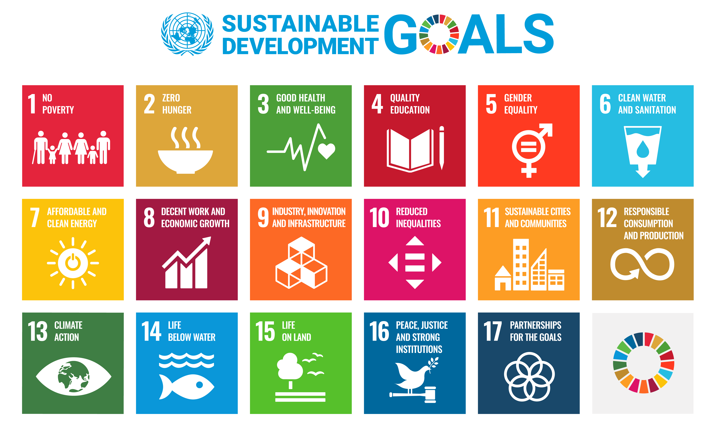

 

# Sustainable Development Goals

### Inhoud

- [Sustainable Development Goals](#sustainable-development-goals)
    - [Inhoud](#inhoud)
  - [Een introductie](#een-introductie)
  - [Referenties](#referenties)

---

**v0.1.0 ** Semester 2 TI SDG start document door HU IICT.

---

## Een introductie

De Sustainable Development Goals (SDG's) zijn de wereldwijde doelstellingen voor duurzame ontwikkeling. De SDG's zijn van 2016 tot 2030 van kracht. Er zijn [17 doelstellingen en 169 onderliggende targets](https://sdgs.un.org/goals) om deze doelen te operationaliseren (omzetten van iets abstracts in meetbare kenmerken).

Een aantal van de SDG's sluit goed aan bij het kas project. Bijvoorbeeld SDG 2: Geen honger. Beëindig honger, bereik voedselzekerheid en verbeterde voeding en promoot duurzame landbouw.

Volgens het Wereldvoedselprogramma hebben op dit moment 795 miljoen mensen niet genoeg voedsel om een gezond en actief leven te leiden. 

Daarnaast hebben we te maken met een uitdijende bevolking. De huidige bevolking op aarde van 8 miljard mensen groeit waarschijnlijk door tot 10 miljard in 2050. Al deze mensen willen eten zoals wij dat doen en dus moet er veel meer voedsel geproduceerd worden. Meer produceren, maar niet meer grond gebruiken.

Je kunt er voor kiezen om bijvoorbeeld groeilampen in je kas te verwerken. Door het gericht aanbieden van [UV licht](./hardware-interfacing/communicatie/analoog-en-digitaal/ADC/README.md) kan je de groei van planten optimaliseren. Wat zijn de technische keuzes die je dan maakt? En wat hebben die keuzes voor (negatieve) consequenties? Het laten branden van extra verlichting kost bijvoorbeeld meer elektra en water. Daarnaast kan het zorgen voor lichtvervuiling. 

We vragen door het verwerken van een SDG in je project om over deze afwegingen goed na te denken, te reflecteren en te communiceren.

## Referenties

* Waarom SDG's in het onderwijs? (<https://husite.nl/duurzaam/duurzame-hu-onderwijs-onderzoek-sdgs-in-het-onderwijs/waarom-sdgs-in-het-onderwijs/>)
* Duurzameontwikkelingsdoelstellingen (<https://nl.wikipedia.org/wiki/Duurzameontwikkelingsdoelstellingen>)
* Wereld statistieken (<https://www.worldometers.info/nl/>)
* Wereldvoedselprogramma (<https://www.wfp.org/>)
* Verenigde Naties (<https://sdgs.un.org/>)
* [SDGs presentatie](./slides/kennissessies/SDGs/SDG-les%20HBO%20-%20voor%20TI.pptx)