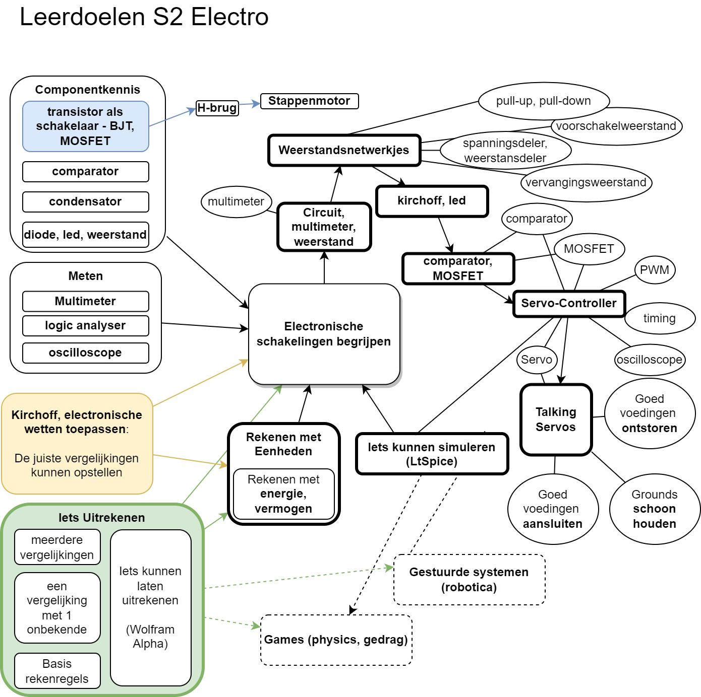

# hardware-interfacing

* [basis-elektronica/](../hardware-interfacing/basis-elektronica/README.md)
* [communicatie/](../hardware-interfacing/communicatie/README.md)
  * [1-wire/](../hardware-interfacing/communicatie/1-wire/README.md)
  * [analoog-en-digitaal/](../hardware-interfacing/communicatie/analoog-en-digitaal/README.md)
    * [ADC/](../hardware-interfacing/communicatie/analoog-en-digitaal/ADC/README.md)
    * [DAC/](../hardware-interfacing/communicatie/analoog-en-digitaal/DAC/README.md)
  * [I2C/](../hardware-interfacing/communicatie/I2C/README.md)
  * [SPI/](../hardware-interfacing/communicatie/SPI/README.md)
  * [UART/](../hardware-interfacing/communicatie/UART/README.md)
* [elektronische-componenten/](../hardware-interfacing/elektronische-componenten/README.md)
  * [capacitor/](../hardware-interfacing/elektronische-componenten/capacitor/README.md)
  * [diode/](../hardware-interfacing/elektronische-componenten/diode/README.md)
  * [H-brug/](../hardware-interfacing/elektronische-componenten/H-brug/README.md)
  * [ic/](../hardware-interfacing/elektronische-componenten/ic/README.md)
    * [74HC595/](../hardware-interfacing/elektronische-componenten/ic/74HC595/README.md)
    * [OpAmp/](../hardware-interfacing/elektronische-componenten/ic/OpAmp/README.md)
  * [LED/](../hardware-interfacing/elektronische-componenten/LED/README.md)
  * [linear-actuator/](../hardware-interfacing/elektronische-componenten/linear-actuator/README.md)
  * [piëzo-element/](../hardware-interfacing/elektronische-componenten/piëzo-element/README.md)
  * [potentiometer/](../hardware-interfacing/elektronische-componenten/potentiometer/README.md)
  * [pull-up&pull-down-resistor/](../hardware-interfacing/elektronische-componenten/pull-up&pull-down-resistor/README.md)
  * [relais&SSR/](../hardware-interfacing/elektronische-componenten/relais&SSR/README.md)
  * [switch/](../hardware-interfacing/elektronische-componenten/switch/README.md)
  * [transistor/](../hardware-interfacing/elektronische-componenten/transistor/README.md)
* [embedded/](../hardware-interfacing/embedded/README.md)
  * [computer/](../hardware-interfacing/embedded/computer/README.md)
    * [Raspberry-Pi/](../hardware-interfacing/embedded/computer/Raspberry-Pi/README.md)
  * [microcontroller/](../hardware-interfacing/embedded/microcontroller/README.md)
    * [Arduino-UNO/](../hardware-interfacing/embedded/microcontroller/Arduino-UNO/README.md)
* [pdfs/](../hardware-interfacing/pdfs/README.md)
* [prototyping/](../hardware-interfacing/prototyping/README.md)
  * [3D_Modeleren/](../hardware-interfacing/prototyping/3D_Modeleren/README.md)
  * [breadboard/](../hardware-interfacing/prototyping/breadboard/README.md)
  * [pcb/](../hardware-interfacing/prototyping/pcb/README.md)
  * [solderen/](../hardware-interfacing/prototyping/solderen/README.md)
## Leerdoelen
