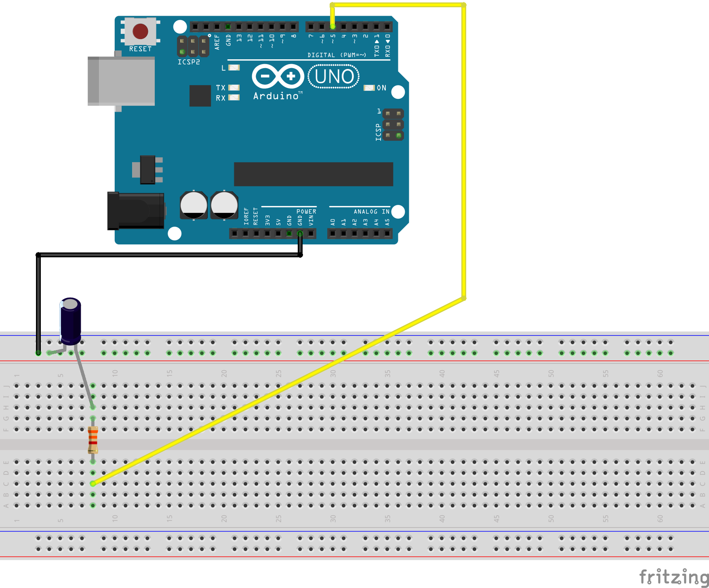

# PWM

## Benodigd

- Een arduino
- Een breadboard
- Een oscilloscope met 2 probes
- Een 1 μF condensator
- Een 3.3k weerstand
- Een 33k weerstand
- Breadboard wires of draad+striptang

## Opdracht

### PWM
PWM (Pulse Width Modulation) is een manier waarmee je met een digitale uitgang (enkel 0 en 1) toch een analoog variërende spanning kunt krijgen. 
Een PWM signaal heeft een zogenaamde *"duty cyle"*. Een duty cycle geeft aan hoeveel percentage van de tijd hij "hoog" of "aan" is.


We gaan dit testen aan de hand van de analoge outputs van de Arduino. De Arduino heeft een aantal digitale pinnen die ook PWM signalen kunnen uitsturen (pin 3,5,6,9,10,11). Je kan dit zien aan het tilde  (~) naast het pin nummer. 
We gebruiken hier analogWrite voor: 

```c++
void setup() {
  pinMode(5, OUTPUT);
}

void loop() {
  analogWrite(5,10);
}
```

1) Upload bovenstaand programma en verbind probe 1 van de scope aan pin 5 van de Arduino (vergeet niet ook de aarde van de probe aan te sluiten).
Als het goed is zie je het volgende:


2) Verander de waarde van de analogWrite naar analogWrite (5,200);
Wat valt je op aan het scope beeld? Wat je in feite aan het doen bent is het instellen van de *duty cycle* van je PWM signaal.

3) We gaan nu een sweep introduceren. Met een sweep variër je de waarde van de uitgang afwisselend van laag naar hoog. Upload het volgende programma op je Arduino:

```c++
void setup() {
  pinMode(5, OUTPUT);
}

void loop() {
  for (int i = 0; i < 255; i++){
    analogWrite(5,i);
    delay(50);
  }
}
```

Zoals je kunt zien hebben we nu een PWM signaal op pin 5 dat afwisselend hoog en laag is. De waarde van de analogWrite geeft de verhouding aan tussen hoe lang hoog en hoe lang laag (duty cycle). Bij de Arduino is 255 gelijk aan 100% hoog.

### Analoog filteren
We willen eigenlijk een mooi analoog signaal wat we kunnen variëren van 0 tot 5 Volt. Een simpele manier om dat te doen is met een RC filter. Een RC filter bestaat uit een weerstand (R) en een condensator (C). We gaan het later nog over condensatoren hebben maar voor nu kunnen we het beschouwen als een soort *"batterijtje"*.

Een RC filter is een *"low pass filter"*. Dat wil zeggen dat het alleen langzame signalen doorlaat. 

4) Bouw het volgende schema (de waarde van de weerstand is 3.3k en de waarde van de condensator is 1 μF):




5) Bouw het na. **LET OP, ALS JE DE ELCO (DE CONDENSATOR) NIET JUIST AANSLUIT EXPLODEERT HIJ! ZORG DAT JE DE MIN OP DE GROUND AANSLUIT!!!!**

6) Bekijk het volgende filmpje:
https://youtu.be/8RlM3kCG-zw

7) Sluit de twee probes van je osciloscoop aan op je circuit. De ene probe (het gele kanaal) op de uitgang van je Arduino pin 5 en de andere probe tussen de weerstand en de condensator. Vergeet niet om de aarde ook aan te sluiten van je beide probes.<br>
Wat je ziet is dat het blauwe signaal een "afgevlakte" versie is van het originele signaal.

8) Verander de waarde van de weerstand van 3.3K naar 33K. Wat valt je op? We gaan het hier de komende weken nog meer over hebben!
