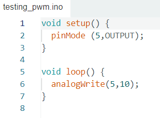
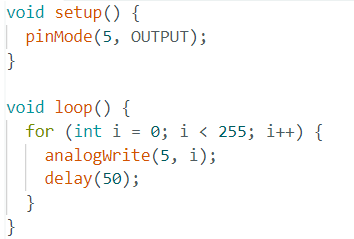

# PWM

## Benodigd

- Een arduino
- Een breadboard
- Een oscilloscope met 2 probes
- Een 1 μF condensator
- Een 3.3k weerstand
- Breadboard wires of draad+striptang

## Opdracht

PWM (Pulse Width Modulation) is een manier waarmee je met een digitale uitgang (enkel 0 en 1) toch een analoog varieerende spanning kunt krijgen. 
Een PWM signaal heeft een zogenaamde *"duty cyle"*. Een duty cycle geeft aan hoeveel percent van de tijd hij "hoog" of "aan" is.

We gaan dit testen aan de hand van de analoge outputs van de Arduino. De Arduino heeft een aantal digitale pinnen die ook PWM signalen kunnen uitsturen (pin 3,5,6,9,10,11). Je kan dit zien aan het wiebertje ~ naast het pin nummer. 
We gebruiken hier analogWrite voor: 

1) Upload bovenstaand programma en verbind probe 1 van de scope aan pin 5 van de Arduino (vergeet niet ook de aarde van de probe aan te sluiten).
Als het goed is zie je het volgende:

2) Verander de waarde van de analogWrite naar analogWrite (5,200);
Wat valt je op aan het scope beeld? Wat je in feite aan het doen bent is het instellen van de *duty cycle* van je PWM signaal.

3) We gaan nu een sweep introduceren. Upload het volgende programma op je Arduino:

Zoals je kunt zien hebben we nu een PWM signaal op pin 5 dat afwisselend hoog en laag is. De waarde van de analogWrite geeft de verhouding aan tussen hoe lang hoog en hoe lang laag (duty cycle). Bij de Arduino is 255 gelijk aan 100% hoog.

