 

# Basis elektronica

### Inhoud

- [Basis elektronica](#basis-elektronica)
    - [Inhoud](#inhoud)
  - [Een introductie](#een-introductie)
  - [Current](#current)
  - [Voltage](#voltage)
  - [Resistance](#resistance)
  - [Circuit diagrams](#circuit-diagrams)

---

**v0.1.0 ** Start document voor basis elektronica door HU IICT.

---

## Een introductie

This chapter provides information for dealing with electronic aspects of small intelligent devices. It is definitely not intended to educate the reader to the level of an electronic designer, but it aims to give a common language for communication with a (micro-) electronics specialist, and enough information to make rough calculations of the viability and functional properties of a design.

## Current

Electrical current is the flow of charged particles (in most cases electrons). In the circuit diagram in the below figure, the circle is a component that somehow causes its top (+) terminal to have a surplus of electrical charge, and its bottom (-) terminal to have an (equal) shortage.

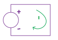

When a wire (a path of no resistance for charge), connects the top terminal to the bottom one, electrical charge will flow from the top connection, through the wire, to the bottom connection, as illustrated  by  the arrow.  This flow  is electrical current, depicted by the symbol (letter) I. As long as the source maintains the surplus at its positive connection, current will be flowing.

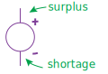

Note that current always flows in a circle, from its source, through a circuit (in our case just a wire), and then back to its source. Without this ‘full circle’ no current will flow.

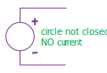

Current is measured by the amount of charge that flows through a wire per unit of time. You could compare it to the amount of water that flows through a river per second. The unit of current is the Ampere, abbreviated as A. Current can be measured by placing a suitable instrument in the circuit. Note that in order to do this, you will have to break the circuit and put the instrument in the place of the break. (The instrument replaces what was previously a wire.)

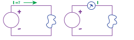

Current always flows in a circuit, from one terminal of an electrical source to the other terminal of the same source. It can’t flow somewhere and stop there. The physical law that states this is known as Kirchhoff’s first law: the sum of all currents flowing into and out of a junction is zero. A suffix is added to the I to distinguish different currents.

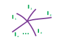

***I1 + I2 + · · · + In = 0***

To put it in a less formal way: what comes in must come out. The circuit snippet in figure 2.7 shows three wires. The current in two of the wires is shown: 1 A into the junction, and 5 A out of the junction.

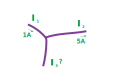

The current in the third wire can be calculated. To do this we must use be careful with the sign of the currents: a current into the junction is positive, a current out of it is negative.

***I1 + I2 + I3 = 0***

***1A − 5A + I3 = 0***

***I3 = −1A + 5A = 4A***

A wire is never ideal, hence the amount of current that a wire can handle is limited by its size, in particular by the amount of heat the can be dissipated. Up to one Ampere you generally don’t have to worry about the size of a wire, and the currents that occur in electronic circuits are generally well below that level. The table below gives some current values that occur in engineering and nature.

| Phenomenon | Current |
| -------- | --------- |
| Lightning  | 30’000 A = 30kA | 
| Welding, car starter motor | 100A |
| Domestic home section fuse | 16A | 
| PC mains | 1A | 
| Electric eel | 1A | 
| Fatal to a human | 0.05A . . . 0.2A = 50mA . . . 200mA | 
| Low-cost LED | 0.02A = 20mA | 
| Barely detectable for a human | 0.001A = 1mA | 
| Switch connected to a micro-controller pin | 10µA | 

## Voltage

When an electrical source maintains a fixed surplus of charge on its one terminal (compared to its other terminal) it is called a voltage source. You can imagine voltage (depicted by the letter U) as the pressure difference on the charged particles that will cause them to flow from a place with a high pressure to a place with a lower pressure. The unit of voltage is the Volt, abbreviated as V. In most cases our electrical sources provide a more-or-less constant voltage, hence we often speak about a voltage source when we in fact mean a source of electrical energy (because the source must deliver both voltage and a current).

To measure a voltage, a suitable instrument (which is unsurprisingly called a Volt meter) must be placed between the two terminals. Note that in this case the instrument does not replace anything. 

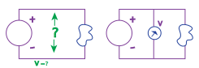

Some voltage levels that occur in nature and engineering are shown in the table below.

| Phenomenon | Voltage |
| -------- | --------- |
| Lightning |	100’000 V |
| Power grid |	400’000 V |
| Electric eel |	800 V |
| Domestic mains |	110 – 230 V |
| Maximum considered safe for humans |	48 V |
| Lead-acid car battery |	12, 24 V |
| Electrical circuits |	1 - 30 V |
| Radio battery |	9 V |
| Li battery |	3 V |
| Alkaline battery |	1.5 V |
| Chips internally |	0.001 - 30 V |

Electrical energy is produced by converting another form of energy to electrical energy. The table below gives some examples.

| Form of energy | Device that converts | |
| -------- | --------- | --------- |
| Kinetic (rotational) |	Dynamo |	Most common for generation |
| Chemical |	Battery or accu |	Most common for storage |
| Light |	Solar cell |	 |
| Heat |	Thermocouple, Peltier element	 | |

Strictly speaking, a voltage is a difference between two points in a circuit. But it is very convenient to able to talk about the voltage at (one) point. To do this, we must define what the other (reference) point is. In most cases this is the so-called ground point, often depicted by an (open) or closed bar. In most cases this is the most negative point in the circuit. When multiple bars are shown in a circuit, they are understood to be connected.

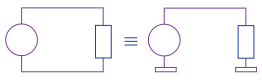

Note that a component isn’t affected by the voltage at its wires relative to the ground, it is only affected by the voltage difference over the component.

## Resistance

The amount of current that flows is determined by the voltage (more voltage causes more current), and by the resistance (depicted by the letter R) against the current (more resistance causes less current). The unit of resistance is the Ohm, represented by the Greek letter Omega: Ω. More Ohm means more resistance and hence (for the same voltage) less current. The relation between voltage, resistance and current is known as Ohm’s law:

$
I = U/R
$

The following circuit contains a voltage source that produces 3 Volt, and a resistor of 10 Ohm, depicted by the rectangle. Hence the current that flows is 3V / 10Ω = 0.3A = 300mA.

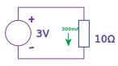

The electrical component that is used for its resistance is called – unsurpri- singly – a resistor. Resistors are available in values from about 0.1Ω (slightly above the resistance of a piece of wire) up to about 10MΩ (comparable the resistance of a few cm of dry human skin).

The international symbol for a resistor is a rectangle, but especially in USA the old symbol, a wiggle, is also used.

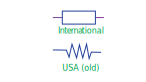

Resistors differ in a number of characteristics, most important in their resistance. You might expect that resistors are sold in ‘fixed spaced’ values like 10, 11, 12, 13, 14, - 98, 99, 100Ω, but that is not the case, because the relative difference between 10 and 11 (10%) is much larger than between 99 and 100 (1%). Instead resistors (and some other components) are sold in ‘relative spaced’ values. A common set of values is the E12 series: 10, 12, 15, 18, 22, 27,  33,  39,  47,  56,  68,  86.  Other values  are available,  but often at an extra cost. Hence designers will often restrict their choice of component values to the E12 series. (Or, when a component value must be more accurately match the calculated value, a value from a finer-spaced series like the E24 or E96.)

The resistors that you will use are color-coded with their value.

## Circuit diagrams

A circuit diagram is a symbolic representation of an electronic circuit. It consists of more-or-less standardised symbols that represent components, and lines that represent wires (electrical conductors) that connect the components. In most cases the circuit diagram doesn’t imply how the components are physically arranged and how exactly they are connected. Hence the following diagrams all equivalent.

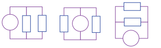

Formally, an electrochemical cell is something that converts chemical energy into electrical energy. 

    Or, in fact, the other way round: a device that uses electrical current to split a chemical substance is called an electrolytic cell.

The voltage produced by a cell is determined by it chemistry. A battery is a combination of a number of cells, with the purpose of producing a higher voltage. The symbol for a single cell is two plates, the wider connected to the positive terminal, the fatter one the negative terminal. A battery is depicted as a stack of cells, without showing the internal connections.

A primary cell can produce electrical energy, but when it has produced all it energy it is dead and useless. A secondary cell can store electrical energy and (re-)produce it. It can do so an (often large) number of times.
Colloquially the term battery is often used for a primary cell (or a battery of primary cells), and the term accu (short for accumulator) is used for a secondary cell (or a battery of secondary cells). The term accumulator refers to the ability to accumulate and store electrical energy.

The voltage produced by a battery or accu cell varies over time, but for practical calculation it is often assumed constant. The picture shows the discharge curve (the voltage over time when used in a certain way) of a common AA (penlight) battery, which is said to produce 1.5V, but actually produces
1.4 - 1.1V for most of its useful lifetime.

[img]