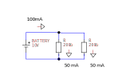
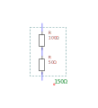

 

# Basis elektronica

### Inhoud

- [Basis elektronica](#basis-elektronica)
    - [Inhoud](#inhoud)
  - [Een introductie](#een-introductie)
  - [Current](#current)
  - [Voltage](#voltage)
  - [Resistance](#resistance)
  - [Circuit diagrams](#circuit-diagrams)
  - [Power](#power)
  - [Energy](#energy)
    - [Energy density and specific energy](#energy-density-and-specific-energy)
  - [Some circuits, components and concepts](#some-circuits-components-and-concepts)
    - [Basic circuit](#basic-circuit)
    - [Resistors in parallel](#resistors-in-parallel)
    - [Resistors in series](#resistors-in-series)
    - [Voltage divider](#voltage-divider)

---

**v0.1.0 ** Start document voor basis elektronica door HU IICT.

---

## Een introductie

This chapter provides information for dealing with electronic aspects of small intelligent devices. It is definitely not intended to educate the reader to the level of an electronic designer, but it aims to give a common language for communication with a (micro-) electronics specialist, and enough information to make rough calculations of the viability and functional properties of a design.

## Current

Electrical current is the flow of charged particles (in most cases electrons). In the circuit diagram in the below figure, the circle is a component that somehow causes its top (+) terminal to have a surplus of electrical charge, and its bottom (-) terminal to have an (equal) shortage.

When a wire (a path of no resistance for charge), connects the top terminal to the bottom one, electrical charge will flow from the top connection, through the wire, to the bottom connection, as illustrated  by  the arrow.  This flow  is electrical current, depicted by the symbol (letter) I. As long as the source maintains the surplus at its positive connection, current will be flowing.

Note that current always flows in a circle, from its source, through a circuit (in our case just a wire), and then back to its source. Without this ‘full circle’ no current will flow.

Current is measured by the amount of charge that flows through a wire per unit of time. You could compare it to the amount of water that flows through a river per second. The unit of current is the Ampere, abbreviated as A. Current can be measured by placing a suitable instrument in the circuit. Note that in order to do this, you will have to break the circuit and put the instrument in the place of the break. (The instrument replaces what was previously a wire.)

Current always flows in a circuit, from one terminal of an electrical source to the other terminal of the same source. It can’t flow somewhere and stop there. The physical law that states this is known as Kirchhoff’s first law: the sum of all currents flowing into and out of a junction is zero. A suffix is added to the I to distinguish different currents.

***I1 + I2 + · · · + In = 0***

To put it in a less formal way: what comes in must come out. The circuit snippet in figure 2.7 shows three wires. The current in two of the wires is shown: 1 A into the junction, and 5 A out of the junction.

The current in the third wire can be calculated. To do this we must use be careful with the sign of the currents: a current into the junction is positive, a current out of it is negative.

***I1 + I2 + I3 = 0***

***1A − 5A + I3 = 0***

***I3 = −1A + 5A = 4A***

A wire is never ideal, hence the amount of current that a wire can handle is limited by its size, in particular by the amount of heat the can be dissipated. Up to one Ampere you generally don’t have to worry about the size of a wire, and the currents that occur in electronic circuits are generally well below that level. The table below gives some current values that occur in engineering and nature.

| Phenomenon | Current |
| -------- | --------- |
| Lightning  | 30’000 A = 30kA | 
| Welding, car starter motor | 100A |
| Domestic home section fuse | 16A | 
| PC mains | 1A | 
| Electric eel | 1A | 
| Fatal to a human | 0.05A . . . 0.2A = 50mA . . . 200mA | 
| Low-cost LED | 0.02A = 20mA | 
| Barely detectable for a human | 0.001A = 1mA | 
| Switch connected to a micro-controller pin | 10µA | 

## Voltage

When an electrical source maintains a fixed surplus of charge on its one terminal (compared to its other terminal) it is called a voltage source. You can imagine voltage (depicted by the letter U) as the pressure difference on the charged particles that will cause them to flow from a place with a high pressure to a place with a lower pressure. The unit of voltage is the Volt, abbreviated as V. In most cases our electrical sources provide a more-or-less constant voltage, hence we often speak about a voltage source when we in fact mean a source of electrical energy (because the source must deliver both voltage and a current).

To measure a voltage, a suitable instrument (which is unsurprisingly called a Volt meter) must be placed between the two terminals. Note that in this case the instrument does not replace anything. 

Some voltage levels that occur in nature and engineering are shown in the table below.

| Phenomenon | Voltage |
| -------- | --------- |
| Lightning |	100’000 V |
| Power grid |	400’000 V |
| Electric eel |	800 V |
| Domestic mains |	110 – 230 V |
| Maximum considered safe for humans |	48 V |
| Lead-acid car battery |	12, 24 V |
| Electrical circuits |	1 - 30 V |
| Radio battery |	9 V |
| Li battery |	3 V |
| Alkaline battery |	1.5 V |
| Chips internally |	0.001 - 30 V |

Electrical energy is produced by converting another form of energy to electrical energy. The table below gives some examples.

| Form of energy | Device that converts | |
| -------- | --------- | --------- |
| Kinetic (rotational) |	Dynamo |	Most common for generation |
| Chemical |	Battery or accu |	Most common for storage |
| Light |	Solar cell |	 |
| Heat |	Thermocouple, Peltier element	 | |

Strictly speaking, a voltage is a difference between two points in a circuit. But it is very convenient to able to talk about the voltage at (one) point. To do this, we must define what the other (reference) point is. In most cases this is the so-called ground point, often depicted by an (open) or closed bar. In most cases this is the most negative point in the circuit. When multiple bars are shown in a circuit, they are understood to be connected.

Note that a component isn’t affected by the voltage at its wires relative to the ground, it is only affected by the voltage difference over the component.

## Resistance

The amount of current that flows is determined by the voltage (more voltage causes more current), and by the resistance (depicted by the letter R) against the current (more resistance causes less current). The unit of resistance is the Ohm, represented by the Greek letter Omega: Ω. More Ohm means more resistance and hence (for the same voltage) less current. The relation between voltage, resistance and current is known as Ohm’s law:

$
I = U/R
$

The following circuit contains a voltage source that produces 3 Volt, and a resistor of 10 Ohm, depicted by the rectangle. Hence the current that flows is 3V / 10Ω = 0.3A = 300mA.

The electrical component that is used for its resistance is called – unsurpri- singly – a resistor. Resistors are available in values from about 0.1Ω (slightly above the resistance of a piece of wire) up to about 10MΩ (comparable the resistance of a few cm of dry human skin).

The international symbol for a resistor is a rectangle, but especially in USA the old symbol, a wiggle, is also used.

Resistors differ in a number of characteristics, most important in their resistance. You might expect that resistors are sold in ‘fixed spaced’ values like 10, 11, 12, 13, 14, - 98, 99, 100Ω, but that is not the case, because the relative difference between 10 and 11 (10%) is much larger than between 99 and 100 (1%). Instead resistors (and some other components) are sold in ‘relative spaced’ values. A common set of values is the E12 series: 10, 12, 15, 18, 22, 27,  33,  39,  47,  56,  68,  86.  Other values  are available,  but often at an extra cost. Hence designers will often restrict their choice of component values to the E12 series. (Or, when a component value must be more accurately match the calculated value, a value from a finer-spaced series like the E24 or E96.)

The resistors that you will use are color-coded with their value.

## Circuit diagrams

A circuit diagram is a symbolic representation of an electronic circuit. It consists of more-or-less standardised symbols that represent components, and lines that represent wires (electrical conductors) that connect the components. In most cases the circuit diagram doesn’t imply how the components are physically arranged and how exactly they are connected. Hence the following diagrams all equivalent.

Formally, an electrochemical cell is something that converts chemical energy into electrical energy. 

    Or, in fact, the other way round: a device that uses electrical current to split a chemical substance is called an electrolytic cell.

The voltage produced by a cell is determined by it chemistry. A battery is a combination of a number of cells, with the purpose of producing a higher voltage. The symbol for a single cell is two plates, the wider connected to the positive terminal, the fatter one the negative terminal. A battery is depicted as a stack of cells, without showing the internal connections.

A primary cell can produce electrical energy, but when it has produced all it's energy it is dead and useless. A secondary cell can store electrical energy and (re-)produce it. It can do so an (often large) number of times.

Colloquially the term battery is often used for a primary cell (or a battery of primary cells), and the term accu (short for accumulator) is used for a secondary cell (or a battery of secondary cells). The term accumulator refers to the ability to accumulate and store electrical energy.

The voltage produced by a battery or accu cell varies over time, but for practical calculation it is often assumed constant. The picture shows the discharge curve (the voltage over time when used in a certain way) of a common AA (penlight) battery, which is said to produce 1.5V, but actually produces 1.4 - 1.1V for most of its useful lifetime.

[img]

The voltage depends on the chemistry of the cell. Alkaline batteries used to be the most common (and still are in for instance flashlights), but are gradually being replaced by Li (Lithium). Lead-acid batteries are still found For some applications the self-discharge of a battery is important: even when it is not used, a battery will lose some of its energy over time. This rate at which this happens varies with the battery chemistry.

| Chemistry | Primary or secondary | Voltage |
| -------- | --------- | --------- |
| alkaline | Primary	| 1.2V |
| Lead-acid	| Secondary	| 2.0V |
| Li	| Primary or secondary	| 3.0V |

A rechargeable battery (accu) will ‘wear out’ in use: for each charge- discharge cycle its capacity will be reduced a little bit. When the capacity is reduced to for instance 50.

The capacity of a battery or accu is often expressed in the (unofficial) current * time: Ah (Ampere-Hour) or mAh (mA-Hour). Table 2.7 shows the capacity of some typical batteries. Note that both the stated voltage and the stated capacity are optimistic values.

| Battery or accu type | Voltage | Capacity |
| -------- | --------- | --------- |
| AA alkaline	| 1.5V	| 2700 mAh |
| AAA alkaline-acid	| 1.5V	| 1200 mAh |
| 9V radio	| 9V	| 500 mAh |
| CR2032 lithium coin cell	| 3.6V	| 225 mAh |
| Car accu	| 12V	| 50 Ah |

## Power

Power is the amount of energy per unit of time, with the symbol P. The unit of power is the Watt. The amount of power generated by electrical current depends both on the amount of current through the circuit, and the amount of voltage over the circuit. It can be expressed as the product (multiplication) of current (in A) and voltage (in V):

$$
P = I ∗ U
$$

In the circuit part seen in 2.17 two meters are used to measure the current through the resistor (500 mA) and the voltage over the resistor (6V). Hence the power in the resistor is:

$$
I = 500mA = 0.5A U = 6V
$$

$$
P = 0.5A ∗ 6V
$$

$$
P  = 3W
$$

These figures are typical for a bicycle headlight. Note that this is an incomplete circuit: there must be something to the left that produces the electrical energy, for instance a battery.

When electrical current generates energy this will have an effect on the component in which this energy is generated. Some components (for instance light bulbs) are designed to do something useful with that energy (light bulbs produce light), but even those components are often not very good at this: most of the energy is dissipated into heat. This can be a problem, because too much heat will cause the temperature of the component to rise, which can destroy the component or even set it (or its surroundings) on fire. Table 2.8 shows some typical power levels.

| Process | Power |
| -------- | --------- |
| Sun	| 3.8 ∗ 1026W |
| Electrical power plant	| 800 MW (thermal) |
| Heater, cooker	| 1 kW |
| Electric eel	| 800 W (for 2 ms) |
| Desktop PC	| 100 W |
| Human	| 100 W (thermal) |
| Electrical component, hot when touched	| 1 W |
| LED	| 50 mW |
| Wi-Fi signal	| 10 µW |

## Energy

Energy (E) is the work done by power over time. Hence it can be calculated by multiplying power and time (duration):

$$
E = P ∗ T
$$

The official unit of energy is the joules, abbreviated as J. One joule is the work (energy) done by one Watt over a period of one second. Another unit that is often used it the Watt-hour, which is (not surprisingly) the amount of work done by one Watt over the period of one hour.

The price of energy from various sources varies widely. Note that the comparison with car fuel doesn’t take the efficiency of actually using car fuel into account

| Source | price (2018)|
| -------- | --------- |
| Car fuel	 | € 1.60/l, € 34 MJ/l	€ 0.17 / kWh |
| Mains	 | € 0.22/kWh	€ 0.22 / kWh |
| AA battery (1.2V, 2000mAh)	 | € 0.25	€ 104 / kWh |

### Energy density and specific energy

Energy density is the amount of energy stored per volume, and specific energy is the amount of energy stored per weight (but the term energy density is often used for both). Both terms are useful to express the efficiency of a particular way of storing energy. Why do electrical cars have such an abysmal radius compared to normal cars? Table 2.10 shows the specific energy of some energy sources.

| Source | Specific energy (MJ/kg)|
| -------- | --------- |
| D-He3 fusion	| 384’000’000 |
| Uranium fission	| 80’620’000 |
| Diesel fuel burning	| 48 |
| TNT explosion	| 4.6 |
| Li battery	| 1.8 |
| Li accu	| 0.6 |
| Alkaline battery	| 0.5 |
| Lead-acid battery	| 0.17 |

The specific energy of a modern (Li) accu compared to that of (diesel) fuel explains it all: with a kilogram of diesel fuel a car will be able to travel 80 times as far as with the same weight of Lithium accu. The comparison is somewhat unfair because burning diesel requires oxygen (air), which is not accounted for in the table because a car doesn’t need to store it.

##	Some circuits, components and concepts

### Basic circuit

Below figure shows an variation on the ‘mother of all circuits’ containing a 10 V voltage source and a 200 Ω resistor. The voltage source determines the voltage over the resistor, hence we can use Ohm’s law to calculate the current through the resistor: 10 V / 200Ω = 0.05 A or 50 mA.

The voltage source can be depicted as a battery, or implied by showing an agreed-upon symbol for the ground and for the voltage source. A circle or triangle is often used for the positive supply, and a small box for the negative one. When such symbols are used, all such symbols are assumed to be connected.

A voltage source feeding those common symbols can be shown, or it can be omitted, with just the voltage shown.

###	Resistors in parallel

The circuit in the figure below is like the previous one, but with one extra 200 Ω resistor in parallel to the first resistor. The voltage source now determines the voltage across *both* resistors, hence the current through each resistor is 50 mA. The total current delivered by the voltage source is the sum of these two currents: 100 mA.

We can now use Ohm’s law in reverse to calculate the single resistor that would be equivalent to the two resistors in the circuit. This resistor would draw 100mA from a 10V source.

$$
I = U/R → R = U/I
$$

Hence that replacement resistor would be 10 V / 0.1 A = 100 Ω. For n resistors of the same value R in parallel, the equivalent resistor value is R / n. In our case, 200 Ω / 2 = 100 Ω.

For different-valued resistors the formula for the equivalent resistance is:

$$
1/R_{Equivalent} = 1/R_1 + 1/R_2 + 1/R_3 + . . .
$$

###	Resistors in series

The circuit below shows a 3V voltage source, and two resistors in series, of 100Ω and 50Ω.

The current through the two resistors will be the same (see section 2.3.1). Hence we can use a variation of Ohm’s law to determine the ratio between the voltages over the two resistors:

$$
I = U/R → U = I ∗ R
$$

In other words: if the current is the same, the voltage is proportional to the resistance. We know the total voltage (that is determined by the 3V voltage source). This voltage is divided among the two resistors in the ratio 100 : 50, hence the voltage across the 100Ω resistor will be 2V, and the voltage across the 50Ω resistor will be 1V. This type of circuit is called a voltage divider, because the two resistors divide the total voltage among the two.

With those voltages know, we can calculate the current. It doesn’t matter for which resistor we calculate the current, the value will be the same. For the top resistor:

$$
R= U/I
$$

$$
U= 3V
$$

$$
I= 20mA = 0.02A
$$

$$
3V/0.02A = 150Ω
$$

For resistors in series, the equivalent resistor value is the sum (addition) of the resistor values:

$$
R_{Equivalent} = R_1 + R_2 + R_3 + . . .
$$

###	Voltage divider
 
Apart from creating a new resistor with a higher resistance, you can also use two resistors in series to create a voltage divider.

The attenuation (the reduction of the voltage) of this voltage divider is:

$$
att = V_{out}/V_i = R_2/R_1+R_2
$$

For instance, if you want to connect the output of an Arduino Nano mi- crocontroller (which can have values from 0 to 5V) to the input of an ESP microcontroller (that should not get values higher than 3.3V), you could use the voltage divider to make them match:
 

$$
att = 3.3V/5V = 0.66
$$

$$
0.66 = R_2/R_1+R_2
$$

$$
0.66(R_1+R_2) = R_2
$$

$$
0.66R_1 + 0.66R_2 = R_2
$$

$$
0.66R_1 = R_2 - 0.66R_2
$$

$$
0.66R_1 = 0.34R_2
$$

$$
0.66R_1/0.34 = R_2
$$

$$
1.94R_1 = R_2
$$

So if you select R1 = 1.2kOhm and R2 =2.2 kOhm, you’ll be close enough.
