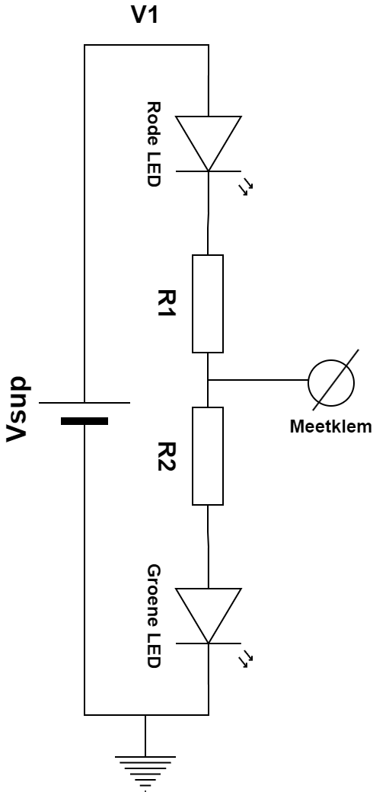
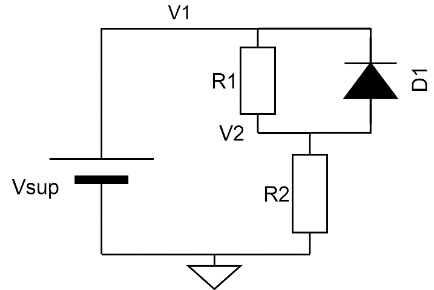
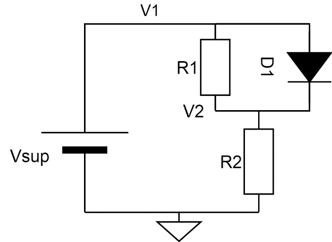

# LED

## Benodigd

- Een breadboard
- Een multimeter
- Een LED
- Een 100 Ω weerstand
- Een 1k weerstand
- Een 10k potmeter
- Breadboard wires of draad+striptang

## Opdracht

De LED (Light emitting diode) is zoals de naam zegt, een diode die licht
geeft als hij geleidt (in voorwaarts staat). Ze diode staat in
voorwaarts als het ene pootje, de anode een voldoende hoge spanning
heeft vergeleken het andere pootje, de kathode.

Bouw de volgende schakeling, met P1=10k potmeter, R1=100 Ω weerstand

1. **Kun je de potentiometer zo instellen dat de led licht geeft?
   Waarom wel/niet?**  

2. Draai nu de LED om:  
     
   Door de weerstand van de potentiometer te veranderen, kun je de
   stroom veranderen.  
   Stel de potentiometer zo in, dat je de led nog net een klein beetje
   ziet branden.  
   **Welke spanning staat er dan over de LED?**

3. **Welke stroom I1 loopt er dan door de LED (bereken I1 door het
   spanningsverschil tussen V1 en V2 te meten en met R1 de wet van Ohm
   toe te passen)?**

4. Draai de potentiometer nu helemaal naar een kant, zodanig dat de LED
   maximaal hard brandt.  
   **Welke spanning staat er dan over de LED?**

5. **Welke stroom I1 loopt er dan door de LED?**

6. **Gehoorzaamt een LED de wet van Ohm? Beargumenteer je antwoord.**

7. **Wat zou er zijn gebeurd als je bij bovenstaande experimenten R1
   zou hebben vervangen door een draadverbinding?**

8. **Bekijk onderstaande schakeling, met R1=1k**  
   ****  
   **Geef zonder de schakeling te bouwen een gefundeerde schatting van
   stroom I1.**

9. **Bouw de schakeling en bepaal ter controle I1 door R1 als
   meetweerstand te gebruiken.**

### Logisch niveau meter
     

Voor de bovenstaande schakeling geldt:

- Vsup = 5V
- R1 = 1kOhm
- R2 = 1kOhm
- De junctiespanning van de Rode LED noem ik even VjRood
- De junctiespanning van de Groene LED noem ik even VjGroen

Deze schakeling is een handig circuit voor het testen van logische niveaus.
Probeer eerst onderstaande vragen te beantwoorden door te redeneren. Controleer vervolgens of het klopt door het circuit te bouwen en te testen:   
**Vraag a: Welke LED brandt als de meetklem wordt verbonden met een (digitale output-) pin die een spanning van 5V heeft? En welke stroom loopt er dan door?**   

**Vraag b: Welke LED brandt als de meetklem wordt verbonden met een (digitale output-) pin die een spanning van 0V heeft? En welke stroom loopt er dan door?**       

**Vraag c: Hoe herken je het als de meetklem wordt verbonden met een punt dat hoogohmig (niet aangesloten) is? Welke stroom loopt dan door de leds?**    

**Vraag d: Bouw het circuit en controleer je voorspellingen. Gedraagt het zich zoals je had verwacht? Wat zijn de waarden van VjRood en VjGroen?**

# Uitsmijter

De uitsmijter kan theoretisch berekend worden. Je kunt het eventueel ook controleren door na te bouwen en te meten

### Opgave 3

Voor de bovenstaande schakeling geldt:

- Vsup = 5V
- R1 = 1kOhm
- R2 = 1kOhm

**Vraag a: Wat is de stroom door R2?**

### Opgave 4

    
Voor de bovenstaande schakeling geldt:

- Vsup = 5V
- R1 = 1kOhm
- R2 = 1kOhm

**Vraag a: Wat is de stroom door D1?**
