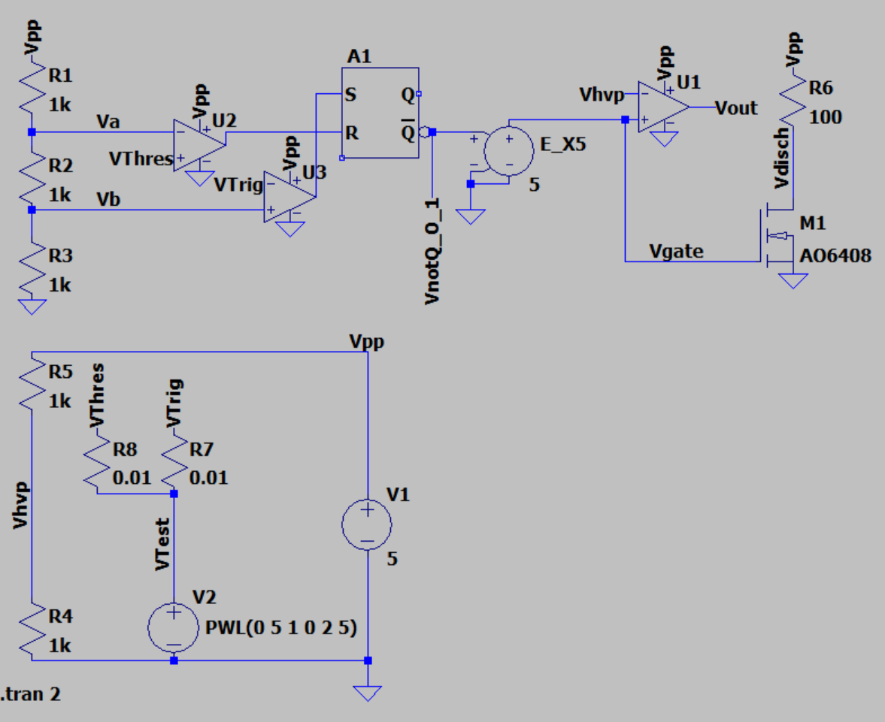
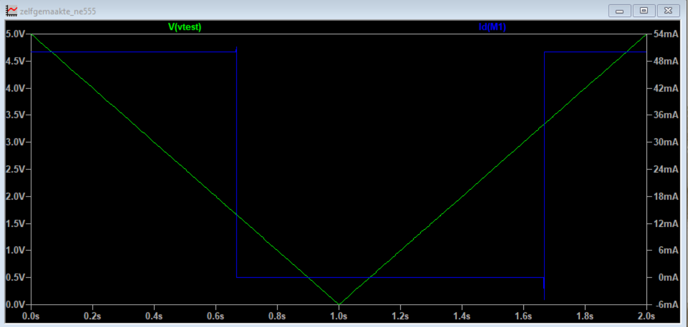

**Jouw naam:**

# Practicum LtSpice

# Voorbereiding

- Zorg dat je **ruim te voren** LtSpice hebt **geinstalleerd** (het kan uren duren (misschien, althans een update zeker)):
    <https://www.analog.com/en/design-center/design-tools-and-calculators/ltspice-simulator.html>
    
- Zorg dat je een of meerdere **tutorials ervan hebt doorgenomen**  
    ( bijvoorbeeld: <https://www.youtube.com/watch?v=JRcyHuyb1V0> )

**Belangrijke LtSpice Tips:**
- In "het echt" zet je vaak een condensator parallel aan een voeding, om diens spanning (extra) te ontstoren/vlak te maken.
- In (LtSpice-) simulaties kun je die condensators parallel aan voedingen (voorlopig) beter weglaten. Dat zorgt ervoor dat de simulatie trager wordt en moeilijker (of zelfs helemaal niet) convergeert.

-   In plaats van de PMOS-FET NDP6020P kun je in LtSpice: kiezen:  
    “pmos” met als type “FDC638P” (plaats eerst de “pmos”. Vervolgens
    rechter muisknop er op en “Pick new mosfet” -\> “FDC638P”

-   In plaats van een opamp van de chip LM324 kun je in LtSpice
    kiezen:  
    “UniversalOpamp2”, met “Level3b” (te selecteren met rechtermuisknop
    op de geplaatste opamp).

-   Je mag ervan uitgaan dat een LED goed zichtbaar brandt als er 1mA of
    meer doorheen gaat.

-   Een potmeter / potentiometer kun je in LtSpice modelleren met twee
    serieweerstanden. Je kunt de waarden van die twee serieweerstanden
    aanpassen, maar moet er dan wel voor zorgen dat de som van die
    weerstanden gelijk blijft (dus bijvoorbeeld 10k Ohm bij een 10k potentiometer
    gaat).    

    Alternatief kun je er een (custom-) model voor gebruiken of maken, waarbij de stand met een parameter in te stellen is. Dat zou je dan even (via chat gpt4 of google tutorials) kunnen uitvogelen.

## De Opdracht
### Servo controller nabouwen in LtSpice
Bij het [practicum-servocontroller](../servo-controller/practicum-servo-controller.md) heb je een servocontroller fysiek gebouwd en bemeten.

Bij deze opdracht ga je dezelfde schakeling bouwen in de simulator en daar "bemeten".

### Opdracht 1
Voor de servo-controller werd een ne555 gebruikt. Het interne schema van de ne555, afkomstig uit diens datasheet is ook te vinden in [practicum-servocontroller](../servo-controller/practicum-servo-controller.md).

Bouw in LtSpice als volgt dat model uit de datasheet van de NE555 na:    

Gebruik daarbij:
- het model UniversalOpamp2 (zie tips) voor de comparators.
- een nmosfet met geschikte Vgsth voor T1: De Ao6408
- de standaard srflipflop "srflop"
  NB: deze standaard (te eenvoudige) flipflop heeft altijd uitgangsspanningsniveaus tussen de 0 en 1V
- dat is niet realistisch. normaalgesproken hoort het tussen 0V en de voedingsspanning, in dit geval 5V te zijn.
  om dat te repareren voegen we een spanningsversterker 
  (symbool E toe met versterkingsfactor 5).
- een testspanningsbron met pwl (PieceWiseLinear) testsignaal dat
  binnen 1 seconde van 0 tot 5 volt gaat en binnen de seconde erna weer terug naar 0V.
- gebruik labels voor de knooppuntsspanningen om te veel spaghetti van draden te voorkomen en 
  makkelijker de knooppuntsspanningen te kunnen inspecteren.

Controleer voor je verder gaat of na het bouwen de Transient simulatie van de spanning VTest en de drainstroom 
Id van Mosfet M1 er als volgt uitzien:    

#### Vraag a
Verklaar de uitkomsten van bovenstaande simulatie aan de hand van een nieuwe screenshot van relevante
spanningen en stromen die je uitleg ondersteunen. Gebruik in je uitleg op zijn minst Vtest, Va, Vb, Vgate en Id1 (de drainstroom van M1).
#### Vraag b
Controleer in de datasheet of de Vgs threshold van de gebruikte MOSFET laag genoeg is. Hoe groot is die?

### Opdracht 2
Bouw nu gebruikmakende van dit model van de NE555 de servocontrollerschakeling uit [practicum-servocontroller](../servo-controller/practicum-servo-controller.md) na in ltspice (vergeet niet de afvlakcondensator van de voeding weg te laten).
### Vraag a
Stel P2 in op op 0 Ohm en P1 op 33%.
Laat met een screenshot van de uitgangsspanning zien dat de servo/pwm-controller goed werkt.
### Vraag b
Leg de werking van de pwm-controller uit door screenshot(s) van de simulatie. Betrek daarbij in ieder geval alle knooppuntsspanningen (behalve de interne knooppuntsspanningen van de NE555).
