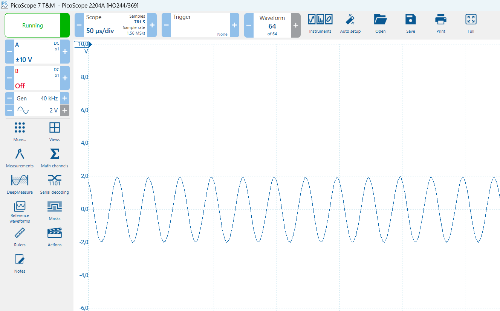
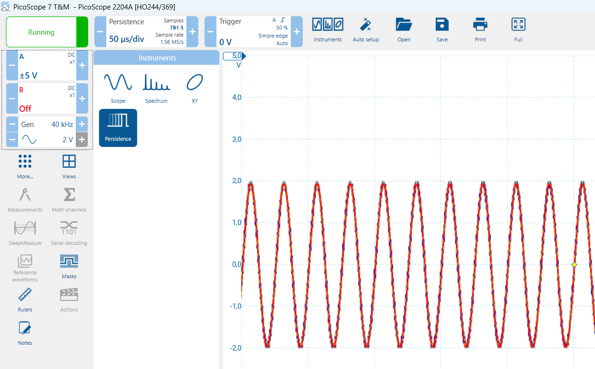

# Opdracht: metingen met de oscilloscoop

Bij deze opdracht ga je een meting uitvoeren waarbij het signaal van de
signaalgenerator wordt aangesloten op de meetingang A. Het signaal dat
je zelf genereert wordt dus het meetsignaal.

Sluit een probe aan op **channel A** op de PicoScope (draai de connector een kwart slag om vast te zetten). Controleer dat de schakelaar op de probe op de stand "1x" staat. Sluit een tweede kabel aan op de **Signaal OUT**.

Verbind de probe van het signaal met je meet probe en vergeet ook niet de aarde te verbinden.

Wanneer je dit goed hebt gedaan kan je een signaal gaan meten. Stel de
PicoScope in op een **sinusvorm van 40kHz in met een amplitude van 2V**
en zet deze aan. Als het goed is zie je nu het volgende:



De kans is heel groot dat het signaal niet stilstaat. Dat komt omdat het
een continu-meting is en dat het periodieke signaal heel vaak op het
scherm wordt getekend. Als je dat niet iedere keer op dezelfde plaats
doet krijg je een “lopend” beeld. Het is dan amper af te lezen. Dit kan
je oplossen door het signaal te triggeren.

## Triggeren

Triggeren houdt in dat je het **meetsignaal** op zo'n manier weergeeft
dat het op het scherm **stilstaat**. Je zou bijvoorbeeld kunnen
triggeren (= starten met schrijven op het scherm) als het signaal “door
de nul-lijn omhoog gaat”, of iedere keer als het de hoogste waarde heeft
bereikt.

Belangrijk bij het triggeren is dat het “schrijven” naar het scherm consequent op hetzelfde moment start en dus alle afbeeldingen netjes over elkaar worden geschreven.

Wat is het verschil tussen falling and rising edge? en wat pas je aan als je de treshold aanpast?

```
```

De software van de oscilloscoop kent drie “basis”-metingen. Dat zijn de drie modes die je bovenin links met iconen kunt kiezen: de Scope Mode, de Persistence Mode en de Spectrum Mode.

Normaal gesproken gebruik je de Scope Mode waarmee je een signaal bekijkt. Met de Spectrum Mode kun je zien welke frequenties er in het meetsignaal aanwezig zijn. Er is echter ook een erg belangrijke en handige mode, de Persistence Mode:



Zoek in de helpfile op wat deze mode doet en bedenk waarvoor een Persistence Mode gebruikt zou kunnen worden. Vul dat in het volgende vak in:

```

```

## Samenvatting

Met dit practicum heb je nu kennis gemaakt met de oscilloscoop. Een
belangrijk apparaat voor het vervolg van je studie Technische
Informatica. Voor de themaopdracht kun je hem lenen. Als je wat meer
geïnteresseerd bent in de hardware kun je hem ook zelf aanschaffen. De
prijs is te overzien.

Het vervolg van het practicum met de oscilloscoop is leuker. Dan doe je
verschillende metingen waar je de oscilloscoop bij gebruikt. Je maakt
dan bijvoorbeeld de bits over de seriële poort zichtbaar. Daarom moet je
iets weten van de hardware en je weg kunnen vinden in de software.