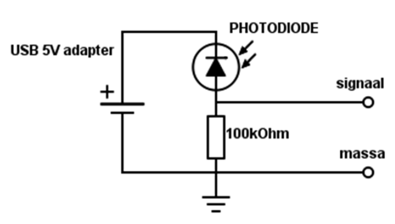

# Meten aan een IR-afstandbediening

Bij de start heb je een infrarood afstandbediening gekregen. Controleer
even of de rode LED brandt als je op het knopje drukt. Dan is de
batterij nog goed. Deze afstandbediening wordt gebruikt om een alarm op
afstand in- en uit te schakelen. Je kunt hem ook voor iets anders
gebruiken als je een geschikte ontvanger hebt. Daarvoor heb je de
frequentie nodig waarmee de IR-LED wordt gepulst. Deze frequentie kun je
met de oscilloscoop meten. De sensor die je voor de meting nodig hebt is
een fotodiode, een diode die gevoelig is voor infrarood licht.

Een CCD, de sensor in de camera voor van je mobiel, is ook gevoelig voor
infrarood licht. Handig om te weten, dan kun je even snel testen of de
IR-handzender (of je afstandbediening thuis) het wel doet.

Open je camera van je mobiel en schijn met de handzender in de camera.
Welke kleur is het licht van de IR-LED als je deze met de camera
bekijkt?

```

```

## De sensor

De sensor om het IR-licht te ontvangen is een fotodiode (zwart vierkant
blokje van 4 bij 4 millimeter). De eigenschap van een diode is dat hij
gevoelig is voor (IR-)licht.

De lichtgevoelige kant is de bovenkant (dat is niet vanzelfsprekend).
Een diode is naast IR ook gevoelig voor zichtbaar licht. Daarom is een
filter aangebracht dat zichtbaar licht zo goed mogelijk tegenhoudt maar
infrarood licht doorlaat.

De fotodiode is een soort diode waarvan de behuizing deels doorzichtig is. In evenredigheid met het invallende licht worden er electronen losgeslagen die een lekstroom veroorzaken. De stroom is dus (grosso modo) lineair evenredig met de hoeveelheid invallend licht.

### Meten van de frequentie



Bouw het bovenstaande schema na op het breadboard (de afgeplatte kant / het korte pootje van de diode is de kant waar de diode-pijl in het schema naar toe wijst). Meet als volgt tussen de klemmen "massa" en "signaal".

Stel de oscilloscoop in als volgt: **AC**, resolutie op **8** bit,
gevoeligheid op **+/- 200 mV**, tijdbasis op **10 µs/div** en de
triggering op **Auto**.

Schijn met de zender in de ontvanger en probeer de pulsen zichtbaar te
maken. Probeer het puls-beeld te “vangen”. Experimenteer met de
triggering en het in- en uitschakelen van de scoop (links onderin de
start- en stop button). Als je het beeld stil hebt kun je de frequentie
berekenen. Schuif de twee meetlinealen (links-onderin een klein
vierkantje dat je kunt verplaatsen) naar de **start** en het **einde**
van een puls en kies frequentiemeting (kun je vinden in de onderbalk,
rechts van het midden, een groen plusje). Wat is de frequentie van de
zender?

```

```

**Plaats het ingevulde meetrapport met de gemaakte schermafdrukken in de GitHub-repository van je team.**