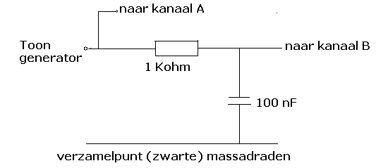

# Meten aan een filter

Als er een dataverbinding van de ene module naar de andere module loopt
is het niet denkbeeldig dat de verbindingsdraden storingen oppikken. Er
zijn altijd stoorsignalen in de buurt, mensen die aan het bellen zijn,
apparatuur die storingen de ether in sturen, enzovoort. Als de
stoorsignalen bestaan uit hoge frequenties kunnen deze tegengehouden
worden met een filter dat alleen lage frequenties doorlaat. Bij het
volgende onderdeel ga je die maken en er aan meten.

Een condensator is voor wisselspanning een weerstand die afhankelijk is
van de frequentie. Als je deze “frequentie-afhankelijke weerstand” in
een spanningsdeling plaatst met een “gewone” weerstand heb je een
filter. Lage frequenties worden doorgelaten, hoge frequenties
(storingen) worden gedempt (= minder goed doorgelaten).

## Het filter

Het laagdoorlaatfilter bestaat uit twee componenten, een weerstand en
een gele condensator die op het protobordje zijn aangebracht. Vergis je
bij het aansluiten niet in de plaats van de weerstand en de condensator,
dan maak je een hoogdoorlaatfilter.

### Aansluiten van de meetdraden voor de meting

Sluit die volgens het bovenstaande volgende schema aan.

Sluit de **drie** meetkabels aan op de PicoScope. Voor de **meting**
maak je gebruik van de **toongenerator/signaalgenerator** van de
**PicoScope** (uitgang op de PicoScope naast de A en de B).

Dit bronsignaal wordt (op het protobordje) op kanaal **A** van de
oscilloscoop aangesloten. Het signaal wordt ook op de weerstand
(=ingang) van het laagdoorlaatfilter aangesloten. De uitgang van het
filter (= knooppunt van weerstand en gele condensator) gaat naar kanaal
**B** van de oscilloscoop. Zo zie je het originele toonsignaal op A en
het gefilterde signaal op B.

Anders gezegd is de aansluiting als volgt: Kanaal A wordt **direct** op
de toongenerator aangesloten (geeft een beeld van de sinus), op kanaal B
wordt het gefilterde signaal aangesloten. Zo kun je het beeld op kanaal
A en B direct met elkaar vergelijken.

### Meten van de kantelfrequentie

De frequentie waarbij het filter nog de helft van het signaal doorlaat
wordt de kantelfrequentie (-3dB punt) genoemd. Als je de frequentie van
het ingangssignaal hoger maakt zal de amplitude van het signaal aan de
uitgang op kanaal B afnemen. Dat gebeurt niet abrupt maar is een
geleidelijk traject.

Stel de frequentie van de toongenerator in op een **Sinus**, frequentie
**100 Hertz**, amplitude van **1V**.

Stel de oscilloscoop (voor beide kanalen **A en B**) in op **DC**,
resolutie voor beide kanalen op 8 bit, gevoeligheid op **+/- 1 V**,
tijdbasis op **1 ms/div** en de triggering op **Auto**.

Als het goed is kun je nu de blauwe lijn van kanaal A en de rode lijn
van kanaal B zien. Verhoog langzaam de frequentie (tot 10 KHz) en kijk
naar de rode sinus. Bij welke frequentie is het signaal op de uitgang
van het filter (kanaal B) nog de helft van het oorspronkelijke signaal?
Maak een schermafdruk van de meting.

**Plaats het ingevulde meetrapport met de gemaakte schermafdrukken in de GitHub-repository van je team.**