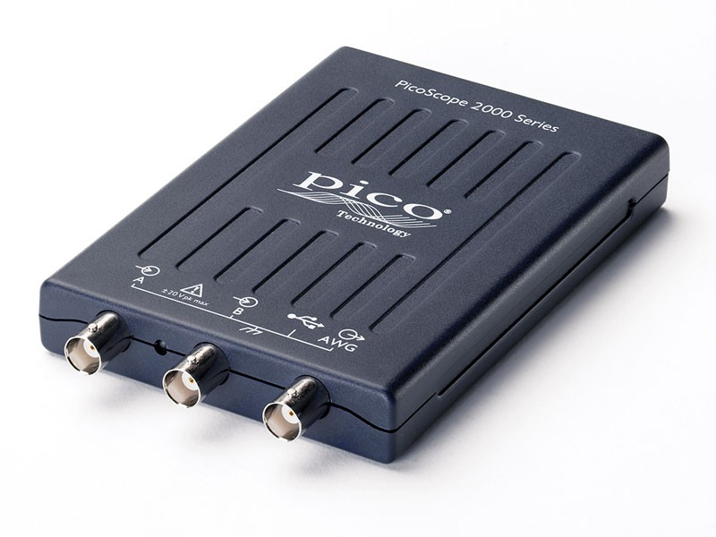
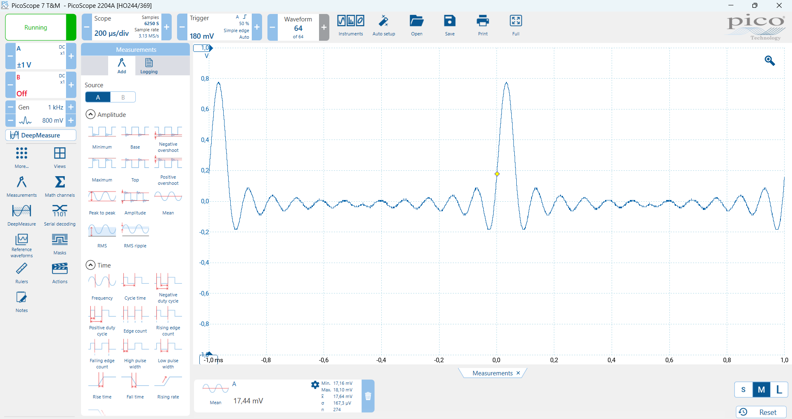
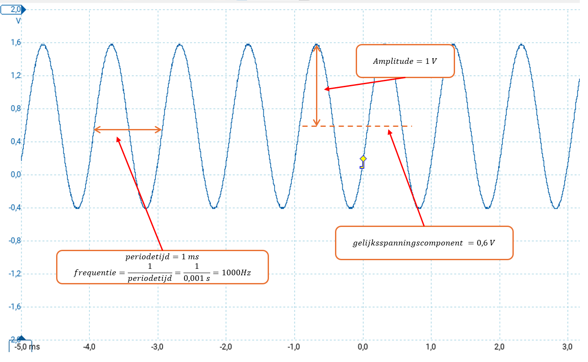
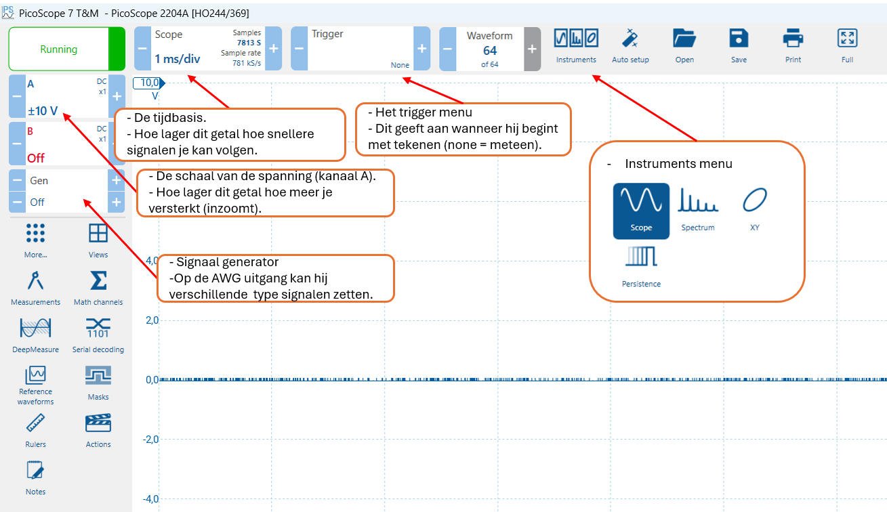
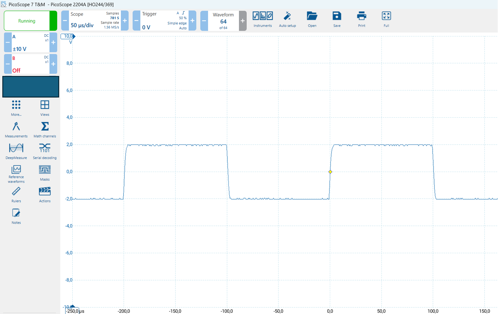
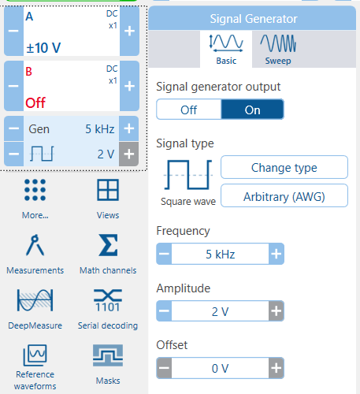
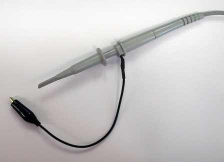
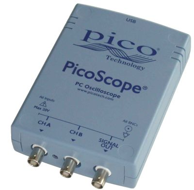

# Meetinstrument de oscilloscoop



## Introductie

Meten is weten! Elektrische signalen kun je niet zien en dat is vaak erg lastig. Je programmeert een outputpoort, maar hij doet het niet. Staat er wel het juiste signaal op? Wat is de frequentie van het kloksignaal dat je gebruikt voor je microcontroller? Je stuurt data serieel naar je modem, maar het lijkt alsof deze niets ontvangt. Wordt er wel een signaal verzonden en zijn de data in het signaal wel correct?



Allemaal vragen waar je het volgende antwoord op kunt geven: **maak het signaal zichtbaar**. Als je het kunt zien weet je wat er gebeurt en kun je conclusies trekken.

Voor het zichtbaar maken van spanningen en signalen gebruiken we
meetinstrumenten. Een belangrijk meetinstrument is een voltmeter (multimeter). Daarmee meet je alleen de actuele spanning op een gegeven punt.

Het wordt lastig als je wilt meten aan een wisselende spanning (analoog of digitaal). De informatie die je krijgt met een voltmeter zegt dan niet zoveel. In dit geval wil je het verloop van het signaal vastleggen en terug kunnen zien. Daar gebruik je een oscilloscoop voor, vaak kortweg scoop genaamd.

## Doel van dit practicum

Na dit practicum ziet de wereld van signalen er anders uit. Onzichtbare signalen heb je zichtbaar gemaakt en dat geeft het gevoel van controle. Dat heb je nodig als je software maakt die signalen naar buiten stuurt, motoren aanstuurt of informatie leest.

Het is belangrijk dat je met een oscilloscoop kunt omgaan als je programmeert voor technische systemen. Het zal in je verdere carrière regelmatig voorkomen dan je denkt “had ik maar een oscilloscoop, dan kan ik zien wat hier gebeurt”.

## Opzet van het practicum

Dit practicum wordt uitgevoerd door een **team** studenten die samen de proeven uitvoeren en samen het meetrapport invullen. Bij het eerste deel van dit practicum doe je een onderzoek naar de hardware. Daarna maak je kennis met de software. Vervolgens ga je de oscilloscoop gebruiken voor een aantal interessante metingen.

Er zijn twee practicum dagen. Je maakt als groep steeds 1 van de twee mogelijke practica. Het eerste deel 'kennismaken met de oscilloscoop' doen we gezamenlijk in de klas.

## Benodigdheden voor dit practicum

Voor het practicum krijg je een oscilloscoop uitgereikt. De oscilloscoop wordt aangesloten op de computer met een USB-kabel. De PC vormt samen met de hardware het meetinstrument. De software is daarbij een essentieel onderdeel en kun je voor je laptop (gratis) downloaden bij de fabrikant van de PicoScope.

Voor het aansluiten van de signalen op de scoop krijg je er **drie**
meetkabels bij.

## De hardware

### Doel van een oscilloscoop

De oscilloscoop is een universeel inzetbaar meetinstrument voor het zichtbaar maken van elektrische signalen als functie van de tijd. Hiermee kan snel een kwalitatieve en kwantitatieve indruk worden verkregen van een elektrisch signaal. Uit het beeld is direct de **periodetijd (frequentie) en de amplitude** af te lezen. Ook de aanwezigheid van een gelijkspanningscomponent (samengesteld signaal) kan snel worden vastgesteld.



Het voordeel van de oscilloscoop ten opzichte van de volt- en ampèremeter is dat deze vrijwel zonder vertraging werkt en de spanningsvorm zichtbaar wordt. Het nadeel is dat de nauwkeurigheid van een oscilloscoop beperkter is dan bijvoorbeeld een eenvoudige multimetermeter (een voltmeter, stroommeter en weerstandsmeter).

### De oscilloscoop in dit practicum

De scoop in dit practicum is een **PicoScope 2204** (momenteel niet meer in productie). Het is een moderne en goedkope digitale oscilloscoop die direct op de PC aangesloten kan worden.

Deze scoop beschikt over **2 kanalen** voor de input en tevens over een **signaalgenerator**. Hiermee kan je een test-meetsignaal genereren (bijvoorbeeld een sinus of een blokgolf). Het is ook mogelijk om een geheel eigen signaal te maken.

Zie de volgende tabel om een idee te krijgen van de prijs en specificaties van deze oscilloscoop:

### PicoScope 2204

| Product | Channels | Bandwidth | Sampling Rate | Buffer Memory | Resolution | Price |
| --- | --- | --- | --- | --- | --- | --- |
| [PicoScope 2204](https://www.picotech.com/oscilloscope/2000/picoscope-2000-specifications) | 2 + AWG | 10 MHz | 100 MS/s | 8 kS | 8 bits (12 bits) | €119.00 |

De fabrikant PicoTech heeft zich gespecialiseerd in het maken van
PC-oscilloscopen. Ze verkoopt oscilloscopen uit het basissegment tot zeer geavanceerde meetinstrumenten. Het type 2204 is de middelste uitvoering van de basisreeks.

Zoek de specificaties van de **2200 serie** op en onderzoek wat de verschillen zijn van de 2204 ten opzichte van de **2205 en 2206**:

Een belangrijk gegeven van een oscilloscoop is de **bandbreedte**. De bandbreedte is een maat voor de frequentie van het signaal dat de oscilloscoop kan meten (niet te verwarren met de frequentie waarmee de oscilloscoop meet, die moet veel hoger zijn.) De prijs van het apparaat is daar sterk van afhankelijk.

Onderzoek wat de bandbreedte is van de PicoScope 2205:

```

```

Wat is de maximale spanning die je op de ingangen mag plaatsen?

```

```

Waarom is het heel handig als je **twee** ingangskanalen hebt om te kunnen meten?

```

```

## De software

De applicatie die gebruikt wordt is PicoScope 7 (huidige versie is 7.1.3). Dit programma laat live het signaal zien dat je aangesloten hebt. Alle instellingen die je doet gaan via de software, er zijn geen hardware-instellingen mogelijk.

Interessant om te weten is dat je ook een eigen applicatie kunt maken die gebruik maakt van de PicoScope. Zo kun je de hardware gebruiken om een speciaal meetsysteem voor een bepaalde toepassing te ontwerpen en te programmeren. Denk hierbij bijvoorbeeld aan een speciale toepassing in de medische sector of een meet- en regelsysteem.

Download de software (Full Version) **PicoScope 7** bij de fabrikant van de oscilloscoop:

[https://www.picotech.com/downloads](https://www.picotech.com/downloads)

Kies voor Windows of Mac de laatste stabiele versie en installeer de software op je laptop. Verken de software.

In de onderstaande schermafdruk zie je een overzicht van enkele
belangrijke knoppen in de software:



Aangezien het een digitale oscilloscoop is wordt het (analoge) ingangssignaal gesampled. Dit betekent dat op verschillende momenten wordt bekeken wat de spanning is. Hoe meer samples, hoe exacter de weergave van je signaal.

Met hoeveel **samples per seconde** digitaliseert de **2204** het signaal?

```

```

Het is ook mogelijk een weergave op te slaan. Op deze manier kan je
later de resultaten bekijken van je meting. Met het programma PicoScope is het dus ook mogelijk metingen later terug te kijken en te analyseren zonder dat je de scoop zelf nog nodig hebt. Zoek op wat voor "metingen" je kan verrichten op een signaal en wat deze betekenen. Kies drie mogelijkheden en beschrijf deze.

1:

2:

3:

Bij de volgende schermafdruk is aan de ingang een blokgolf aangeboden.



Kijk goed naar de instellingen van de oscilloscoop. Links op de Y-as staat de signaalsterkte in Volt. Op de horizontale as, de X-as staat de tijd in microseconden. Bespreek met elkaar hoe je de amplitude en frequentie van deze blokgolf berekent. Wat is de (uitgerekende) frequentie van het signaal?

Sterkte van het signaal in Volt:

Tijd die één periode duurt (vergroot het plaatje om beter af te kunnen lezen):

Berekende frequentie:

```

```

## Signaalgenerator

De PicoScope 2204 is niet alleen een oscilloscoop maar heeft ook een **signaalgenerator**. Deze kan ook via het progamma ingesteld worden om signalen te genereren.

Het volgende plaatje geeft het menu van de signaalgenerator. Zoek de generator op in het menu:



Onderzoek de instellingen. Welke **type** golfvormen kan je genereren vanuit de signaalgenerator?

```

```

## Bekijken van een signaal

Voor het bekijken van een signaal wordt over het algemeen een probe gebruikt. Een probe is een speciale meetpen en heeft een hoge ingangsimpedantie (ingangsweerstand). Daarmee wordt het signaal minimaal belast en vervormd.

Hier is een plaatje van een probe en de oscilloscoop zelf:




Met deze probe kan je makkelijk kleine componenten of aansluitingen aanstippen om het signaal te bekijken.

### Opzet van het practicum

Dit practicum wordt uitgevoerd door een team studenten die samen de
proeven uitvoeren en ook samen dit meetrapport invullen. Het is
belangrijk dat alle teamleden alle (voorgaande) tekst doorlezen.

Van het resultaat van verschillende metingen wordt een schermafdruk
gemaakt.

**Zorg ervoor dat iedere schermafdruk wordt voorzien van een naam, zodat duidelijk is bij welk onderdeel van het practicum de afdruk behoort!**

### Practicum meten aan hardware

Er zijn twee practicum dagen. Je maakt met je team op elke dag minimaal één practicum. Maak een verslag en plaats de uitwerking op de groeps-repository. De volgende practica zijn verplicht:

- Het meten met een oscilloscoop en het maken van verschillende signalen met een [Signaalgenerator](./01_oscilloscope_signaalgenerator.md).

- Een meting aan een [infrarood-afstandbediening](./03_oscilloscope_IR.md). Hiervan willen we de frequentie van de pulsen weten om een geschikte ontvanger te kunnen kiezen.

- Een meting aan het signaal van de [seriële poort](./04_oscilloscope_seriele_poort.md). Hiermee maak je het digitale signaal zichtbaar om daarmee de start-, stop- en databit(s) te beoordelen en de bitsnelheid te meten.

Of

- Een meting aan een [laagdoorlaat filter](./05_oscilloscope_RC-filter.md). Zo’n filter wordt gebruikt om stoorsignalen met een hoge frequentie tegen te houden.
  
### Extra verdieping

Het volgende practicum kan je doen voor extra verdieping.

- Een meting aan een [voedingsadapter](./02_oscilloscope_voedingsspanning.md) die gevoed wordt door het lichtnet (wisselspanning) en een <u>gelijk</u>spanning aan de uitgang geeft. Met de meting onderzoek je hoe “mooi” de gelijkspanning op de uitgang is.
