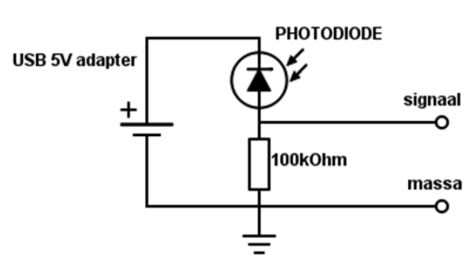

# Meten aan een IR-afstandbediening

Bij de start heb je een infrarood afstandbediening gekregen. Dan is de
batterij nog goed. Deze afstandbediening wordt gebruikt om een alarm op
afstand in- en uit te schakelen. Je kunt hem ook voor iets anders
gebruiken als je een geschikte ontvanger hebt. Daarvoor heb je de
frequentie nodig waarmee de IR-LED wordt gepulst. Deze frequentie kun je
met de oscilloscoop meten. De sensor die je voor de meting nodig hebt is
een fotodiode, een diode die gevoelig is voor infrarood licht.

Een CCD, de sensor in de camera voor van je mobiel, is ook gevoelig voor
infrarood licht. Handig om te weten, dan kun je even snel testen of de
IR-handzender het wel doet.

Open je camera van je mobiel en schijn met de handzender in de camera.
Welke kleur is het licht van de IR-LED als je deze met de camera
bekijkt?

```

```

## De sensor

De sensor om het IR-licht te ontvangen is een fotodiode. De eigenschap van een diode is dat hij
gevoelig is voor (IR-)licht.

De fotodiode is een soort diode waarvan de behuizing deels doorzichtig is. In evenredigheid met het invallende licht worden er electronen losgeslagen die een lekstroom veroorzaken. De stroom is dus (grosso modo) lineair evenredig met de hoeveelheid invallend licht.

### Meten van de frequentie



Bouw het bovenstaande schema na op het breadboard (de afgeplatte kant / het korte pootje van de diode is de kant waar de diode-pijl in het schema naar toe wijst). Meet als volgt tussen de klemmen "massa" en "signaal".

Stel de oscilloscoop in als volgt: **AC**,gevoeligheid op **+/- 500 mV**, tijdbasis op **10 µs/div** en de triggering op **Auto**.

Schijn met de zender in de ontvanger en probeer de pulsen zichtbaar te maken. Probeer het puls-beeld te “vangen”. Experimenteer met de triggering en het in- en uitschakelen van de scoop. Als je het beeld stil hebt (hiervoor zal je naar "single trigger" moeten) kun je de frequentie berekenen. 

Wat is de frequentie van de zender?

```

```
Stel de oscilloscoop in als volgt: **AC**,gevoeligheid op **+/- 500 mV**, tijdbasis op **20 ms/div** en de triggering op **single**.

Lees de volgende [https://www.digikey.nl/en/maker/tutorials/2021/understanding-the-basics-of-infrared-communications](https://www.digikey.nl/en/maker/tutorials/2021/understanding-the-basics-of-infrared-communications) website. 

Is dit een NEC protocol, RC5 of heel iets anders?

```

```


**Plaats het ingevulde meetrapport met de gemaakte schermafdrukken in de GitHub-repository van je team.**