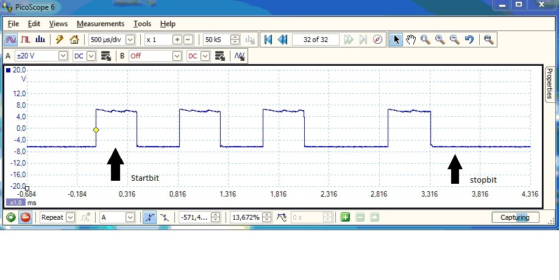

# Meten aan de seriële poort

In een practicum van het voorgaande blok heb je iets gedaan met de
seriële poort. Het bleef toen bij een afbeelding van het seriële signaal dat je moest onderzoeken. Bij dit practicum ga je het signaal met de oscilloscoop zelf meten en controleren of de instelling die je aan de seriële poort gegeven heb ook kloppen.

## Aansluiten en testen van de seriële poort

De eerste stap, voordat je gaat meten, is instellen en controleren of je
seriële karakters kunt versturen.

Sluit de seriële connector aan op de seriële poort van de computer (voor een meting op je laptop kun je gebruik maken van de meegeleverde USB-serieel-converter, [de driver staat hier](https://www.silabs.com/developers/usb-to-uart-bridge-vcp-drivers?tab=downloads).

Start het communicatieprogramma **PuTTY** op (je kunt installeren via de Microsoft Store). Stel de terminal in op: 9600 bits/sec, geen pariteit, 8 databits, 1 stopbit (9600,n,8,1). Kies voor flowcontrol: Geen/None.

Maak op het protobordje een verbinding tussen de **gele draad (of tx pin)** (daar
komen de bits uit) en de **groene draad (of rx pin)** (daar gaan de bits naar
binnen). De **blauwe draad (of gnd pin)** (de massa) wordt op de massa (=blauwe lijn) aangesloten.

Door de verbinding van de gele en de groene draad worden de karakters
die je op het toetsenbord intikt ook op het scherm geplaatst. Als je de
verbinding weer los maakt moet dat niet zo zijn. Test dat! (als het niet
werkt heb je een verkeerde com-poort gekozen)

Als je de USB-serieel-convertor gebuikt moet je bij apparaatbeheer kijken onder welke COM-poort deze is aangemeld. **Deze Com-poort moet je in PuTTY kunnen kiezen!**

## Interpretatie van een meting

### Meting vanuit een schermafdruk

Dit is een schermafdruk van een meting: 

.

Kijk in het plaatje naar instellingen van de oscilloscoop. Om de metingen juist te kunnen interpreteren doe je eerst een onderzoek van de afbeelding.

Bereken uit het plaatje ook de bitsnelheid (probeer voor de
bitsnelheid het aantal bits te delen op de tijd). Bepaal daarna het
betreffende karakter aan de hand van de bits via de ASCII-tabel. **LET OP: na het startbit komen EERST de minst significante bits (die je
RECHTop schrijft). Een “laag signaal” is een ”1”!**

Bitsnelheid: bits/seconde Het karakter (7 databits instelling, geen
pariteit) is:

### Meten met de oscilloscoop

Als de verbinding werkt kun je de oscilloscoop aansluiten en de ingetikte karakers zichtbaar maken. Voor het zichtbaar maken moet je even “spelen” met de instellingen van de oscilloscoop.

Sluit de massa van de oscilloscoop aan op de massa van de seriële poort (zwarte op blauw).

Sluit de signaaldraad van de oscilloscoop aan op de verbinding van de
gele en groene draad. De data wordt nu “afgetapt” en naar de
oscilloscoop gestuurd.

    Tip: het kan handig zijn om PuTTY op de ene computer of laptop te starten en op de andere de meting te doen. Het kan wel op één computer maar dan moet je schakelen tussen de actieve vensters.

**Stel PuTTY in met de uitgerekende gegevens van de afbeelding en controleer of je eigen meting klopt met het uitgerekende karakter.**

Wat is de spanning van het hoge - en het lage signaal?

U-hoog = + volt U-laag = - volt

Maak een schermafdruk van de meting.

Controleer of de PuTTY is ingesteld op **9600,n,8,1**. Geef
achter elkaar a,b,c,d,e,f,g,h in en onderzoek de verandering in de
eerste drie bits van je meting. Omdat de ASCII-tabel oplopende
coderingen gebruikt veranderen alleen de aangegeven bits.

**Hoe ziet de meting van de letter ‘w’ eruit?** Teken de afbeelding in
het onderstaande tekstvak en geef aan wat het startbit, de databits en
het de stopbit is. Maak een schermafdruk van de meting.

Bits (0/1) op volgorde:

**Plaats het ingevulde meetrapport met de gemaakte schermafdrukken in de GitHub-repository van je team.**
