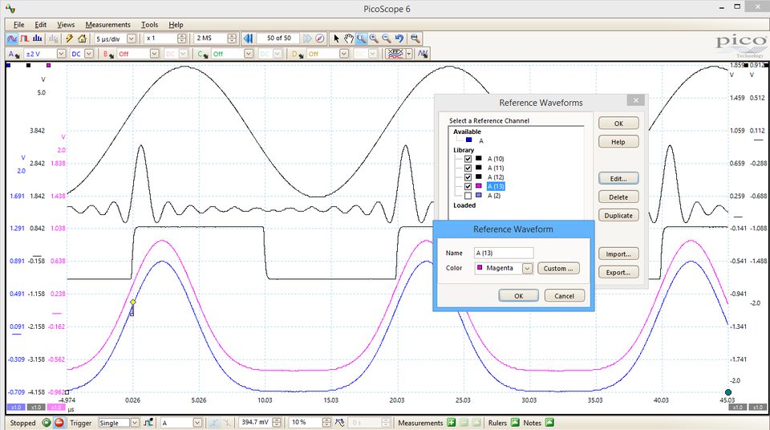
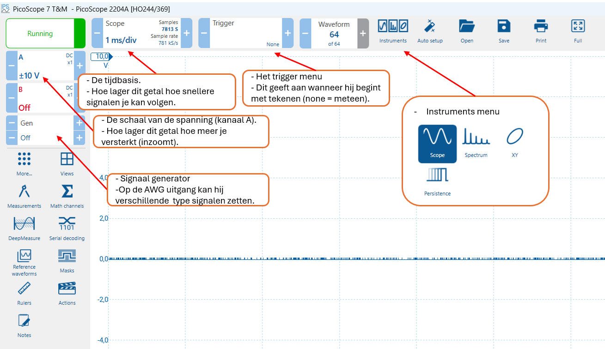
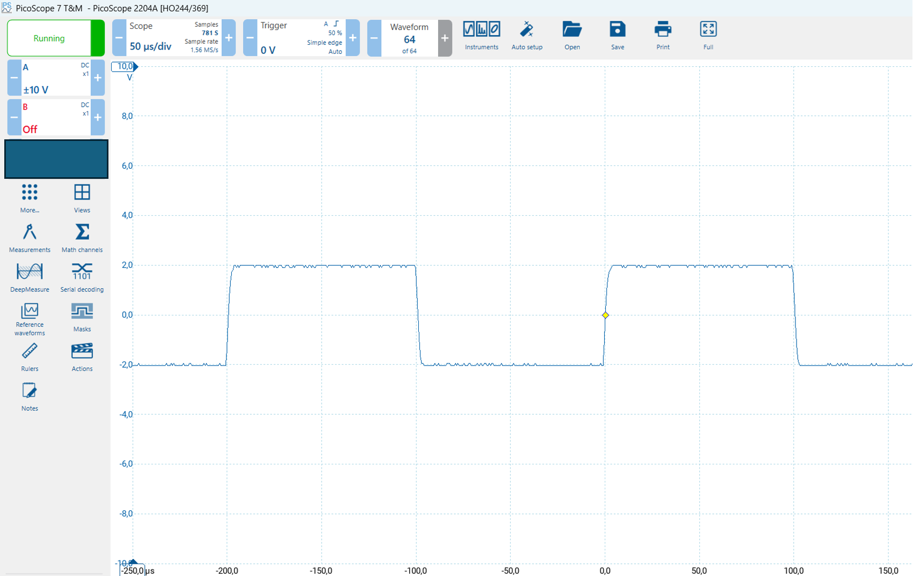
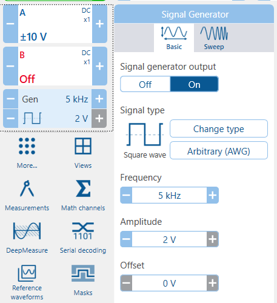
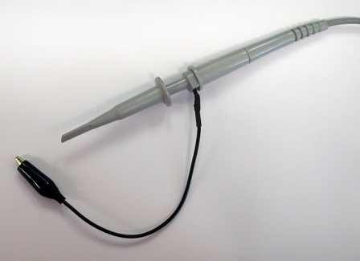
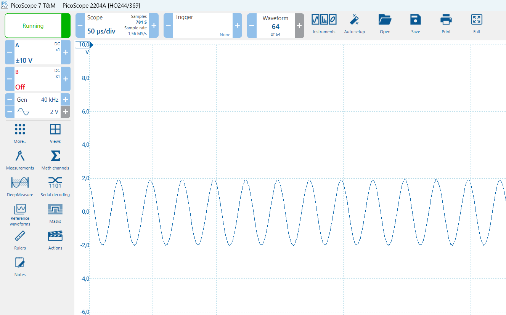
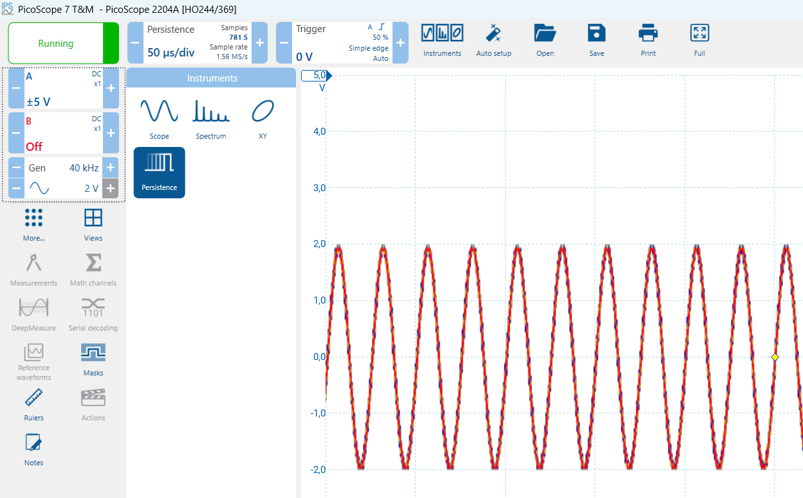
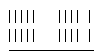

# Meetinstrument de oscilloscoop




# Introductie

Meten is weten! Elektrische signalen kun je niet zien en dat is vaak erg lastig. Je programmeert een outputpoort, maar hij doet het niet. Staat er wel het juiste signaal op? Wat is de frequentie van het kloksignaal dat je gebruikt voor je microcontroller? Je stuurt data serieel naar je modem, maar het lijkt alsof deze niets ontvangt. Wordt er wel een signaal verzonden en zijn de data in het signaal wel correct?

Allemaal vragen waar je het volgende antwoord op kunt geven: **maak het signaal zichtbaar**. Als je het kunt zien weet je wat er gebeurt en kun je conclusies trekken.

Voor het zichtbaar maken van spanningen en signalen gebruiken we
meetinstrumenten. Een belangrijk meetinstrument is een voltmeter.
Daarmee meet je alleen de actuele spanning op een gegeven punt.

Het wordt lastig als je wilt meten aan een wisselende spanning (analoog of digitaal). De informatie die je krijgt met een voltmeter zegt dan niet zoveel. In dit geval wil je het verloop van het signaal vastleggen en terug kunnen zien. Daar gebruik je een oscilloscoop voor, vaak kortweg scoop genaamd.

**Doel van dit practicum**

Na dit practicum ziet de wereld van signalen er anders uit. Onzichtbare signalen heb je zichtbaar gemaakt en dat geeft het gevoel van controle. Dat heb je nodig als je software maakt die signalen naar buiten stuurt, motoren aanstuurt of informatie leest.

Het is belangrijk dat je met een oscilloscoop kunt omgaan als je
programmeert voor technische systemen. Het zal in je verdere carrière regelmatig voorkomen dan je denkt “had ik maar een oscilloscoop, dan kan ik zien wat hier gebeurt”.

**Opzet van het practicum**

Dit practicum wordt uitgevoerd door een team studenten die samen de
proeven uitvoeren en samen dit meetrapport invullen. Bij het eerste deel van dit practicum doe je een onderzoek naar de hardware. Daarna maak je kennis met de software. Vervolgens ga je de oscilloscoop gebruiken voor een aantal interessante metingen.

**Benodigdheden voor dit practicum**

Voor het practicum krijg je een oscilloscoop uitgereikt. De oscilloscoop wordt aangesloten op de computer met een USB-kabel. De PC vormt samen met de hardware het meetinstrument. De software is daarbij een essentieel onderdeel en kun je voor je laptop (gratis) downloaden bij de fabrikant van de PicoScope.

Voor het aansluiten van de signalen op de scoop krijg je er **drie**
meetkabels bij. Deze kun je gemakkelijk aansluiten op het meegeleverde experimenteerbordje (ook wel protobordje of breadboard genoemd).

# Belangrijke opmerking:

**Dit practicum is een mix van informatie die met activiteiten wordt afgewisseld. Het is belangrijk dat je ALLE tekst leest! Daar win je tijd mee, de opdrachten zijn dan beter uit te voeren en je weet wat de achtergronden van de metingen zijn.**

# De hardware

## Doel van een oscilloscoop

De oscilloscoop is een universeel inzetbaar meetinstrument voor het
zichtbaar maken van elektrische signalen als functie van de tijd.
Hiermee kan snel een kwalitatieve en kwantitatieve indruk worden
verkregen van een elektrisch signaal. Uit het beeld is direct de
**periodetijd (frequentie) en de amplitude** af te lezen. Ook de
aanwezigheid van een gelijkspanningscomponent (samengesteld signaal) kan snel worden vastgesteld.

Het voordeel van de oscilloscoop ten opzichte van de volt- en
ampèremeter is dat deze vrijwel zonder vertraging werkt en de
spanningsvorm zichtbaar wordt. Het nadeel is dat de nauwkeurigheid van een oscilloscoop beperkter is dan bijvoorbeeld een eenvoudige
multimetermeter (een voltmeter, stroommeter en weerstandsmeter).

## De oscilloscoop in dit practicum

De scoop in dit practicum is een **PicoScope 2204** (momenteel niet meer in productie). Het is een moderne en goedkope digitale oscilloscoop die direct op de PC aangesloten kan worden.

Deze scoop beschikt over **2 kanalen** voor de input en tevens over een **signaalgenerator**. Hiermee kan je een test-meetsignaal genereren (bijvoorbeeld een sinus of een blokgolf). Het is ook mogelijk om een geheel eigen signaal te maken.

Zie de volgende tabel om een idee te krijgen van de prijs en
specificaties van deze oscilloscoop:

### PicoScope 2204

| Product | Channels | Bandwidth | Sampling Rate | Buffer Memory | Resolution | Price |
| --- | --- | --- | --- | --- | --- | --- |
| [PicoScope 2204](https://www.picotech.com/oscilloscope/2000/picoscope-2000-specifications) | 2 + AWG | 10 MHz | 100 MS/s | 8 kS | 8 bits (12 bits) | €119.00 |

De fabrikant PicoTech heeft zich gespecialiseerd in het maken van
PC-oscilloscopen. Ze verkoopt oscilloscopen uit het basissegment tot zeer geavanceerde meetinstrumenten. Het type 2204 is de middelste uitvoering van de basisreeks.

Zoek de specificaties van de **2200 serie** op en onderzoek wat de
verschillen zijn van de 2204 ten opzichte van de **2205 en 2206**:

```
ruimte om je antwoord te noteren
```

Een belangrijk gegeven van een oscilloscoop is de **bandbreedte**. De bandbreedte is een maat voor de frequentie van het signaal dat de oscilloscoop kan meten (niet te verwarren met de frequentie waarmee de oscilloscoop meet, die moet veel hoger zijn.) De prijs van het apparaat is daar sterk van afhankelijk.

Onderzoek wat de bandbreedte is van de PicoScope 2205 en wat de
meerprijs is ten opzichte van de PicoScope 2204:

```

```

Wat is de maximale spanning die je op de ingangen mag plaatsen?

```

```

Waarom is het heel handig als je **twee** ingangskanalen hebt om te
kunnen meten?

```

```

# De software

De applicatie die gebruikt wordt is PicoScope 7 (huidige versie is 7.1.3). Dit programma laat live het signaal zien dat je aangesloten hebt. Alle instellingen die je doet gaan via de software, er zijn geen hardware-instellingen mogelijk.

Interessant om te weten is dat je ook een eigen applicatie kunt maken die gebruik maakt van de PicoScope. Zo kun je de hardware gebruiken om een speciaal meetsysteem voor een bepaalde toepassing te ontwerpen en te programmeren. Denk hierbij bijvoorbeeld aan een speciale toepassing in de medische sector of een meet- en regelsysteem.

Download de software (Full Version) **PicoScope 7** bij de fabrikant van de oscilloscoop:

<https://www.picotech.com/downloads> 

Kies voor Windows of Mac de laatste stabiele versie en installeer de software op je
laptop. Verken de software.

In de onderstaande schermafdruk zie je een overzicht van enkele
belangrijke knoppen in de software:




Aangezien het een digitale oscilloscoop is wordt het (analoge)
ingangssignaal gesampled. Dit betekent dat op verschillende momenten wordt bekeken wat de spanning is. Hoe meer samples, hoe exacter de weergave van je signaal.

Met hoeveel **samples per seconde** digitaliseert de **2204** het
signaal?

```

```

Het is ook mogelijk een weergave op te slaan. Op deze manier kan je
later de resultaten bekijken van je meting. Met het programma PicoScope is het dus ook mogelijk metingen later terug te kijken en te analyseren zonder dat je de scoop zelf nog nodig hebt. Zoek op wat voor "metingen" je kan verrichten op een signaal en wat deze betekenen. Kies drie mogelijkheden en beschrijf deze.

1:

2:

3:

Bij de volgende schermafdruk is aan de ingang een blokgolf aangeboden.



Figure : PicoScope 6

Kijk goed naar de instellingen van de oscilloscoop. Links op de Y-as staat de signaalsterkte in Volt. Op de horizontale as, de X-as staat de tijd in microseconden. Bespreek met elkaar hoe je de amplitude en frequentie van deze blokgolf berekent. Wat is de (uitgerekende) frequentie van het signaal?

Sterkte van het signaal in Volt:

Tijd die één periode duurt (vergroot het plaatje om beter af te kunnen lezen):

Berekende frequentie:

```

```

## Signaalgenerator

De PicoScope 2204 is niet alleen een oscilloscoop maar heeft ook een **signaalgenerator**. Deze kan ook via het progamma ingesteld worden om signalen te genereren.

Het volgende plaatje geeft het menu van de signaalgenerator. Zoek de generator op in het menu:



Figure : de signaalgenerator

Onderzoek de instellingen. Welke **type** golfvormen kan je genereren vanuit de signaalgenerator?

```

```

In de keuze voor het type signaal is er ook het type “arbitrary” zoek uit wat je hiermee kan doen en geef dit aan in het volgende tekstvak:

```

```

## Bekijken van een signaal

Voor het bekijken van een signaal wordt over het algemeen een probe
gebruikt. Een probe is een speciale meetpen en heeft een hoge
ingangsimpedantie (ingangsweerstand). Daarmee wordt het signaal minimaal belast en vervormd.

Hier is een plaatje van een probe en de oscilloscoop zelf:




Met deze probe kan je makkelijk kleine componenten of aansluitingen
aanstippen om het signaal te bekijken. Voor metingen aan hoge
frequenties is het gebruik een probe wel belangrijk, voor dit practicum gebruiken we gewone aansluitingen, goed genoeg voor wat eenvoudige experimenten.

**Opdracht: metingen met de oscilloscoop**

Bij deze opdracht ga je een meting uitvoeren waarbij het signaal van de
signaalgenerator wordt aangesloten op de meetingang A. Het signaal dat
je zelf genereert wordt dus het meetsignaal.

Sluit een probe aan op **channel A** op de PicoScope (draai de connector een kwart slag om vast te zetten). Controleer dat de schakelaar op de probe op de stand "1x" staat.
Sluit een tweede kabel aan op de **Signaal OUT**.

Als je met je vingers de rode draad van de ingang A vastpakt moet het
signaal op je scherm groter worden. Je lichaam is een antenne voor
signalen en die worden zichtbaar gemaakt. Het sterkste “lichaamssignaal”
is een signaal van 50 Hertz. Dat is het (brom)signaal dat je draadloos
ontvangt van de draden van het elektriciteitsnet die overal om ons heen
aanwezig zijn.

Prik op het experimenteerbordje de twee zwarte draden (de massa of “min”
aansluiting) zo dat ze met elkaar verbinding maken. Sluit ook de beide
rode draden via het experimenteerbordje aan op elkaar.

Wanneer je dit goed hebt gedaan kan je een signaal gaan meten. Stel de
PicoScope in op een **sinusvorm van 40kHz in met een amplitude van 2V**
en zet deze aan. Als het goed is zie je nu het volgende:


De kans is heel groot dat het signaal niet stilstaat. Dat komt omdat het
een continu-meting is en dat het periodieke signaal heel vaak op het
scherm wordt getekend. Als je dat niet iedere keer op dezelfde plaats
doet krijg je een “lopend” beeld. Het is dan amper af te lezen. Dit kan
je oplossen door het signaal te triggeren.

**Triggeren**

Triggeren houdt in dat je het **meetsignaal** op zo'n manier weergeeft
dat het op het scherm **stilstaat**. Je zou bijvoorbeeld kunnen
triggeren (= starten met schrijven op het scherm) als het signaal “door
de nul-lijn omhoog gaat”, of iedere keer als het de hoogste waarde heeft
bereikt.

Belangrijk bij het triggeren is dat het “schrijven” naar het scherm
consequent op hetzelfde moment start en dus alle afbeeldingen netjes
over elkaar worden geschreven.

Zoek uit welke vormen van triggeren je kan doen met de scoop en
beschrijf het verschil tussen de vier verschillende soorten is (zie
hiervoor de helpfunctie):

1:

2:

3:

4:

De software van de oscilloscoop kent drie “basis”-metingen. Dat zijn de
drie modes die je bovenin links met iconen kunt kiezen: de Scope Mode,
de Persistence Mode en de Spectrum Mode.

Normaal gesproken gebruik je de Scope Mode waarmee je een signaal
bekijkt. Met de Spectrum Mode kun je zien welke frequenties er in het
meetsignaal aanwezig zijn. Er is echter ook een erg belangrijke en
handige mode, de Persistence Mode:




Zoek in de helpfile op wat deze mode doet en bedenk waarvoor een
Persistence Mode gebruikt zou kunnen worden. Vul dat in het volgende vak
in:

```

```

**Verkennen van de software**

Nu je de basismetingen onder de knie hebt, is het tijd om wat verder de
software in te duiken. De resterende tijd van het practicum ga je aan de
slag met de helpfuntie van de software. Daar wordt gedegen uitgelegd hoe
deze werkt.

**Opdracht**

Ga naar menukeuze “Help” en kies “User’s Guide…”. Kies **PicoScope and
oscilloscope primer** -\> **PicoScope basics** en doorloop kort alle
helpfunties.

Interessant voor onderzoek op een databus is de “**serial decoding**”.

Voor welke **veldbus** is het protocol al aanwezig?

```

```

Nu je een idee hebt hoe de scope werkt zou je een aantal toepassingen
kunnen bedenken voor het gebruik van de scoop. Bedenk een 3 aantal
toepassingen die je de komende jaren in je studie zou kunnen gebruiken:

```

```

**Samenvatting**

Met dit practicum heb je nu kennis gemaakt met de oscilloscoop. Een
belangrijk apparaat voor het vervolg van je studie Technische
Informatica. Voor de themaopdracht kun je hem lenen. Als je wat meer
geïnteresseerd bent in de hardware kun je hem ook zelf aanschaffen. De
prijs is te overzien.

Het vervolg van het practicum met de oscilloscoop is leuker. Dan doe je
verschillende metingen waar je de oscilloscoop bij gebruikt. Je maakt
dan bijvoorbeeld de bits over de seriële poort zichtbaar. Daarom moet je
iets weten van de hardware en je weg kunnen vinden in de software.

# Introductie

Meten is weten! Na de kennismaking met de oscilloscoop is het nu tijd om
te gaan meten. Welke problemen kun je als TI-er later in de praktijk
tegenkomen waarbij het noodzakelijk is om een meting te doen? We hebben
wat rondgekeken en erover nagedacht. Als TI-er zal je niet snel in de
productontwikkeling van hardware terechtkomen. Dat is het domein van de
elektronicus. **We vinden dat een TI-er sterk moet zijn in het koppelen
van sensoren aan elektronische modules en het koppelen van modules aan
elkaar.** Het zwaartepunt zal daarbij zeker bij de software liggen. Toch
moet een TI-er niet bang zijn voor de hardware en gevoel ontwikkelen om
hardware aan elkaar te koppelen. Daarbij zijn drie zaken belangrijk, de
voeding van de module / sensor, de interface tussen de modules en de
sensoren en, zeer belangrijk, ontstoring.

**Doel van dit practicum**

Het doel van dit deel van het practicum is om vaardigheid op te doen met
het meten aan een component door middel van een oscilloscoop. Je gaat
metingen doen waarbij je de metingen op een juiste manier moet
interpreteren. Een oscilloscoop maakt signalen zichtbaar om daarmee
conclusies te kunnen trekken over het signaal. Daarbij is het ook
mogelijk om aan de signalen te meten.

Bij dit practicum zet je metingen op met het volgende doel:

- Een meting aan een voedingsadapter die gevoed wordt door het
  lichtnet (wisselspanning) en een <u>gelijk</u>spanning aan de
  uitgang geeft. Met de meting onderzoek je hoe “mooi” de
  gelijkspanning op de uitgang is.
- Een meting aan een infrarood-afstandbediening. Hiervan willen we de
  frequentie van de pulsen weten om een geschikte ontvanger te kunnen
  kiezen.
- Een meting aan het signaal van de seriële poort. Hiermee maak je het
  digitale signaal zichtbaar om daarmee de start-, stop- en databit(s)
  te beoordelen en de bitsnelheid te meten.
- Een meting aan een laagdoorlaat filter. Zo’n filter wordt gebruikt
  om stoorsignalen met een hoge frequentie tegen te houden.

**Opzet van het practicum**

Dit practicum wordt uitgevoerd door een team studenten die samen de
proeven uitvoeren en ook samen dit meetrapport invullen. Het is
belangrijk dat alle teamleden alle (voorgaande) tekst doorlezen.

Van het resultaat van verschillende metingen wordt een schermafdruk
gemaakt.

**Zorg ervoor dat iedere schermafdruk wordt voorzien van een naam, zodat
duidelijk is bij welk onderdeel van het practicum de afdruk behoort!**

**Benodigdheden voor het practicum**

Bij dit practicum heb je een oscilloscoop tot je beschikking. De
oscilloscoop wordt aangesloten op de computer met een USB-kabel. De PC
vormt samen met de hardware het meetinstrument.

Controleer of je het volgende hebt gekregen:

- PicoScope 2204 met witte USB-kabel
- **<u>Drie</u>** aansluitkabels met een BNC-connector
- Een protobordje
- Een afstandbediening
- Een stekkervoeding 5 volt, 1,2A (met aansluitconnector voor
  aansluiting op het protobordje)
- Een USB-kabel met een USB- naar serieel converter
- Een aansluitstekker voor de seriële poort (met een groene, gele en
  blauwe draad)
- Een aantal elektronische onderdelen (zijn op het protobordje
  geprikt):
  - Een filter met een condensator (100 nF, geel van kleur) en
    weerstand 1K (bruin,zwart,rood)
  - Een infraroodsensor met fotodiode (zwart vierkantje) en
    weerstand 1K (bruin,zwart,rood)

Zijn deze onderdelen aanwezig?

```

```

Het protobordje heeft interne geleidingsbanen die als volgt lopen:

# Een meting aan de stekkervoeding

De voeding is een belangrijk onderdeel van een systeem. Fabrikanten
besteden daar veel aandacht aan. In de eerste plaats moet een juiste
spanning gekozen worden. Daarbij hoort ook een keuze voor het maximaal
geleverde vermogen. Ook is het belangrijk of het een wisselspanning of
een gelijkspanning moet zijn. Praktisch gezien zijn alle voedingen voor
een elektronisch apparaat gelijkspanningsvoedingen. Heel soms zit de
gelijkrichter in het apparaat zelf en levert de voeding een eenvoudige
wisselspanning af.

Ook voor de kwaliteit van een voeding moet een keuze worden gemaakt. De
vraag is natuurlijk wat de kwaliteit van een voeding is. Welke
eigenschappen van een voeding zijn belangrijk voor een gegeven
toepassing?

```

```

Voor een voeding die een gelijkspanning levert kun je denken aan de
volgende gegevens:

- nauwkeurigheid van de geleverde spanning
- zuiverheid van de geleverde gelijkspanning
- (spannings)gedrag bij zware belasting
- efficiëntie van de spanningsomzetting en warmteontwikkeling
- verbruik bij nullast (als er geen vermogen wordt afgenomen)
- gedrag bij kortsluiting
- mate van storingsgevoeligheid (b.v. het doorgeven van storingen van
  het lichtnet)
- welke eigenschap voor een voeding kun je zelf nog bedenken?

**Wat is een spanningsbron**

De eigenschap van een “ideale” spanningsbron is het leveren van de
juiste spanning bij iedere willekeurige belasting. Bij iedere belasting
levert de voeding exact de juiste (bijbehorende) stroom. De spanning is
dus vast en de stroom wordt door de voeding automatisch ingesteld. Bij
grote (of zware) belasting levert de voeding ook een grote stroom. Een
spanningsbron mag niet worden kortgesloten, dan gaat er (theoretisch)
een oneindig grote stroom lopen. Hoe komt dat? Tip, verklaar dit aan de
hand van de wet van Ohm.

**Meting van de rimpelspanning**

De zuiverheid van de uitgangsspanning geeft aan hoe “mooi” de
gelijkspanning is. Een batterij heeft een ideale strakke gelijkspanning
(bij een constante belasting). Bij de spanning van de stekkervoeding is
het anders. Onze stekkervoeding wordt gevoed vanuit het lichtnet en
heeft een omzetter (gelijkrichter) die van de wisselspanning een
gelijkspanning maakt. Die omzetting wordt zo goed mogelijk uitgevoerd
maar het is lastig om er een perfecte gelijkspanning van te maken.

Afhankelijk van de kwaliteit van de voeding is er een “rimpel” op de
uitgangspanning aanwezig. Het is belangrijk om te weten hoe groot deze
rimpel is. Ook is het belangrijk om te weten of het apparaat dat gevoed
wordt daar tegen kan. Bij de volgende meting ga je de “rimpel” van de
stekkervoeding meten.

Sluit **kanaal A** van de oscilloscoop aan op de voeding (rood op rood
en zwart op blauw). De oscilloscoop moet ingesteld worden op **AC**
(wisselspanning). Bij de keuze gelijkspanning (**DC**) is de rimpel niet
zichtbaar omdat deze klein is ten opzichte van de 5 volt die de voeding
geeft.

Kies bij “channel options” (button naast de DC/AC keuze) voor een
resolutie van **8 bits**. Kies voor de gevoeligheid een **+/-100 mV**.
Kies voor de tijdbasis **2 ms/div**. en triggermode op **Auto**.

Het blijkt dat de stekkervoeding (met een prijs van minder dan 10 Euro)
een heel goede gelijkspanning afgeeft. De rimpel op de gelijkspanning is
nog net te meten.

Hoe groot is de rimpel **maximaal** (dus inclusief de grootste pieken)?
Meet in de persistence-mode voor een aantal seconden lang.

Geef het antwoord van **top tot top** (Vtt) in millivolt. Dat is dus de
spanning boven de nullijn plus de spanning onder de nullijn (schat de
waarde als het beeld niet goed stil staat):

```
Vtt-rimpel =    mV (maak een schermafdruk van de meting)
```

Kijk in de specificatie van de voeding [stekkervoeding type 10818](./stekkervoeding-type-510818-5V-6W.pdf). Welke
informatie is er gegeven over de grootte van de rimpel? Reken de grootte
om naar mV:

```
Grootte rimpelspanning in mV: 
```

**Meten aan een IR-afstandbediening**

Bij de start heb je een infrarood afstandbediening gekregen. Controleer
even of de rode LED brandt als je op het knopje drukt. Dan is de
batterij nog goed. Deze afstandbediening wordt gebruikt om een alarm op
afstand in- en uit te schakelen. Je kunt hem ook voor iets anders
gebruiken als je een geschikte ontvanger hebt. Daarvoor heb je de
frequentie nodig waarmee de IR-LED wordt gepulst. Deze frequentie kun je
met de oscilloscoop meten. De sensor die je voor de meting nodig hebt is
een fotodiode, een diode die gevoelig is voor infrarood licht.

Een CCD, de sensor in de camera voor van je mobiel, is ook gevoelig voor
infrarood licht. Handig om te weten, dan kun je even snel testen of de
IR-handzender (of je afstandbediening thuis) het wel doet.

Open je camera van je mobiel en schijn met de handzender in de camera.
Welke kleur is het licht van de IR-LED als je deze met de camera
bekijkt?

```

```

**De sensor**

De sensor om het IR-licht te ontvangen is een fotodiode (zwart vierkant
blokje van 4 bij 4 millimeter). De eigenschap van een diode is dat hij
gevoelig is voor (IR-)licht.

De lichtgevoelige kant is de bovenkant (dat is niet vanzelfsprekend).
Een diode is naast IR ook gevoelig voor zichtbaar licht. Daarom is een
filter aangebracht dat zichtbaar licht zo goed mogelijk tegenhoudt maar
infrarood licht doorlaat.

De fotodiode is een soort diode waarvan de behuizing deels doorzichtig is. In evenredigheid met het invallende licht worden er electronen losgeslagen die een lekstroom veroorzaken. De stroom is dus (grosso modo) lineair evenredig met de hoeveelheid invallend licht.

**Meten van de frequentie**


Bouw het bovenstaande schema na op het breadboard (de afgeplatte kant / het korte pootje van de diode is de kant waar de diode-pijl in het schema naar toe wijst). Meet als volgt tussen de klemmen "massa" en "signaal".

Stel de oscilloscoop in als volgt: **AC**, resolutie op **8** bit,
gevoeligheid op **+/- 200 mV**, tijdbasis op **10 µs/div** en de
triggering op **Auto**.

Schijn met de zender in de ontvanger en probeer de pulsen zichtbaar te
maken. Probeer het puls-beeld te “vangen”. Experimenteer met de
triggering en het in- en uitschakelen van de scoop (links onderin de
start- en stop button). Als je het beeld stil hebt kun je de frequentie
berekenen. Schuif de twee meetlinealen (links-onderin een klein
vierkantje dat je kunt verplaatsen) naar de **start** en het **einde**
van een puls en kies frequentiemeting (kun je vinden in de onderbalk,
rechts van het midden, een groen plusje). Wat is de frequentie van de
zender?

```

```

**Meten aan de seriële poort**

In een practicum van het voorgaande blok heb je iets gedaan met de
seriële poort. Het bleef toen bij een afbeelding van het seriële signaal dat je moest onderzoeken. Bij dit practicum ga je het signaal met de oscilloscoop zelf meten en controleren of de instelling die je aan de seriële poort gegeven heb ook kloppen.

**Aansluiten en testen van de seriële poort**

De eerste stap, voordat je gaat meten, is instellen en controleren of je
seriële karakters kunt versturen.

Sluit de seriële connector aan op de seriële poort van de computer (voor een meting op je laptop kun je gebruik maken van de meegeleverde USB-serieel-converter, [de driver staat hier](https://www.silabs.com/developers/usb-to-uart-bridge-vcp-drivers?tab=downloads).

Start het communicatieprogramma **PuTTY** op (je kunt installeren via de Microsoft Store). Stel de terminal
in op: 9600 bits/sec, geen pariteit, 8 databits, 1 stopbit (9600,n,8,1).
Kies voor flowcontrol: Geen/None.

Maak op het protobordje een verbinding tussen de **gele draad (of tx pin)** (daar
komen de bits uit) en de **groene draad (of rx pin)** (daar gaan de bits naar
binnen). De **blauwe draad (of gnd pin)** (de massa) wordt op de massa (=blauwe lijn)
aangesloten.

Door de verbinding van de gele en de groene draad worden de karakters
die je op het toetsenbord intikt ook op het scherm geplaatst. Als je de
verbinding weer los maakt moet dat niet zo zijn. Test dat! (als het niet
werkt heb je een verkeerde com-poort gekozen)

Als je de USB-serieel-convertor gebuikt moet je bij apparaatbeheer
kijken onder welke COM-poort deze is aangemeld. **Deze Com-poort moet je
in PuTTY kunnen kiezen!**

**Interpretatie van een meting**

**Meting vanuit een schermafdruk**

Dit is een schermafdruk van een meting: [Serieel.jpg](./serieel.jpg).
Kijk in het plaatje naar instellingen van de oscilloscoop. Om de
metingen juist te kunnen interpreteren doe je eerst een onderzoek van de
afbeelding.

Bereken uit het plaatje ook de bitsnelheid (probeer voor de
bitsnelheid het aantal bits te delen op de tijd). Bepaal daarna het
betreffende karakter aan de hand van de bits via de ASCII-tabel. **LET OP: na het startbit komen EERST de minst significante bits (die je
RECHTop schrijft). Een “laag signaal” is een ”1”!**

Bitsnelheid: bits/seconde Het karakter (7 databits instelling, geen
pariteit) is:

**Meten met de oscilloscoop**

Als de verbinding werkt kun je de oscilloscoop aansluiten en de
ingetikte karakers zichtbaar maken. Voor het zichtbaar maken moet je
even “spelen” met de instellingen van de oscilloscoop.

Sluit de massa van de oscilloscoop aan op de massa van de seriële poort
(zwarte op blauw).

Sluit de signaaldraad van de oscilloscoop aan op de verbinding van de
gele en groene draad. De data wordt nu “afgetapt” en naar de
oscilloscoop gestuurd.

Tip: het kan handig zijn om PuTTY op de ene computer of laptop
te starten en op de andere de meting te doen. Het kan wel op één
computer maar dan moet je schakelen tussen de actieve vensters.

**Stel PuTTY in met de uitgerekende gegevens van serieel.jpg en
controleer of je eigen meting klopt met het uitgerekende karakter.**

Wat is de spanning van het hoge - en het lage signaal?

U-hoog = + volt U-laag = - volt

Maak een schermafdruk van de meting.

Controleer of de PuTTY is ingesteld op **9600,n,8,1**. Geef
achter elkaar a,b,c,d,e,f,g,h in en onderzoek de verandering in de
eerste drie bits van je meting. Omdat de ASCII-tabel oplopende
coderingen gebruikt veranderen alleen de aangegeven bits.

**Hoe ziet de meting van de letter ‘w’ eruit?** Teken de afbeelding in
het onderstaande tekstvak en geef aan wat het startbit, de databits en
het de stopbit is. Maak een schermafdruk van de meting.

Bits (0/1) op volgorde:

**Meten aan een filter**

Als er een dataverbinding van de ene module naar de andere module loopt
is het niet denkbeeldig dat de verbindingsdraden storingen oppikken. Er
zijn altijd stoorsignalen in de buurt, mensen die aan het bellen zijn,
apparatuur die storingen de ether in sturen, enzovoort. Als de
stoorsignalen bestaan uit hoge frequenties kunnen deze tegengehouden
worden met een filter dat alleen lage frequenties doorlaat. Bij het
volgende onderdeel ga je die maken en er aan meten.

Een condensator is voor wisselspanning een weerstand die afhankelijk is
van de frequentie. Als je deze “frequentie-afhankelijke weerstand” in
een spanningsdeling plaatst met een “gewone” weerstand heb je een
filter. Lage frequenties worden doorgelaten, hoge frequenties
(storingen) worden gedempt (= minder goed doorgelaten).

**Het filter**

Het laagdoorlaatfilter bestaat uit twee componenten, een weerstand en
een gele condensator die op het protobordje zijn aangebracht. Vergis je
bij het aansluiten niet in de plaats van de weerstand en de condensator,
dan maak je een hoogdoorlaatfilter.


**Aansluiten van de meetdraden voor de meting**

Sluit die volgens het bovenstaande volgende schema aan.

Sluit de **drie** meetkabels aan op de PicoScope. Voor de **meting**
maak je gebruik van de **toongenerator/signaalgenerator** van de
**PicoScope** (uitgang op de PicoScope naast de A en de B).

Dit bronsignaal wordt (op het protobordje) op kanaal **A** van de
oscilloscoop aangesloten. Het signaal wordt ook op de weerstand
(=ingang) van het laagdoorlaatfilter aangesloten. De uitgang van het
filter (= knooppunt van weerstand en gele condensator) gaat naar kanaal
**B** van de oscilloscoop. Zo zie je het originele toonsignaal op A en
het gefilterde signaal op B.

Anders gezegd is de aansluiting als volgt: Kanaal A wordt **direct** op
de toongenerator aangesloten (geeft een beeld van de sinus), op kanaal B
wordt het gefilterde signaal aangesloten. Zo kun je het beeld op kanaal
A en B direct met elkaar vergelijken.

**Meten van de kantelfrequentie**

De frequentie waarbij het filter nog de helft van het signaal doorlaat
wordt de kantelfrequentie (-3dB punt) genoemd. Als je de frequentie van
het ingangssignaal hoger maakt zal de amplitude van het signaal aan de
uitgang op kanaal B afnemen. Dat gebeurt niet abrupt maar is een
geleidelijk traject.

Stel de frequentie van de toongenerator in op een **Sinus**, frequentie
**100 Hertz**, amplitude van **1V**.

Stel de oscilloscoop (voor beide kanalen **A en B**) in op **DC**,
resolutie voor beide kanalen op 8 bit, gevoeligheid op **+/- 1 V**,
tijdbasis op **1 ms/div** en de triggering op **Auto**.

Als het goed is kun je nu de blauwe lijn van kanaal A en de rode lijn
van kanaal B zien. Verhoog langzaam de frequentie (tot 10 KHz) en kijk
naar de rode sinus. Bij welke frequentie is het signaal op de uitgang
van het filter (kanaal B) nog de helft van het oorspronkelijke signaal?
Maak een schermafdruk van de meting.

**Plaats het ingevulde meetrapport met de gemaakte schermafdrukken in de
GitHub-repository van je team.**
