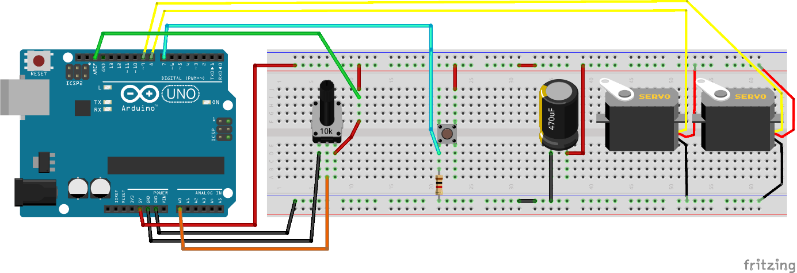
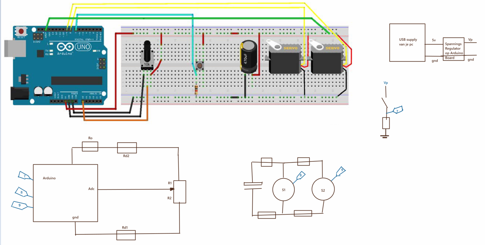
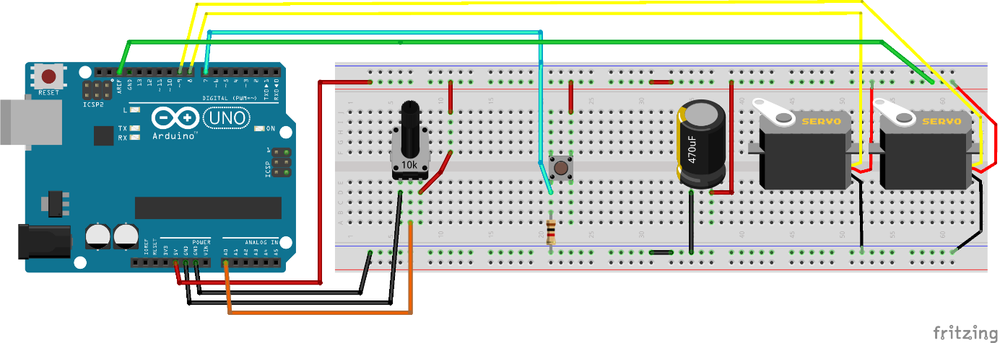
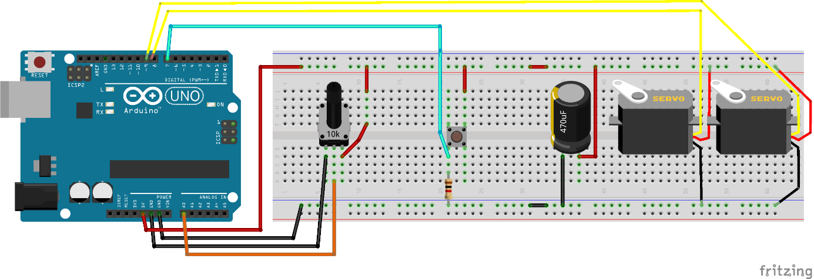
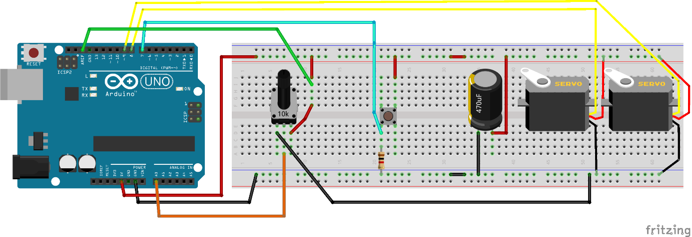
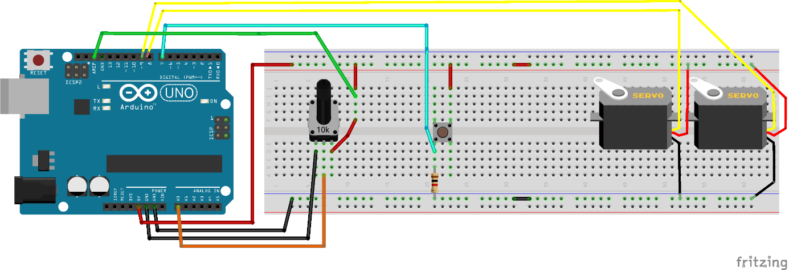
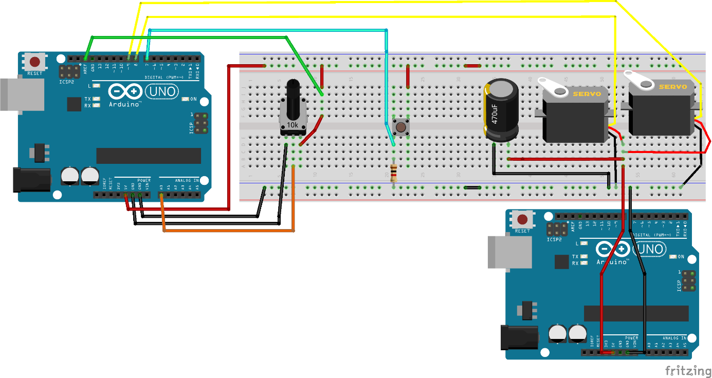
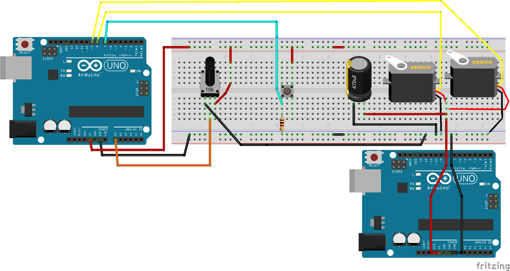

# Inleiding

Als je dingen aanstuurt of meet, wil je meestal niet dat die dingen
elkaar beinvloeden.  
Als je robotarm bijvoorbeeld omhoog moet bewegen, wil je niet dat hij
soms horizontaal gaat trillen.  
Bij dit practicum gaan we ervaring opdoen met de mogelijke oorzaken van
zo’n naar bijverschijnsel.

Als testcase gaan we twee servos aansturen. Van de eerste servo is de
hoek in te stellen met een potentiometer. De tweede servo kunnen we met
een knop naar de ene of de andere kant laten sweepen. Als we de
potentiometer met rust laten mag de eerste servo idealiter niet gaan
bewegen als we met de knop de sweep van de tweede servo activeren.

Voor de experimenten in dit practicum is het belangrijk om de
aansluitdraden op ongeveer dezelfde plekken in het breadboard en de
arduino te prikken. Het kan dus bijvoorbeeld ook uit maken waar in de
voedingsrail of groundrail je een draad prikt.

## Benodigdheden:

- Een Arduino en een breadboard
- Een 10k (of zo) potentiometer
- Een weerstand (1k tot 50k of zo)
- Een elco (470uF of zo)
- Twee kleine servos
- Een tweede 5V voeding (zoals bijvoorbeeld een tweede Arduino)

# Een “goede start”



Probeer bovenstaande fritzing schema na te bouwen en upload de Arduino sketch uit de appendix naar je Arduino via de Arduino IDE.
Je kunt ook deze link gebruiken: [Talking_Servos.ino](./Talking_Servos.ino)

Onderstaand is dezelfde fritzing nog eens weergegeven, maar nu met wat electrische schemas erbij (Rd staat voor "draadweerstand"):

Merk op dat fritzing-diagrammen het nabouwen makkelijker maken, maar dat electrische schema's duidelijker weergeven wat er aan de hand is.

Controleer vervolgens dat het werkt:

- Dat je met de potentiometer de eerste servo in elke mogelijke hoek
  kunt zetten.
- Dat je met de drukknop de tweede servo kunt laten sweepen.
- Dat de eerste servo tijdens dat sweepen netjes op zijn plaats blijft
  (niet gaat trillen)

# Experiment 1 : Aref verleggen

Ga uit van het schema van de “goede start”, maar sluit Aref op een ander
punt aan:



Vermoedelijk zal nu in sommige standen van de potentiometer (niet op,
maar in de buurt van de extreme hoeken) de eerste servo (licht) gaan
trillen tijdens het bedienen van de sweep-knop van de tweede servo.
Controleer dat.

**Vraag 1: Verklaar hoe dat komt.**

# Experiment 2 : Aref loshalen

Ga uit van het schema van de “goede start”, maar haal dit keer Aref
geheel los.



Vermoedelijk zal nu in sommige standen van de potentiometer (niet op,
maar in de buurt van de extreme hoeken) de eerste servo (licht) gaan
trillen tijdens het bedienen van de sweep-knop van de tweede servo.
Controleer dat.

**Vraag 2: Verklaar hoe dat komt.**

# Experiment 3 : Potmeter ground verleggen

Herstel het schema van de “goede start” weer (Aref weer op de oude plek
aansluiten), maar verleg nu de ground van de potmeter:



Vermoedelijk zal nu in sommige standen van de potentiometer (niet op,
maar in de buurt van de extreme hoeken) de eerste servo (licht) ook in
deze situatie gaan trillen tijdens het bedienen van de sweep-knop van de
tweede servo. Controleer dat.

**Vraag 3: Verklaar hoe dat komt.**

# Experiment 4 : Elco weglaten

Herstel het schema van de “goede start” weer (grounds weer op de oude
plek aansluiten), maar verwijder nu de elco:



Vermoedelijk zal nu in sommige standen van de potentiometer (niet op,
maar in de buurt van de extreme hoeken) de eerste servo (licht) ook in
deze situatie gaan trillen tijdens het bedienen van de sweep-knop van de
tweede servo. Controleer dat.

**Vraag 4: Verklaar hoe dat komt.**

# Experiment 5 : Tweede voeding gebruiken

Zet nu de elco weer terug, en voed de servos als onderstaand uit een
tweede voeding. Bijvoorbeeld een tweede Arduino (die kan evt aan een
andere laptop hangen):



Controleer dat het nog steeds goed (zonder trillen) werkt.

**Vraag 5: Wat is het voordeel van het toevoegen van (een of meer)
voedingen?**

# Experiment 6 : Tweede voeding gebruiken – met Aref losgehaald en verlegde ground

Nu gaan we zowel Aref loshalen als ground verleggen (op dezelfde manier
als tevoren).



**Vraag 6a: Welk resultaat verwacht je als je weer gaat controleren of
de eerste servo in bepaalde standen gaat trillen als je het sweep effect
van de tweede servo activeert?  
**Controleer of dat klopt.

**Vraag 6b: Welk resultaat nam je waar?  
Vraag 6c: Verklaar hoe dat komt.**

# Experiment 7: Software aanpassing

Sluit de zaak aan op een manier waarbij de servo’s elkaar zo veel
mogelijk beinvloeden.  
Bijvoorbeeld zowel aref weglaten als ground verleggen als condensator
weglaten.  

Probeer de software aan te passen zodanig dat de beinvloeding minder
wordt.  
(Hint: als een servo ineens een grote sprong moet maken, trekt hij een
grote piekstroom..)

**Vraag 7a: Hoe ziet je software aanpassing eruit, en waarom?  
Vraag 7b: Komt het resultaat overeen met je verwachting?**

```Appendix 1 - Arduino sketch
// TalkingServos.ino
#include <Servo.h>

Servo myservo0; // create servo object to control a servo

Servo myservo1; // create servo object to control a servo

int potpin = A0; // analog pin used to connect the potentiometer

int val; // variable to read the value from the analog pin

int buttonPin = 7;
int pwmPinServo0 = 8;
int pwmPinServo1 = 9;

void setup() {
  pinMode(buttonPin,INPUT);

  myservo0.attach(pwmPinServo0); // attaches the servo on pin 9 to the servo object

  myservo1.attach(pwmPinServo1); // attaches the servo on pin 8 to the servo object
}

void loop() {
  val = analogRead(potpin); // reads the value of the potentiometer (value between 0 and 1023)

  val = map(val, 0, 1023, 0, 180); // scale it for use with the servo (value between 0 and 180)

  myservo0.write(val); // sets the servo position according to the scaled value

  delay(15); // waits for the servo to get there

  if(digitalRead(buttonPin))
  {
    myservo1.write(180);
  }
  else
  {
    myservo1.write(0);
  }
}
```