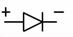
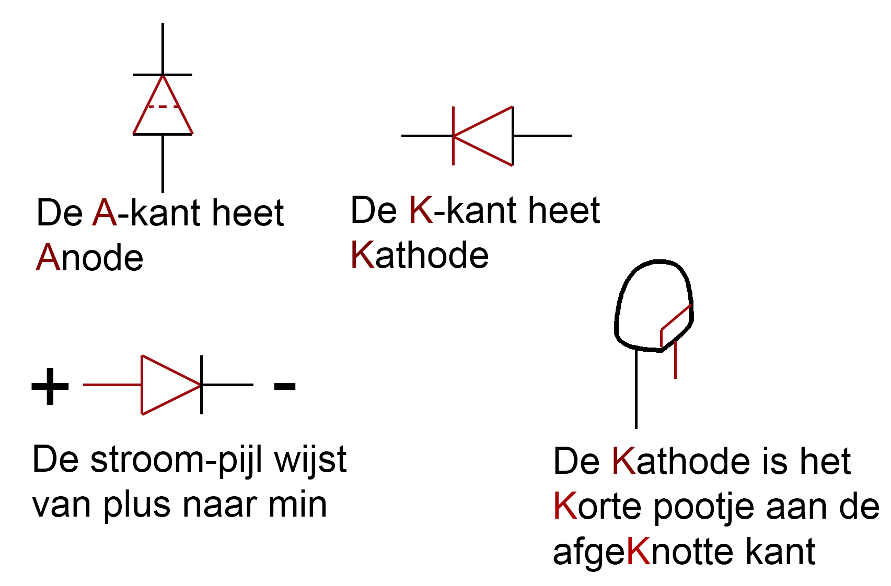
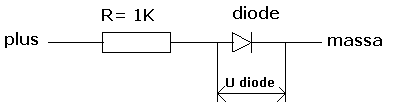
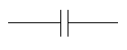
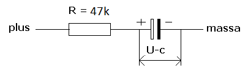
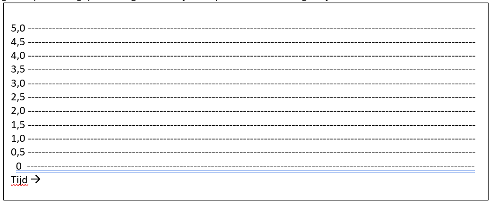
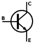
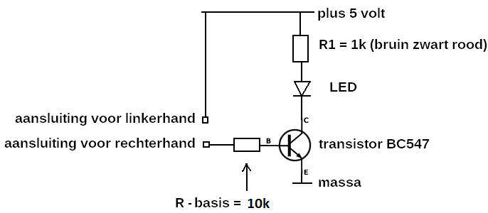
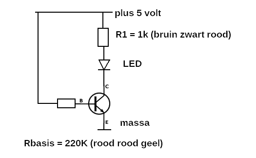

# Practicum meten aan diode, condensator en transistor

# 

# Introductie

Bij het voorgaande practicum met de multimeter heb je kennisgemaakt met
de meter zelf en een meting gedaan met een veelgebruikte component in de
elektronica, de weerstand. In dit practicum ga je eerst meten aan twee
belangrijke componenten, de condensator en de diode.

Het tweede deel van dit practicum bouw je een versterkerschakeling op en
ga je daar ook aan meten.

**Doel van dit practicum**

- Een condensator laden
- Een diode verkennen en er aan meten
- Een meting opzetten en de resultaten in een grafiek uitzetten
- Ervaring opdoen met het opzetten van een schakeling volgens een
  schema
- Kennismaken met een versterkerschakeling

**Opzet van het practicum**

Dit practicum wordt uitgevoerd door twee studenten die samen de proef
uitvoeren en ook samen dit meetrapport invullen en inleveren.

**Benodigdheden voor dit practicum**

- Een multimeter
- Een voedingsadapter met aansluitconnector
- Een protobordje (een bordje waar je onderdelen op kunt “prikken”)
- Een 1k weerstand
- Een 10k weerstand
- Een 47k weerstand
- Een 220k weerstand
- Een diode
- Een LED
- Een bc547 transistor (bc550 mag ook)
- Een 470uF capaciteit

# De diode

Een diode is een halfgeleider die een bijzondere eigenschap heeft, hij
laat stroom in **één richting** door. Daar kun je mooi gebruik van maken
als je wisselspanning uit het lichtnet wilt gelijkrichten. Het positieve
deel van de sinus laat je doorgaan, het negatieve deel van de sinus houd
je tegen of stuur je de andere (goede) richting op.

Naast het gebruik van stroomsturing heeft de diode nog andere
eigenschappen. Hij kan licht uitzenden (LED), licht ontvangen
(fotodiode), straling uitzenden voor radar (gunn-diode), een kleine
variabele capaciteit vormen (toegepast in afstemming van radio’s) of een
bescherming geven tegen gevaarlijke spanningspieken (bij relais).

In schakelingen wordt de diode veel toegepast als bescherming of het
sturen van de stroom in de juiste richting. Bij het gebruik is het
belangrijk om de diode in de goede richting aan te sluiten.

 Dit is het symbool van de diode. De + is
de anode, de – is de kathode

**Ezelsbruggetjes bij de diode:**

**Een weerstand is lineair. Een hogere spanning over de weerstand geeft
een grotere stroom door de weerstand (wet van Ohm). Een diode heeft
daarentegen een niet-lineaire karakteristiek. Als de stroom door de
diode groter wordt neemt de spanning maar heel weinig toe**.

Teken een **diode-doorlaatkarakteristiek** (zoek
op met Google) in de onderstaande vrije ruimte. Teken de doorlaatkarakteristiek van een weerstand in dezelfde grafiek, dat is een rechte lijn. Zet daarbij **Horizontaal** de spanning, en **vertikaal**
de stroom. Links-onder is het nulpunt. Bespreek met je
practicumpartner wat de twee grafieken van diode en weerstand eigenlijk
laten zien en probeer de verschillen onder woorden te brengen.
#
#
#
#
#
#
#
#
#
#
#
**Meting aan een diode**

Als je de diode-doorlaatkarakteristiek goed getekend hebt zie je dat een
diode een **drempelspanning** heeft. Onder de drempelspanning loopt er
**geen** stroom (de diode gedraagt zich als een heel hoge weerstand). Is
de spanning groter dan de drempelspanning dat neemt de stroom sterk toe.

De conclusie is dat de spanning **over** een diode nagenoeg de
drempelspanning is, ongeacht de stroom die er door loopt.

De drempelspanning kun je eenvoudig meten. Sluit de diode in **serie**
met een weerstand (1 Kohm) aan op de voedingspanning. De weerstand komt
op plus (rode lijn), de diode op de min of massa (blauwe lijn).

Meet de spanning **over** de diode (U diode), dus van massa naar het
knooppunt van de weerstand en de diode. Let op, de aansluiting waar de
zwarte ring op de diode zit moet op de min/massa. (als je 5 volt over de
diode meet staat deze niet in doorlaat- maar in sperrichting). Doe ook
een meting met een 10 K weerstand.
- Spanning Udiode(bij 1k voorschakelweerstand)=  [V]
- Spanning Udiode(bijn 10k voorschakelweerstand)= [V]

Merk op dat volgens de wet van Ohm er bij de 10 K weerstand een 10 keer
kleinere stroom door de diode stroomt. Toch is de spanning niet veel
lager. Een diode wordt ook wel voor spanningreferentie gebruikt.

# 

# De condensator

Een condensator is opgebouwd uit twee geleiders met een relatief grote
oppervlakte, die zich dicht bij elkaar bevinden en gescheiden zijn door
een materiaal dat polariseerbaar is, het diëlektricum. Wanneer de ene
geleider positief geladen wordt ten opzichte van de andere, verplaatst
de negatieve lading in het diëlektricum zich naar de positieve plaat en
omgekeerd: positieve lading beweegt naar de andere geleider. De naam is
afgeleid van het latijn condensare: samenpersen, dus condensator =
samenperser, wat betrekking heeft op de ladingen die samengeperst worden
bij de polen (platen) van de condensator. (bron: Wikipedia)

**Opslag van energie**

De condensator is een veelgebruikte component in de elektronica. **Een
heel belangrijke functie is (tijdelijke) opslag van energie.** Daarin
kun je de condensator zien als een (kleine) oplaadbare batterij.

   
Hierboven zie je het symbool van een condensator.  Zoals je ziet is er geen directe “doorgang”

De condensator voor opslag van energie is heel belangrijke component om
storingen via de voeding te voorkomen. Als een schakeling (even) veel
stroom vraagt kan er een spanningsdip in de voeding ontstaan. De voeding
kan het even niet bolwerken om aan de “energievraag” voldoen. De afstand
van de voeding tot de schakeling is hierin belangrijk. De lengte van de
voedingsdraden vormen een weerstand die (populair gezegd) een snelle
toestroom van de stroom in de in de weg staat.

**Variabele weerstand**

De condensator wordt ook veel gebruikt als frequentie-afhankelijke
weerstand. Hiermee worden voor wisselspanningen filters gemaakt die
bepaalde frequentie wel of juist niet doorlaten. Bij de
oscilloscoopproef heb je daar al kennis mee gemaakt of ga je daar nog
mee aan het werk.

**Capaciteit van een condensator**

De capaciteit van condensatoren wordt uitgedrukt in de eenheid
**Farad.** Condensatoren die voor sigaalverwerking worden toegepast zijn
vaak er klein (in waarde). Voor een oscillatorschakeling wordt
bijvoorbeeld een condensator van 20 pF gebruikt (een pico is
10-12 Farad). Een condensator die als batterijvervanger wordt
gebruikt heeft een heel hoge capaciteit van 1 Farad.

Om een idee te krijgen van de verschillen in grootte maak je een
vergelijking in volume. Als een condensator van een **pico Farad** een
kubieke millimeter groot is, hoe groot is dan het volume van een
condensator met een capaciteit van 1 Farad, uitgedrukt in een aantal
m3?

Om een condensator meer capaciteit te geven en de behuizing niet te
groot te laten worden er **elektrolytische condensatoren** gemaakt. Die
hebben wel veel energie in een klein volume maar zijn polariteit
gevoelig. <u>**Dat betekent dat ze een plus- en een min aansluiting
hebben**.</u>

**Meten van het laden van een condensator**

Het laden en ontladen van een condensator is geen lineair verloop maar
een **e-macht**. Als de condensator leeg is laadt hij heel snel op, hoe
voller hij wordt, hoe langzamer het opladen gaat.

Laad de condensator van 470 µF op. **LET OP**: kijk goed wat de
min-aanluiting is (grijze baan met -)!

Start de meting met het **ONTLADEN** van de condensator door het
<u>kortsluiten</u> van de twee aansluitingen. Dan weet je zeker dat hij
leeg is. Start vervolgens het **laden** van de condensator door een
weerstand van **47 Kohm** in serie met de condensator en de voeding te
plaatsen. START op dat moment een tijdmeting en noteer de **tijd** in
het onderstaande tekstblok met een **U-condensator** op 0 volt; 0,5 volt
tot 4,5 volt (totaal 9 metingen).

Zet de voorgaande meting uit in onderstaande grafiek (vervang een
streepje door een ander karakter). Linksonder is het nulpunt. De
verticale as de spanning. De horizontale as is de tijd-as. Maak zelf een
goede (evenredige) verdeling voor de tijdas. Tip: de laatste meting zet
je helemaal rechts.

**Een versterkerschakeling**

**inleiding**

Het tweede deel van het practicum is het maken van een versterker met
een transistor. Dat is de “Hello World” van de Electro-technici. Leuk om
te maken en te zien hoe je een heel kleine stroom kunt versterken. Met
een kleine stroom door je lichaam kun je en LED laten branden. Het is
wel verstandig om daarvoor een versterker te gebruiken. Als je de gehele
stoom van de LED door je lichaam laat lopen is het niet gezond. Daar heb
je een hoge spanning voor nodig en daar heeft je hart een probleem mee.

Een transistor is een **stroomversterker** en bestaat uit **drie**
aansluitingen, **één** stuuringang en **twee** aansluitingen waar de
hoofdstroom doorheen loopt. Met een heel kleine basis- of stuurstroom
kan een veel grotere belasting worden aangestuurd.

Symbool van de transistor

**Opbouwen versterker**

De basisstroom (stuurstroom) kan heel klein zijn. Voldoende om door je
lichaam de LED te laten branden. De meeste studenten voelen daar naar
niet veel van, slechts een enkeling kan niet goed tegen de spanning. Bij
de volgende opdracht ga je deze schakeling opbouwen.

De schakeling is als volgt. Zie dat **de transistor is als een
schakelaar in de verbinding van de LED naar de massa**. Met de
transistor schakel je de stroom door de LED. De basis (B) is de
stuuringang om de hoofdstoom van C naar E te sturen.

Op Sharepoint staat een afbeelding hoe de componenten op het protobordje
opgebouwd moeten worden (**voorbeeldtransistorversterker.jpg**) .

Pak met je hand het metaal van de weerstand-draad (220K) die los is. De
versterker werkt als de LED dan een beetje oplicht (je lichaam is een
ontvanger voor elektromagnetische golven en geeft een beetje spanning
af). Als je met je ene hand de aansluiting van de weerstand beetpakt en
met de andere hand het metaal van het plus-draadje moet de LED feller
oplichten. Als je harder knijpt (of je vingers een beetje vochtig maakt)
moet de LED nog beter oplichten. Als de LED niet brandt heb je wellicht
de LED of/en de transistor verkeerd-om aangesloten (let op de platte
kant).

Bespreek met elkaar hoe het komt dat de LED feller brandt als je harder
knijpt:

Je gaat nu meten hoe groot de stroom is die door je lichaam loopt en wat
de versterkingsfactor is.

**De transistor**

De transistor is van het type BC547B. Een belangrijk gegeven van een
transistor is de stroom die door de belasting kan gaan. Op Sharepoint
staat een datasheet (**Transistor-BC547B.pdf**) met technische
informatie. Open de datasheet. Hoe groot is de maximale
(collector)stroom die je met deze transistor door de belasting kunt
sturen?

**Meten van de stroomversterking**

Sluit nu de basis via een **220 Kohm** weerstand direct aan op de
**plus** van de voeding. (de LED moet dan helder oplichten)

Voor het bepalen van de **stroomversterking** moet je de **basisstroom**
(klein) en de **collectorstroom** (groot) weten. Als je de spanning
**meet** over de basisweerstand en de spanning **meet** over
collectorweerstand R1 (in serie met de LED), kun je met de wet van Ohm
de stroom uitrekenen:

Berekende stroomversterking:

Wellicht interessant om te weten is hoe groot de stroom door je lichaam
was, die voldoende was om de LED goed te laten oplichten. Je lichaam
staat in serie met de weerstand Rbbasis (220K Ohm). Meet je
lichaamsweerstand met de multimeter en kies daarbij de juiste stand
(1M).

**Afsluiten van het practicum**

Vóórdat je afsluit meld je aan de docent dat je klaar bent en geef je
een demo van de versterkerschakeling. Deze kijkt dan of alles goed
gegaan is.

Controleer of de groene LED het doet het doet als de spanning op het
bordje staat. De groene LED met weerstand moet op het bordje blijven
staan, de andere componenten haal je van het bordje af.

Doe de weerstanden, de diode en de condensator weer in het zakje.

Zijn alle onderdelen weer compleet?

**SCHAKEL DE MULTIMETER UIT!**
