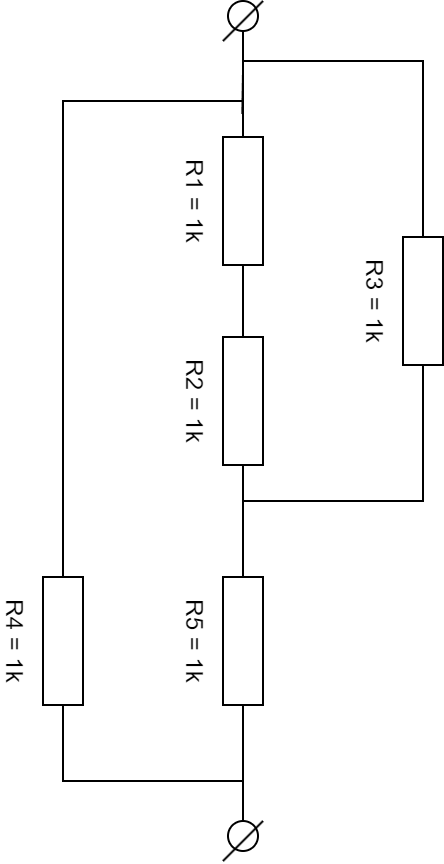
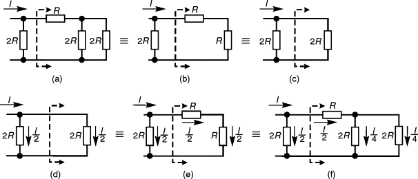
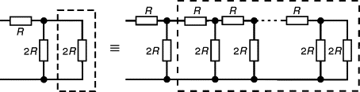
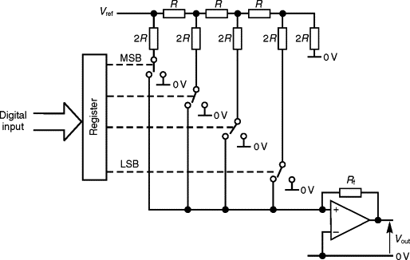

# Weerstandsnetwerkjes

**Jouw naam:  
Naam van jouw teamgenoot:**

# Voorbereiding

Zorg voordat je aan de practica begint, dat je:

1. de bijbehorende theorie (reader en sheets) goed hebt doorgenomen

2. de benodigde materialen en gereedschappen voor alle opdrachten
   gereed hebt

## Benodigdheden

Voor deze practica heb je (als team) nodig:

- Een breadboard

- Een multimeter

- Een 10 Ω weerstand

- Twee 1k weerstanden (1k is een verkorte schrijfwijze voor 1k Ω,
  ofwel 1000 ohm)

- Een 2,2k weerstand

- Een 10k potmeter

- Wat geisoleerd, stug draad (geschikt om in breadboard te prikken)

- Wat breadboard wires

- Een striptang

- Een spanningsbron van rond de 5V.  
  Mogelijkheden: een adapter van 5V, een USB-adapter, een
  arduino-nano, een 4,5V batterij.

Als je van een van deze dingen niet weet wat het is, google er dan even
op.

# Wat wordt er van je verwacht?

- Voer de opdrachten uit samen met een andere student.

- Het is niet erg als je in overleg met andere teams een antwoord
  uitvogelt.  
  Zorg er wel voor dat je het 100% begrijpt, anders schiet je jezelf
  in je voet.

- Maak een copie van dit document, en voeg daarin je antwoorden
  toe. Als je iets moet invullen, wordt dat aangekondigd met
  **vetgedrukte** letters.

- Vermeld bij het inleveren helemaal bovenaan zowel je eigen naam als
  die van je teamgenoot.

# Serieweerstand en Spanningsdeler

## Benodigd

- Een breadboard

- Een multimeter

- Een 1k weerstand

- Een 2,2k weerstand

- Breadboard wires of draad+striptang

## Opdracht

1. Zet op je breadboard een weerstand van 1k in serie met een weerstand
   van 2,2k:  
   
   

2. **Geef de berekening van de de vervangingsweerstand van deze
   aaneenschakeling van weerstanden (ook wel “serieweerstand” genaamd).
   Tip: Gebruik de spanningswet van Kirchoff (Vtotaal = VR1+VR2) en de
   wet van ohm.**

3. Controleer het nu via een meting: zet de multimeter in “weerstand
   meet modus” en meet de serieweerstand.  
   **Welke weerstand meet je?**

4. Bouw de volgende schakeling:  
   
   

5. **Geef een berekening van de grootte van de stroom I1 (door R1) en
   van stroom I2 (door R2).**

6. **Geef een berekening van knooppunts-spanning V2.**   

7. **Leidt een formule af voor de verhouding tussen V2 en V1. (geef een
   formule van V2/V1, uitgedrukt in R1 en R2)**

8. **Controle-meting. Welke spanning meet je op V2?**

9. Stel dat je twee chips met elkaar wilt verbinden.  
   De ene chip heeft een digitale uitgang die tussen 0 en 5V
   schakelt.  
   De andere chip heeft een digitale ingang die signalen tussen de 0 en
   3,3V verwacht.  
   **Hoe kun je beide chips goed-werkend op elkaar aansluiten?**

# Potentiometer

## Benodigd

- Een multimeter

- Een 10k potmeter (potentiometer of regelbare weerstand)

## Opdracht

Neem de potentiometer:

1. Meet met de multimeter de weerstand tussen pootje 1 en 3 (de
   buitenste pootjes), terwijl je de potentiometer naar links en naar
   rechts draait.  
   **Welke weerstandswaarde(n) lees je af:  
   \* Als hij helemaal naar links staat?  
   \* Als hij in het midden staat?  
   \* Als hij helemaal naar rechts staat?**

2. Meet met de multimeter de weerstand tussen pootje 1 en 2, terwijl je
   de potentiometer naar links en naar rechts draait.  
   **Welke weerstandswaarde(n) lees je af:  
   \* Als hij helemaal naar links staat?  
   \* Als hij in het midden staat?  
   \* Als hij helemaal naar rechts staat?** 

3. Meet met de multimeter de weerstand tussen pootje 2 en 3, terwijl je
   de potentiometer naar links en naar rechts draait.  
   **Welke weerstandswaarde(n) lees je af:  
   \* Als hij helemaal naar links staat?  
   \* Als hij in het midden staat?  
   \* Als hij helemaal naar rechts staat?**

4. **Beschrijf hoe een potmeter werkt.**

# Parallelweerstand en stroomdeler

## Benodigd

- Een breadboard

- Een multimeter

- Een 10 Ω weerstand

- Een 1k weerstand

- Een 2,2k weerstand

- Breadboard wires of draad+striptang

## Opdracht

1. Zet op je breadboard een weerstand van 1k parallel met een weerstand
   van 2,2k:  
   
   

2. **Geef de berekening van de vervangingsweerstand van deze
   aaneenschakeling van weerstanden (ook wel “parallelweerstand”
   genaamd).**

3. Controleer het nu via een meting: zet de multimeter in “weerstand
   meet modus” en meet de parallelweerstand.  
   **Welke weerstand meet je?**

4. Bouw de volgende schakeling, met Vsup=5V, R1 = 1k en R2 = 2,2k:  
   
   

5. - **Geef een berekening van de grootte van de stroom I1 (door R1) en
     van stroom I2 (door R2).**** 
   
   - **Hoe groot is de verhouding tussen de stromen? (geef een formule voor I1/I2 uitgedrukt in R1 en R2)**  

6. **Hoe groot is de som van I1 en I2?**

7. We willen ter controle nu de stroom meten die uit voeding Vsup
   komt.  
   Dit keer meten we die stroom indirect, door een klein
   meetweerstandje R3=10 Ω in het stroompad te zetten:  
     
   
   **Meet de spanningsval over dat meetweerstandje R3, en leidt daaruit
   met behulp van de wet van Ohm af hoe groot stroom I3 is.**

8. **Bereken met behulp van alleen I3 en V2 de vervangingsweerstand R1
   en R2. (Tip: de vervangingsweerstand als geheel gehoorzaamt ook de
   wet van Ohm).**

9. Door het invoegen van het meetweerstandje is de stroom die door de
   parallelweerstand R1 en R2 loopt, ietsje veranderd.  
   **Hoe komt dat?**

10. **Wat is het voordeel van het stroom meten door middel van het meten
    van spanningen over meetweerstandjes in plaats van het meten van
    stromen door direct stromen te meten met de multimeter?**

# Combi

## Benodigd

- Een breadboard

- Een multimeter

- Twee 1k weerstanden

- Een 2,2k weerstand

- Breadboard wires of draad+striptang

## Opdracht

1. Bouw de volgende schakeling:  
   
   

2. **Geef de berekening van de vervangingsweerstand van deze
   serieschakeling van weerstand R3 met de parallelweerstand bestaande
   uit R1 en R2.  

3. Controleer het nu via een meting: zet de multimeter in “weerstand
   meet modus” en meet de vervangingsweerstand.  
   **Welke weerstand meet je?**

4. Bouw de volgende schakeling, met Vsup=5V, R1 = 1k, R2 = 2,2k en R3 =
   1k:  
   
   

5. **Meet de spanning over R3, bereken daaruit de stroom I3.**

6. **Bereken mbv alleen I3 en V1 de vervangingsweerstand van het geheel
   dat bestaat uit R3, R1 en R2. (Tip: de vervangingsweerstand als
   geheel gehoorzaamt ook de wet van Ohm).**    

# Pull-up
Stel je wil met een drukschakelaar een logisch signaal maken voor een ingangspin van een microcontroller.

1. Stel je gebruikt daarvoor een schakelaar met **pull-up** weerstand, wat is dan het gedrag van het circuit? Waarom werkt het niet als je de pull-up weerstand weglaat?

# Pull-down

Stel je wil met een drukschakelaar een logisch signaal maken voor een ingangspin van een microcontroller.

1. Stel je gebruikt daarvoor een schakelaar met **pull-down** weerstand, wat is dan het gedrag van het circuit? Waarom werkt het niet als je de pull-down weerstand weglaat?

# Uitsmijter (theorie)

   

1. **Bereken de vervangingsweerstand (die je tussen de klemmen meet) van het bovenstaande netwerk**
   (Tip: gebruik alleen de formules voor serie en parallelweerstand)

# Bonus: Laddernetwerk

   

   

   

1. **Probeer uit te leggen waar de bovenstaande plaatjes over gaan.**

Tips: 

- Kijk eens naar [ladder-networks](https://www.sciencedirect.com/topics/engineering/ladder-networks)).
- De opamp-weerstandscombinatie rechtsonder regelt zijn ingang op 0Volt, en converteert de binnenkomende stroom naar de uitgangs-spanning: -Iin * Rt.
