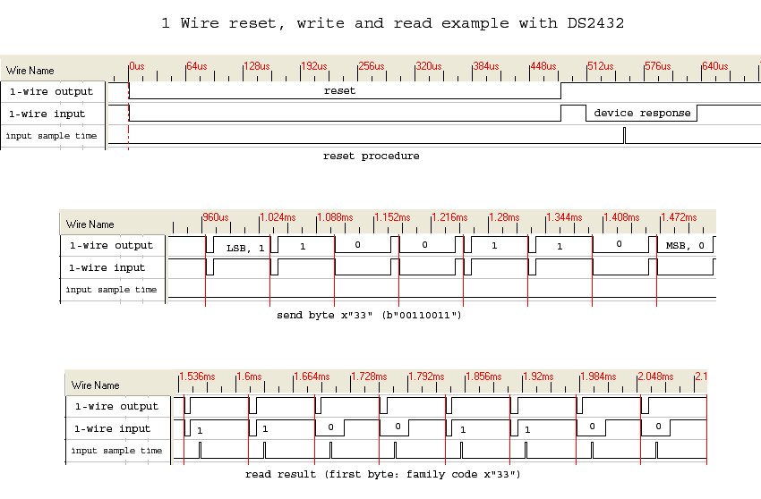

 [](logo-id)

# Communicatieprotocol: 1-Wire[](title-id) <!-- omit in toc -->

### Inhoud[](toc-id) <!-- omit in toc -->

- [Een introductie](#een-introductie)
- [Bus-systeem](#bus-systeem)
- [Parallel protocol](#parallel-protocol)
- [Serieel protocol](#serieel-protocol)
- [1-Wire](#1-wire)
- [Daisy chain topologie](#daisy-chain-topologie)
- [Ster topologie](#ster-topologie)
- [DS18B20 temperatuursensor](#ds18b20-temperatuursensor)
- [De schakeling](#de-schakeling)
- [Arduino voorbeeld code](#arduino-voorbeeld-code)
- [Referenties](#referenties)

---

**v0.1.0 [](version-id)** Start document voor 1-Wire uitleg en voorbeeld code door HU IICT[](author-id).

---

## Een introductie

1-Wire is een communicatieprotocol dat sterk lijkt op [I<sup>2</sup>C](../I2C/README.md) datacommunicatie. Er is echter minder dataoverdracht mogelijk bij een lagere snelheid. De afstand die overbrugt kan worden is echter wel groter. Deze vorm van communicatie zie je vaak terug in goedkope sensortoepassingen zoals het meten van temperatuur. Het 1-Wire bussysteem is ontwikkeld door Dallas Semiconductor Corporation (later overgenomen door Maxim Integrated). Daarom spreken we ook wel van `Dallas 1-Wire`. 1-Wire gebruikt minimaal een enkele lijn voor voeding en dataoverdracht.

Hieronder worden enkele belangrijke concepten verder uitgelegd.

## Bus-systeem

Een **bus** is in de computertechniek een manier om verschillende componenten in een computer of tussen computers op een standaard manier te verbinden. Een bus voldoet vaak aan een standaard.

## Parallel protocol

Bij **parallelle communicatie** worden er zoveel mogelijk bits gelijktijdig verzonden over een verzameling van kabels.

Gegevensoverdracht is hoger, en complexer omdat data die over verschillende kabels gaan synchroon moeten blijven. Seriële communicatie is daardoor zeer populair gebleven. Ook omdat daar geen grote connectoren voor nodig zijn die ook nog eens makkelijk kunnen beschadigen.

> 'PCI Express' is een vorm van parallele communicatie. Daar heeft echter elke data lijn een eigen clock-signaal. Er kan dus over meerdere kabels informatie verzonden worden zonder dat er synchronisatie-issues ontstaan.

## Serieel protocol

Een **serieel protocol** voor gegevensoverdracht stuurt alle bits aan informatie één voor één door. 

Omdat er minder signalen gelijktijdig worden verzonden is een goedkopere kabel mogelijk. Voor de komst van USB (universal serial bus) waren de meeste computers uitgerust met een seriele interface (PS/2 of RS232) voor het aansluiten van randapparatuur zoals muis en toetsenbord.

'1-Wire' is en serieel protocol.

## 1-Wire

**1-Wire** is een tweedraads bus-systeem. Er is minimaal een draad nodig voor data communicatie en voeding. De andere draad (GND) wordt gebruikt als aarde en is nodig om de stroomkring te sluiten.

> GND wordt meestal niet meegeteld: voor 1-Wire heb je altijd tenminste twee draaden nodig.

Elk component in een 1-Wire bus-systeem heeft een uniek 64-bit adres (ROM-ID) om sensordata van een specifiek toestel te kunnen vragen. In theorie kan je aan een 1-Wire bus meer dan honderd sensoren koppelen.

Er zijn twee mogelijke manieren om 1-Wire sensoren aan te sluiten.

1. Parasitic mode

   In '**parasitic**' mode (ook 'parasite power mode' genoemd) is de data lijn (DQ) ook de voedingslijn.

   Deze modus is nodig voor [1-wire buttons](https://hu-hbo-ict.gitlab.io/turing-lab/ti-lab-shop/1-wire%20button%20with%20tag.html), daze hebben fysiek maar twee aansluitingen.

   De DS18B20 kan ook 'parasitic' worden gebruikt, maar bij enkele functies - bv de temperatuurmeting - heeft hij veel meer stroom nodig dan tijdens de communicatie. Daarom is het tijdens de meting nodig met een transistor parallel tot de 'weak pull-up' weerstand voldoende stroom ter beschikking te stellen. Zie graag het datasheet (link aan het einde van de pagina).

2. Regular mode

   Sommige 1-wire devices hebben een aparte aansluiting voor de voeding. Dan heb je drie draden (VDD, DQ, GND) nodig, maar er is zeker gesteld dat de chip altijd voldoende stroom heeft voor alle functies.

   Dit is de '**regular**' of 'non-parasitic' mode.

   Bij sommige sensoren is het in dit geval ook erg aangeraden de VDD pin en GND te verbinden met een 100nF condensator. (Deze condensator heeft als functie storingen op de voedingslijn te voorkomen.)

## Daisy chain topologie

Als je de data-lijn van componenten steeds aan elkaar doorverbindt, heb je een **Daisy Chain topologie**. De componenten staan als het ware in serie met elkaar. Een voorbeeld voor daisy-chaining zijn de 'NeoPixel' LED strips, met meerdere WS2811 of WS2812 RGB-LEDs achter elkaar.

## Ster topologie

Zoals de naam al aangeeft zijn de sensoren bij een **Ster topologie** met 1 centraal punt gekoppeld. De sensoren in het netwerk staan parallel verbonden met de centrale controller (bv de 1-Wire controller).

## DS18B20 temperatuursensor

Om temperatuur te meten kan je gebruik maken van DS18B20 temperatuursensor. Dit is een digitale sensor met een 1-Wire interface. De sensor komt in verschillende vormen. In dit voorbeeld maken we gebruik van de waterdichte variant.

 De DS18B20 zonder behuizing lijkt met zijn drie poten erg op een [transistor](../../elektronische-componenten/transistor/README.md) maar bevat een veel meer ingewikkeld IC. Let goed op wat je gebruikt!

## De schakeling

De waterdichte DS18B20 versie heeft drie draden: rood, zwart en geel (of wit). Rood is de voeding (3,3V..5V), zwart naar ground (GND) en geel (of wit) is de data pin. Voor de data pin is volgens het datasheet een 'weak  pull-up' weerstand van 4,7k$\Omega$ nodig om een 'zwevende' staat te voorkomen.


(Let op: de weerstandskleuren in het beeld zijn niet juist, 4,7kOhm heeft de kleurencode geel-violet-rood-goud.)

- De 5V op de Arduino -> rood van de temperatuursensor
- De pin 12 op de Arduino -> geel of wit temperatuursensor (signaal, 'Data')
- De GND op de Arduino -> zwart van de temperatuursensor

## Arduino voorbeeld code

```arduino
//1-Wire Arduino sketch for DS18B20 waterproof temperature sensor

#include <OneWire.h>
#include <DallasTemperature.h>

float temp = 0.0;
int oneWireBus = 12;
OneWire oneWire(oneWireBus);
DallasTemperature sensors(&oneWire);

void setup() {
  Serial.begin(9600);
  Serial.println("1-Wire Arduino sketch for DS18B20 waterproof temperature sensor");
  sensors.begin();
}

void loop() {
  sensors.requestTemperatures();
  temp = sensors.getTempCByIndex(0);

  Serial.print("Temperature reading: ");
  Serial.println(temp);

  delay(5000);
}
```

[Arduino bestand](../1-wire/files/Arduino_DS18B20_probe/Arduino_DS18B20_probe.ino)

## Referenties

- 1-Wire (<https://en.wikipedia.org/wiki/1-Wire>)
- DS18B20 datasheet van Analog Devices
  (<https://www.analog.com/en/products/ds18b20.html>), <!-- markdown-link-check-disable-line -->
  direct link to datasheet
  <https://www.analog.com/media/en/technical-documentation/data-sheets/DS18B20.pdf>. (Link checked 09-08-2025.) <!-- markdown-link-check-disable-line -->
- 1-Wire overview (<https://www.youtube.com/watch?v=lsikcaA7q-c>)
