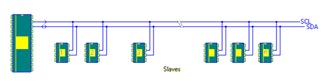
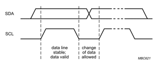
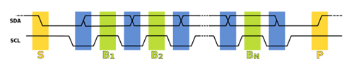
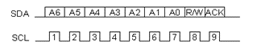
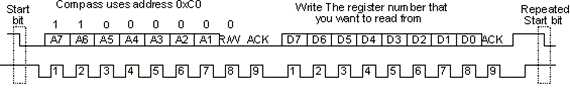
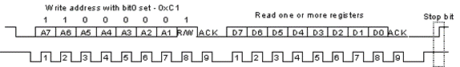
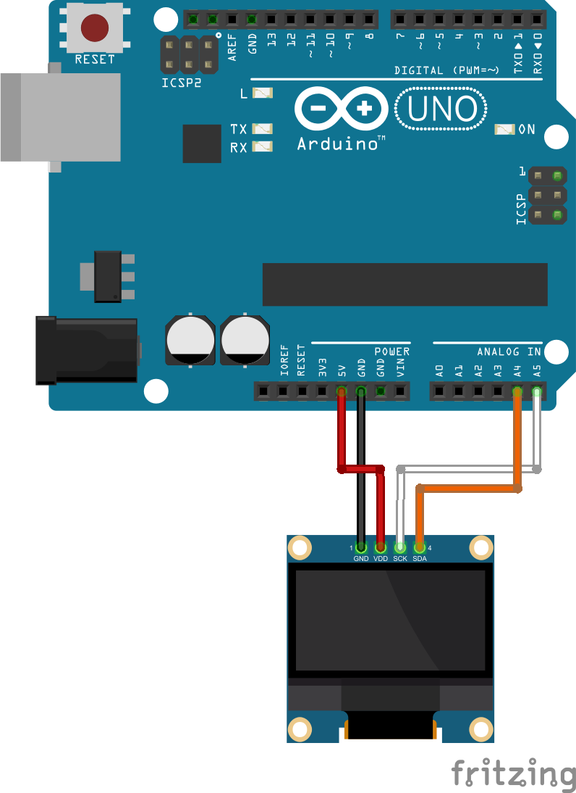

 

# I2C: Inter Integrated Circuit <!-- omit in toc -->

### Inhoud <!-- omit in toc -->

- [Een introductie](#een-introductie)
- [I2C Communicatie protocol](#i2c-communicatie-protocol)
- [De schakeling](#de-schakeling)
- [Arduino voorbeeld code](#arduino-voorbeeld-code)
- [Referenties](#referenties)

---

**v0.1.1 ** Start document voor I2C door HU IICT.

---

## Een introductie

I2C (Inter Integrated Circuit) is een veel gebruikt communicatie-protocol dat oorspronkelijk ontwikkeld en gepatenteerd is door Philips. Hierdoor moesten andere fabrikanten die het wilden toepassen een vergoeding betalen. Veel fabrikanten vermeden dit door gewoon het I2C protocol te gebruiken, maar het TWI (Two Wire Interface) te noemen. Inmiddels is het patent van Philips verlopen, maar je ziet nog vaak de naam TWI in datasheets.

Bij SPI delen de slaves drie lijnen en zijn er daarnaast selectielijnen die aangeven welke slave mag communiceren. I2C gebruikt een andere type bus. De I2C-bus bestaat maar uit 1 datalijn, SDA (Serial DAta), 1 kloklijn, SCL (Serial CLock), en geen selectielijnen. Het kost dus minder hardware (draden, I/O pinnen), maar het is ook langzamer dan SPI. Daarnaast is ook het communicatieprotocol complexer. In bovenstaand figuur zien we één master en meerdere slaves aangesloten op een I2C-bus.

I2C gebruikt dus twee lijnen: SDA (Serial DAta) en SCL (Serial CLock). Beide lijnen hebben een ‘pull-up’ weerstand. De slaves kunnen deze een lijnen laag trekken (met de ground verbinden), maar niet hoog trekken (dat doen de weerstanden al). Deze opzet wordt opencollector (of open-drain) genoemd. Deze interne aansluiting is zichtbaar in bovenstaand figuur. SDA kan worden gebruikt door zowel de master als de slaves. De SCL wordt aangestuurd door de master.

> De I2C standaard staat ‘clock stretching’ toe: een slave verlengt een klokpuls door de SCL-lijn laag te houden totdat de slave het bitje klaar heeft. Deze mogelijkheid wordt in de praktijk niet vaak gebruikt.

## I2C Communicatie protocol

(Ook geschreven: I2C of IIC.)

In de overdracht van databits gebruikt I2C een puls op de kloklijn (SCL) om één bit via de SDA-lijn over te dragen. Het protocol eist dat tijdens het verzenden van databits de SDA-lijn stabiel is (niet verandert) terwijl SCL verandert of hoog is (zie bovenstaand figuur). Als er meer dan één bit moet worden verstuurd, dan worden de bits één voor één overgedragen, het hoogste (meest significante) bit eerst. De SCL wordt altijd aangestuurd door de master (meestal een micro-controller), de SDA wordt aangestuurd door het device dat de data verzendt. Dit kan dus zowel de master als een slave zijn.

Omdat I2C maar twee lijnen heeft moeten we buiten de data die we willen verzenden ook informatie verzenden om het proces van het dataverzenden in goede banen te leiden. Hiervoor heeft I2C twee paar speciale signalen, ook wel condities genoemd: S (start) en P (stoP). De S-conditie wordt verzonden door de SDA laag te maken terwijl SCL hoog is. De P-conditie wordt verzonden door de SDA hoog te maken terwijl SCL hoog is. S geeft het begin van een I2C transactie aan (je kan het zien als een soort reset), P geeft het einde van een transactie aan. Bovenstaand figuur laat de S- en P-conditie zien.

Bij SPI zijn er selectielijnen om aan te geven welke slave mocht communiceren over de bus. Bij I2C hebben we geen selectielijnen, dus het communiceren over welke slave mag communiceren moet over de bus gaan. Bij I2C begint daarom elke transactie van data met een commando-byte die wordt verstuurd door de master. De commando-byte bevat een 7-bit adres, en één R/W-bit dat aangeeft of de transactie een write (de master gaat data naar de slave zenden) of een read (de slave gaat data naar de master zenden) is. De R/W-bit is 1 voor een read, 0 voor een write.

In bovenstaand figuur zien we de opbouw van een commando-byte. Daarnaast wordt na iedere byte er een acknowledge-bit verzonden door de partij die het voorafgaande byte heeft ontvangen (zie onderstaand figuur).

Na het commandobyte stuurt dus een slave een acknowledge-bit. Na elke byte tijdens write stuurt de slave ook een acknowledge-bit. Na elke byte tijdens read stuurt de master een acknowledge-bit.

Het diagram in bovenstaand figuur toont een write actie naar een slave met adres 1100000b. Er wordt eerst een commando-byte verstuurt met het adres van de slave en de R/W-bit. De R/W bit is laag, dus het is een write. Na de commando-byte, die verzonden is door de master volgt een acknowledge-bit van de slave naar de master. Vervolgens zendt de master 1 byte aan data, en de slave zendt weer een acknowledge-bit. Daarna had de master een P kunnen zenden en daarna een S om de volgende transactie te starten, maar in dit plaatje zend de master een ‘repeated start bit’, dit is een soort combinatie van P en S. De master kan nu nog een byte aan data sturen naar de slave, zonder opnieuw een commando-byte te sturen.

Om iets uit een slave te lezen moet de master een read transactie gebruiken. Nadat de master het juiste commando-byte heeft gestuurd zal dan de geadresseerde slave data bytes naar de master sturen. Dit blijft de slave net zo lang doen totdat de master de transactie beëindigt met een stop-bit.

In bovenstaand figuur zien we een tijdlijn van een read. De commando-byte wordt verstuurd door de master. Gevolgd door een acknowledge-bit van de geadresseerde de slave. De tweede byte (D7 t/m D0) wordt verzonden door de slave. De tweede acknowledge-bit komt vanuit de master.

Merk op dat er in een read transactie geen gelegenheid is voor de master.

## De schakeling

Als voorbeeld nemen we een SSD1306 0.96 inch I2C OLED display en sluiten dit aan op een Arduino Uno. Maak de volgende verbinding:

- Vcc – 5V
- Gnd – Gnd
- SDA – A4
- SCK – A5

Je dient nu alleen nog het I2C [Hexidecimal](../../../software/getalsysteem/README.md) adres te vinden van de OLED en dat kan met dit [I2C_Scanner](./files/I2C_scanner/I2C_scanner.ino) script.

## Arduino voorbeeld code

Installeer in de Arduino IDE de volgende libraries `Adafruit GFX Library` en `Adafruit SSD1306`.

Upload de demo ssd1306_128x32_i2c en controleer of je het juiste adres gebruikt.

## Referenties

- I2C (<https://en.wikipedia.org/wiki/I%C2%B2C>)
