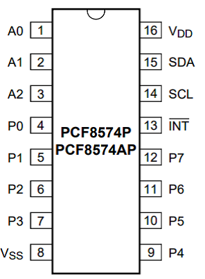

# I2C aansturing van de PCF8574

Deze opdracht is je “Hello World” oefening voor het werken met I2C. Ook voor de volgende semesters zal dat een essentiele ervaring zijn.

De PCF8574 heeft een I2C interface waarmee je 8 I/0 pinnen kan uitlezen of aansturen. De 8 I/O pinnen van de chip zijn open-collector, met ingebouwde, zwakke pull-ups.

1. Lees eerst de gehele opdracht voordat je aan de slag gaat.
2. Gebruikt het internet: wat is een open-collector? Waarom is het handig?
3. Zoek op internet naar de datasheet van de PCF8574.
4. Sluit de PCF8574 chip aan:
   - VSS aan GND (ground)
   - VDD aan 3.3V
   - De I2C-pinnen (SCL en SDA – of SCL1 en SDA1, afhankelijk van de I2C library) naar de Arduino
   - Verbind die pinnen ook met `pull-up weerstanden` (van bijvoorbeeld 2.2kOhm) naar de voedingsspanning.
   - A0-A2 aan GND (ground)
   - INT gebruik je niet
5. Sluit LEDs (met weerstanden) aan op P0, P1, P2 en P3 (naar de VDD/power, dus actief laag).  
6. Gebruik de Wire library om de chip aan te sturen.  
   - Zoek in de chip datasheet op wat het I2C adres van de chip is.
   - Let op: de PCF8574 en de PCF8574A zijn verschillend.
   - Bedenk je of het genoemde adres in de datasheet **met of zonder het r/w bit** is.
   - Bedenk je of Wire een adres met of zonder het r/w bit verwacht.
   - Laat de LEDs in een `KITT patroon` (heen en weer) oplichten.\
     (Wat is de KITT patroon? Zie graag [het Knight RiderTM intro](https://youtu.be/oNyXYPhnUIs?t=12).\
      Een ander voorbeeld zijn de [Cylons van Battlestar GalacticaTM](https://www.reddit.com/r/1970s/comments/1jcbp8m/the_cylons_from_battlestar_galactica_are_as_peak/).)
   - Debug en/of controleer de I2C signalen met behulp van je Logic Analyzer.
7. Sluit op P4 een drukknop aan naar de ground.  
8. Lees via de Arduino de stand van de schakelaar uit en bestuur daarmee een of meer LEDs.

    > NB: Door middel van de open-collector kunnen de I/O-pinnen
    > (P1 t/m P7) zichzelf verbinden met de ground.\
    > De I/O-pinnen hebben intern zwakke pull-ups.\
    > Zet ze dus in open-collector mode en schrijf er een “1” heen om ze als input te configureren.

# Wat lever je in?

- De C++ code die je hebt gebruikt om het kitt-patroontje op de leds te laten zien.
- De C++ code die je hebt gebruikt om punt 7 en 8 hierboven uit te voeren.

Vergeet niet de code van commentaar te voorzien, zodat duidelijk is wat de bedoeling is.
