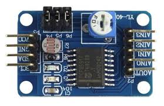

# Workshop I2C

Deze workshop doen we samen in de les. We behandelen in de klas eerst de achtergrond en werking van [I2C](../README.md).

## YL-40 boardje
  

Onderstaand vind je het schema van het bovenstaande YL-40 boardje. Stel dat je weet dat AIN staat voor "Analog In", probeer dan zoveel mogelijk aan de hand van het schema te beredeneren wat dit boardje doet / hoe het werkt.

## PCF 8591

De chip is een PCF8591, een via I2C protocol te besturen [ADC](../../analoog-en-digitaal/ADC/README.md) chip.

## Opdracht Datasheet

Bestudeer de datasheet. Probeer de volgende key-data te vinden (schrijf het paginanummer op bij elke key-item, zodat je het makkelijk kunt terugvinden)

- Op welke voedinggsspanningen kan het werken?   
  Zou je het zonder level-shifters met een 5V microcontroller kunnen laten werken? En met een 3.3V microcontroller?
- Wat is de sampling rate?   
  Waarom is dat belangrijk om te weten?
- Hoe kun je de waarde van een register uitlezen?
- Hoe kun je efficient de waarden van een reeks registers uitlezen?
- Wat gebeurt er na opstarten (power-on)?
- Hoeveel adresbits verwacht deze chip?
- Hoe lees je de laatst geconverteerde Analoog naar Digitaal conversie waarde uit?
- Op welke manieren kun je de ADC-converters configureren?

## Opdracht: lichtintensiteit van de LDR uitlezen

Gebruik de standaard Wire library om gebruikmakend van de gegevens uit de datasheet de hoeveelheid licht die valt op de LDR te meten en als tekst naar de seriele monitor te sturen.

(Belangrijk: Met deze oefening oefen je het aansturen van een chip op basis van de gevonden data in de datasheet. Kopieer dus geen code voor de pcf8591 van een website of chatgpt - dan schiet je jezelf in je voet.)

Gebruik de I2C communicatie de standaard Wire library van de Arduino IDE. [Deze eerder als voorbereiding getipte webpagina](https://www.circuitbasics.com/how-to-set-up-i2c-communication-for-arduino/) laat met een voorbeeld zien hoe die library werkt. Debug en/of controleer de I2C signalen met behulp van je logic analyser.

## Opdracht: lichtintensiteit alle 4 de adc's uitlezen
Pas nu de code aan, zodat de waarden van alle 4 de adc's binnen dezelfde read worden uitgelezen en op de seriele monitor worden weergegeven.