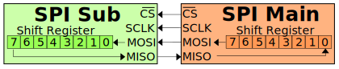
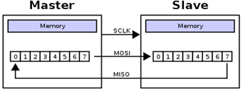
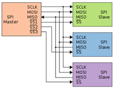
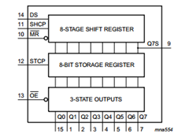
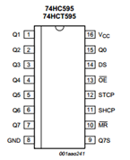
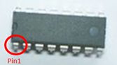

 

# SPI: Serial Peripheral Interface

### Inhoud

- [SPI: Serial Peripheral Interface](#spi-serial-peripheral-interface)
    - [Inhoud](#inhoud)
  - [Een introductie](#een-introductie)
  - [De schakeling](#de-schakeling)
  - [SPI protocol](#spi-protocol)
  - [Referenties](#referenties)

---

**v0.1.0 ** Start document voor SPI door HU IICT.

---

## Een introductie

SPI (Serial Peripheral Interface) is een communicatiestandaard waarbij één chip, de master, bepaalt welke van de andere chips (slaves) mag communiceren over de bus. De SPI-aansluiting bestaat in haar meest simpele vorm uit twee datalijnen en een kloklijn. De eerste datalijn heet MOSI (Master Out Slave In) hierover wordt de data van de master naar een slave gestuurd. De tweede datalijn is de MISO (Master In Slave Out) hierover wordt de data van een slave naar de master gestuurd. De kloklijn, SCLK (Serial CLocK), is er om aan te geven wanneer de volgende bit wordt verstuurd over de datalijn. Het signaal van de kloklijn wordt gegenereerd door de master.

    Om de associatie met slavernij te voorkomen is het voorstel gedaan om de pin referenties in relatie tot SPI aan te passen. [A Resolution to Redefine SPI Signal Names](<https://www.oshwa.org/a-resolution-to-redefine-spi-signal-names/>). Deze terminologie is nog niet volledig overgenomen in dit document.

In bovenstaand figuur zien we een master en een slave die voor SPI op elkaar zijn aangesloten. Over de MOSI- en de MISO-lijnen wordt de data één bit tegelijk verstuurd. We kunnen het geheel dus zien als een cyclische schuifregister die deels in de master zit en deels in de slave zit.

Het is ook mogelijk om met SPI meerdere slaves op de master aan te sluiten waarbij de slaves de MOSI- en de MISO-lijnen delen. Wel hebben we dan per slave een selectielijn, SS (Slave Select), nodig om aan te geven welke slave mag communiceren met de master. De master stuurt deze SS-lijnen aan. Bovenstaand figuur laat een SPI aansluiting met meerdere slaves zien. De SS-lijnen zijn meestal active low, dat betekent dat de lijn van de slave die actief is een laag signaal heeft en de andere een hoog signaal hebben.

   

In bovenstaand figuur zien we de 74HC595 schuifregister. Door deze als slave via SPI aan te sluiten op je Arduino kan je het aantal output pinnen van je Arduino vergroten. Je kan ook juist het aantal input pins verhogen door een SN74LS598 schuifregister aan te sluiten. SPI heb je ook nodig om met sommige sensoren en actuatoren te communiceren en natuurlijk kan je SPI ook gebruiken om twee Arduino’s met elkaar te laten communiceren.

    Er kunnen ook een andere reden zijn om een schuifregeister te gebruiken omdat er dan bijvoorbeeld minder draden hoeven te lopen naar van de micro-controller naar de plek waar de IO pinnen nodig zijn. Of omdat de pinnen van een extender chip vaak meer stroom kunnen leveren dan die van een micro-controller. Of gewoon omdat de pinnen van de micro-controllerr op zijn: goedkope micro-controllerrollers hebben vaak veel minder IO pinnen. Een PIC10F200 heeft er bijvoorbeeld maar 6.

## De schakeling

De 74HC595 schuifregister heeft drie ingangen die aan de micro-controller moeten worden aangesloten: shift-clock (SHCP = SHift Clock Pulse), data (DS), en hold-clock (STCP = STorage Clock Pulse). Verder moet je natuurlijk GND en VCC (3.3V) aansluiten, en MR (Master Reset) aan VCC en OE (Outpout Enable) aan GND.

## SPI protocol

Het SPI protocol kan je op verschillende manieren implementeren. De Arduino Uno heeft een peripheral (speciaal stukje hardware op de chip) dat het SPI protocol implementeert. Als je de maximale snelheid van dataoverdracht wil bereiken dan moet je deze peripheral gebruiken, maar dat is niet triviaal, en hoe je zo’n peripheral precies moet aansturen verschilt van chip tot chip. 

## Referenties

- SPI (<https://en.wikipedia.org/wiki/Serial_Peripheral_Interface>)