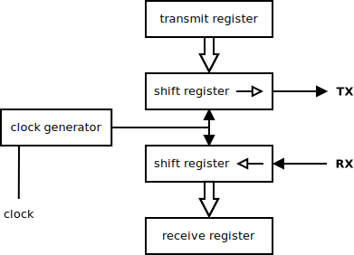

 [](logo-id)

# UART[](title-id)

### Inhoud[](toc-id)

- [UART](#uart)
    - [Inhoud](#inhoud)
  - [Een introductie](#een-introductie)
- [UART communicatie tussen Raspberry Pi en Arduino](#uart-communicatie-tussen-raspberry-pi-en-arduino)
  - [Handleiding UART communicatie RPI - Arduino](#handleiding-uart-communicatie-rpi---arduino)
  - [Python versie controleren](#python-versie-controleren)
  - [Virtual Environments gebruiken](#virtual-environments-gebruiken)
  - [Informatie opvragen over UARTs:](#informatie-opvragen-over-uarts)
  - [Zenden en ontvangen via extra UART op de Arduino Uno](#zenden-en-ontvangen-via-extra-uart-op-de-arduino-uno)
  - [Zenden met de Arduino Uno](#zenden-met-de-arduino-uno)
  - [Ontvangen met de Arduino Uno](#ontvangen-met-de-arduino-uno)
  - [Zenden met de Arduino Due](#zenden-met-de-arduino-due)
  - [Ontvangen met Arduino Due](#ontvangen-met-arduino-due)
  - [Referenties](#referenties)

---

**v0.1.0 [](version-id)** Start document voor UART door HU IICT[](author-id).

---

## Een introductie

UART staat voor “Universal Asynchronous Receiver/Transmitter”. UART is een asynchrone seriele interface met configuratie mogelijkheden zoals het aantal stopbits en even of oneven pariteit. UART wordt gebruikt voor communicatie met randapperatuur. Een microcontroller heeft meestal een of meerdere UARTs op de chip. UARTs maken vaak gebruik van communicatiestandaarden als RS-232 en RS-422.

# UART communicatie tussen Raspberry Pi en Arduino

Wil je (sensor)dat uitwisselen tussen je Arduino UNO en een Raspberry Pi gebruik dan bij voorkeur UART. Het is relatief eenvoudig. Je heb maar twee draden nodig. Het is betrouwbaar en je hebt meerdere UARTs tot je beschikking om meerdere Arduino's te koppelen.

## Handleiding UART communicatie RPI - Arduino

Eerst installeer op de Raspberry PI ghostwriter om makkelijk .md files zoals deze te maken:  

**sudo apt-get install ghostwriter**

## Python versie controleren

**pyhton --version**
laat zien: python 3.9.2 is geinstalleerd. (8-2023)
 
De folder structuur die we maken van het Python project:

- mijn_project
  + venv
  + src
  + tests
  + Readme.md

Thonny schijnt een snelle editor te zijn op Raspberry Pi die gaan we voor dit project gebruiken.

**sudo apt install thonny**

Als je rechtsboven aanklikt "use regular version" en Thonny herstart dan krijg je de versie met alle opties te zien.

vanaf de command line kun je dan bijvoorbeeld typen:  
**thonny tests/tmpTest1.py**

of als de commandline parallel moet blijven werken:

**thonny tests/tmpTest1.py &**

## Virtual Environments gebruiken

Je kunt met Python Virtual Environment (venv) een lichtgewicht geisoleerde Python omgeving maken. Installeer Python venv als volgt:

**sudo apt-get install python3-venv**

cd naar je python project directory en creeer er dan de folder met de environment:

**python3 -m venv myenv**

Activeer je venv:  

**source myenv/bin/activate**

Je ziet dan aan (myenv) aan het begin van de command prompt dat je in die environment "zit".

Nu kun je pip install gebruiken:

**pip install matplotlib**

Je code uitvoeren:

**python tests/tmpTest1.py**

De venv weer verlaten kan eenvoudig met: 

**deactivate**

Wat echt nodig is voor UART communicatie:

**pip install pyserial**

Vervolgens de ingebouwde UART van de Raspberry Pi (uart0) inschakelen via:  

**sudo raspi-config**

Kies vervolgens:
-> Interfacing Options -> Serial Port aanzetten.

## Informatie opvragen over UARTs:

**cat /boot/overlays/README**

levert o.a. informatie over de UARTs , bij mijn rpi4:

```
Name:   uart0
Info:   Change the pin usage of uart0
Load:   dtoverlay=uart0,  <param>=<val>
Params: txd0_pin                GPIO pin for TXD0 (14, 32 or 36 - default 14)

        rxd0_pin                GPIO pin for RXD0 (15, 33 or 37 - default 15)
    
        pin_func                Alternative pin function - 4(Alt0) for 14&15,
                                7(Alt3) for 32&33, 6(Alt2) for 36&37
Name:   uart1
Info:   Change the pin usage of uart1
Load:   dtoverlay=uart1,<param>=<val>
Params: txd1_pin                GPIO pin forimport serial

Name:   uart2
Info:   Enable uart 2 on GPIOs 0-3. BCM2711 only.
Load:   dtoverlay=uart2,<param>
Params: ctsrts                  Enable CTS/RTS on GPIOs 2-3 (default off)

Name:   uart3
Info:   Enable uart 3 on GPIOs 4-7. BCM2711 only.
Load:   dtoverlay=uart3,<param>
Params: ctsrts                  Enable CTS/RTS on GPIOs 6-7 (default off)

Name:   uart4
Info:   Enable uart 4 on GPIOs 8-11. BCM2711 only.
Load:   dtoverlay=uart4,<param>
Params: ctsrts                  Enable CTS/RTS on GPIOs 10-11 (default off)

Name:   uart5
Info:   Enable uart 5 on GPIOs 12-15. BCM2711 only.
Load:   dtoverlay=uart5,<param>
Params: ctsrts                  Enable CTS/RTS on GPIOs 14-15 (default off)
```

Die BCM2711 is een communicatiechip die Raspberry Pi 4 boardjes hebben.
Voorbeeld:
Bij uart2 staat: gpios 0-3. Dat impliceert:
gpio0 = tx, gpio1 = rx, gpio2 = cts en gpio3 = rts
cts (clear to send) en rts (request to send) zijn twee signalen die je zou kunnen toevoegen om de uart comms betrouwbaarder te maken, maar dat doen we normaal gesproken niet (het verdubbelt het aantal signaallijnen)

Controleer de uart-gpio pin mapping voor je eigen boardje:  

**cat /proc/cpuinfo**

Het kan zijn dat jouw Raspberry Pi 4 een andere versie te hebben: BM2835.  

backup de config file:

### In Debian Bullseye:
**sudo cp /boot/config.txt /boot/config.txt.backup**  
**sudo nano /boot/config.txt**

### in Debian Bookwurm:
**sudo cp /boot/firmware/config.txt /boot/firmware/config.txt.backup**  
**sudo nano /boot/firmware/config.txt**

Zorg dat daar in staat:  
```
enable_uart=1
```
En ook (bijvoorbeeld pal eronder) op basis van het bovenstaande:
```  
dtoverlay=uart0,txd0``_``pin=14,rxd0``_``pin=15  
dtoverlay=uart1,txd1``_``pin=32,rxd1``_``pin=33  
dtoverlay=uart2  
dtoverlay=uart3  
dtoverlay=uart4  
dtoverlay=uart5
```

De bovenstaande pinnen zijn zg "bcm pinnen"  
Bijvoorbeeld "bcm pin 15" komt overeen met 
"pin10 van de connector van de rpi".

Bewaar de veranderingen en reboot:  

**sudo reboot**

Controleer na het opstarten of het gelukt is met:

**ls /dev/ttyAMA&#10033;**

Als het goed is zie je nu 4 extra uart poorten: ttyAMA2 tot en met ttyAMA5 in het lijstje erbij staan.

## Zenden
Met de volgende Python code kan je het testen:

```python
import serial
import time

def send_data_to_serial(port_name, baudrate=9600):
    # Maak een verbinding met de seriële poort
    ser = serial.Serial(port_name, baudrate, timeout=1)

    try:
        while True:
            # Stuur de cijferreeks naar de seriële poort
            ser.write(b'12345\n')
    
            # Wacht een seconde
            time.sleep(1)
    except KeyboardInterrupt:
        print("\nProgramma gestopt.")
    finally:
        ser.close()

if __name__ == "__main__":
    PORT_NAME = '/dev/ttyAMA2'  # Aangepast voor de Raspberry Pi
    send_data_to_serial(PORT_NAME)
```

### op Debian Bullseye
(als je Debian Bookwurm hebt, skip dan deze alinea)    
ttyAMA0 komt dus overeen met uart0 (gpio 14 en 15)
Je kunt een logic analyser gebruiken om dit te testen. Dan ook proberen met ttyAMA1, 2, 3 en 4.

Probleem: gpio pin 32 en 33 en evenmin 36 en 40 zijn niet aangeboden op de 40 pins connector van de Raspberry Pi 4.
uart1 lijkt dus alleen bruikbaar als ze identiek is aan uart0.
Wat blijkt verder:  
ttyAMA1 blijkt overeen te komen met uart2 uit het bovenstaande, dus op gpio 0 en 1  
Dat werkt.
ttyAMA2 met uart3 (dus gpio 4 en 5)
ttyAMA3 met uart4 (dus gpio 8 en 9)
ttyAMA4 met uart5 (dus gpio 12 en 13)

### op Debian Bookwurm
Op Debian Bookwurm lijken de nummers gelijk getrokken:
ttyAMA2 voor uart2, ttyAMA3 voor uart3, etc.

## Ontvangen
Ook het luisteren werkt:
```python
import serial

def listen_to_serial(port_name, baudrate=9600):
    # Maak een verbinding met de seriële poort
    ser = serial.Serial(port_name, baudrate, timeout=1)

    try:
        print(f"Luisteren naar gegevens op {port_name} ...")
        while True:
            data = ser.readline()  # Lees een regel van de seriële poort
            if data:
                print(f"Ontvangen: {data.decode().strip()}")
    except KeyboardInterrupt:
        print("\nProgramma gestopt.")
    finally:
        ser.close()

if __name__ == "__main__":
    PORT_NAME = '/dev/ttyAMA2'  # Voor de Raspberry Pi
    listen_to_serial(PORT_NAME)
```


## Zenden en ontvangen via extra UART op de Arduino Uno

Dat kan alleen via een software UART omdat de Arduino slechts beschikking heeft over één enkele hardware UART.

## Zenden met de Arduino Uno

```c++
#include <SoftwareSerial.h>

SoftwareSerial mySerial(10, 11); // RX, TX

void setup() {
  // Open seriële communicaties en wacht:
  Serial.begin(9600);
  while (!Serial) {
    ; // wacht tot seriële poort verbonden is. Nodig voor native USB-poort alleen
  }

  // stel de data rate in voor de SoftwareSerial-poort:
  mySerial.begin(9600);
}

void loop() { // verstuur de cijferreeks elke 2 seconden
  mySerial.println("12345");
  delay(2000);
}
```

## Ontvangen met de Arduino Uno

```c++
#include <SoftwareSerial.h>

SoftwareSerial mySerial(10, 11); // RX, TX (pas dit aan naar jouw pins)

void setup() {
  Serial.begin(9600);      // Start de hardware seriële poort
  mySerial.begin(9600);    // Start de software seriële poort
}

void loop() {
  // Als er data beschikbaar is op de extra UART, print het op de standaard UART
  while (mySerial.available()) {
    char c = mySerial.read();
    Serial.print(c);
  }

  // Als je ook data van de standaard UART naar de extra UART wilt sturen:
  while (Serial.available()) {
    char c = Serial.read();
    mySerial.print(c);
  }
}
```

## Zenden met de Arduino Due

```c++
void setup() {
  // Initialiseer Serial1 met een baudrate van 9600:
  Serial1.begin(9600); // Start Serial1 (hardware UART op pins 18 & 19)
}

void loop() {
  // Verstuur de cijferreeks elke 2 seconden via Serial1
  Serial1.println("12345");
  delay(2000);
}
```

## Ontvangen met Arduino Due

```c++
void setup() {
  SerialUSB.begin(9600);   // Start de standaard seriële poort (verbonden met de USB)
  Serial1.begin(9600);     // Start Serial1 (hardware UART op pins 18 & 19)
}

void loop() {
  // Als er data beschikbaar is op Serial1, print het op de standaard seriële poort
  while (Serial1.available()) {
    char c = Serial1.read();
    SerialUSB.print(c);
  }
}
```

## Referenties
- UART (<https://en.wikipedia.org/wiki/Universal_asynchronous_receiver-transmitter>)
- Thonny (<https://thonny.org/>)
