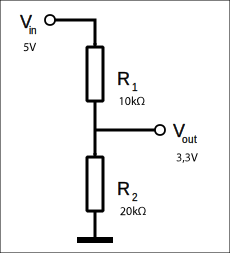

# Practicum UART

## Voorbereiding

- Neem mee:
  - een Arduino Uno
  - een geinstalleerde Raspberry Pi 4
  - je elektronica spullen (breadboard, weerstanden etc.)
  - je logic analyser (als je deze hebt)
- Lees alvast de lesstof door: [UART](./README.md)
- Kijk de volgende video: [Salae Logic Analyser Tutorial](https://www.youtube.com/watch?v=rR5cEFRO9_s)
- Een indruk voor de plaats van deze opdracht in het geheel vind je [in dit overzicht](./img/overzicht1.png) en [in dit overzicht](./img/overzicht2.png).

## Opdracht 1

Laat je Arduino via UART (rx,tx) communiceren met de Arduino van je buurman.

 

### Vraag A

Noteer je bevindingen / persoonlijke lessen.

### Vraag b

Voeg een screenshot van de logic analyser toe met daarop een gecommuniceerde byte. Leg uit hoe uit de bits volgt dat de waarde van de gecommuniceerde byte het getal is dat de logic analyser erbij weergeeft.

## Opdracht 2

Laat je Arduino via seriele verbinding (rx,tx pinnen) communiceren met je Raspberry Pi. 

 

De Arduino heeft 5V logica de Raspberry Pi 3V. Het is verstandig om een voltage divider te maken om zo de elektronica niet te beschadigen. Het aansluit schema zou er dan zo uit moeten zien. De 5V is de tx pin van de Arduino en de 3,3V is verbonden met de rx pin van de Raspberry Pi.

### Vraag A

Noteer je bevindingen / persoonlijke lessen.

## Bonus Opdracht 1

Communiceer vanuit een Python of C++ programma op je Windows laptop via UART met je Raspberry Pi ([gebruik Python op VSCode](../../../software/python/python-op-vscode.md)).

Leen daarvoor een USB to serial converter.

Check even welk type je gebruikt. Als het gebruik maakt van een CP210x chip, kun je hier de driver downloaden:  [driver voor CP210x](https://www.silabs.com/developers/usb-to-uart-bridge-vcp-drivers?tab=downloads))

### Vraag A

Welke code heb je gebruikt op de PC kant?

### Vraag B

Noteer je bevindingen / persoonlijke lessen.

## Bonus Opdracht 2

Zelfde als Bonus Opdracht 1, maar nu twee laptops die (zonder Arduino's) via USB-naar-Serial converters met elkaar communiceren.
