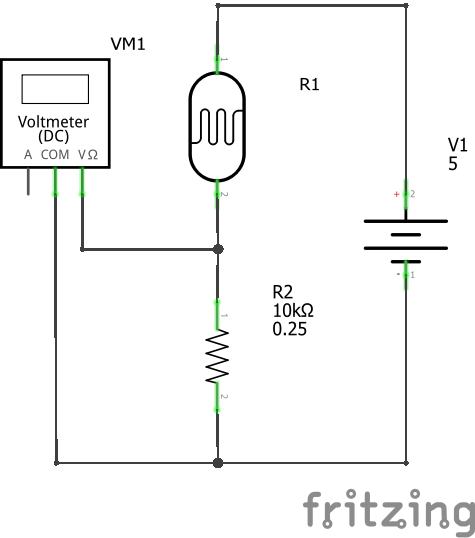
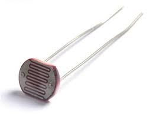
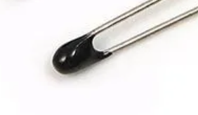
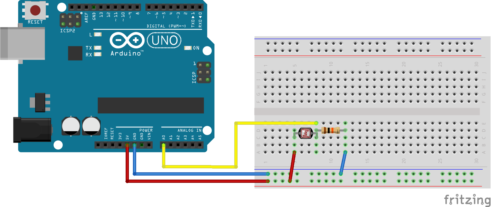

 [](logo-id)

*NTC temperatuur-weerstand curve*

# LDR-NTC: analoog naar digitaal met passieve sensoren [](title-id)

### Inhoud[](toc-id)

- [LDR-NTC: analoog naar digitaal met passieve sensoren ](#ldr-ntc-analoog-naar-digitaal-met-passieve-sensoren-)
    - [Inhoud](#inhoud)
    - [Basis principe](#basis-principe)
    - [LDR](#ldr)
    - [NTC](#ntc)
    - [De schakeling](#de-schakeling)
  - [Arduino voorbeeld code](#arduino-voorbeeld-code)
  - [Referenties](#referenties)

---

### Basis principe

LDR en NTC zijn beiden weerstanden. De ene verandert zijn waarde onder invloed van licht, de andere met de temperatuur.
Met hulp van een vaste weerstand kunnen we deze verandering van weerstand omzetten in de verandering van een spanning.
Deze spanning kan de ADC meten en in een getal omzetten.



Om een analoge waarde te meten en een verandering te zien als de omgeving verandert zijn zowel LDR als NTC geschikt.
(We hadden ook een potmeter kunnen gebruiken. Het principe blijft gelijk.)

### LDR



Een `Light Dependent Resistor` (LDR) verandert zijn weerstand afhankelijk van de hoeveelheid licht die erop valt.

De LDR's in de [Turing Lab Hardware Shop](https://hu-hbo-ict.gitlab.io/turing-lab/ti-lab-shop/) veranderen hun weerstand tussen ca. 2 MegaOhm (donker) tot circa 600 Ohm (erg helder). Waarschijnlijk is de aanwezige sensor een 5528 type (LDR03/LDR04).

### NTC



Een thermistor is een weerstand die zijn waarde met de temperatuur van de omgeving verandert.

Er zijn twee types van deze weerstanden:

- `Negative Temperature Coefficient` (NTC) weerstanden. Deze verlaagd zijn weerstand als de temperatuur van de omgeving hoger wordt.
- `Positive Temperature Coefficient` (PTC) weerstanden. Deze verhoogd zijn weerstand als de temperatuur van de omgeving hoger wordt.

### De schakeling

We tonen in dit voorbeeld een LDR, maar in plaats ervan kan je ook een NTC gebruiken.



## Arduino voorbeeld code

De voorbeeld code meet alleen een spanning en geeft deze via het serial interface uit.

> Het voorbeeld gebruikt Analog Pin 'A0', maar je kan het programma makkelijk aanpassen om een andere Analog Pin te kiezen. Dat is handig bijvoorbeeld als je een Arduino Nano gebruikt.

```arduino
// LDR-NTC.ino - Analog Input example - 2024-02-04-hp
// Tested on Arduino Nano
// [+5V]---[=LDR or NTC_10K=]---[A0]---[=10k=]---[GND]

const long baudrate = 9600;
const int  delaytime_ms = 1000; // delay 1000ms = 1s

const int pinAnalogIn = A0;
int dataAnalogIn = 0;

// The Arduino Analog-to-Digital Converter (ADC) has 10 bit resolution.
// Each measurement results in a number from 0 to 1023.
// Arduino Uno and Arduino Nano map this to a range from 0 Volts to 5 Volts.
const float analogDataToVolt = 5.0 / 1024;

void setup() {
  pinMode(pinAnalogIn, INPUT);
  // Initialize serial interface and wait for port to open:
  Serial.begin(baudrate);
  while (!Serial) {
    ; // wait for serial port to connect. Needed for native USB port only
  }
  Serial.println("LDR-NTC.ino - Analog Input example");
}

void loop() {
  dataAnalogIn = analogRead(pinAnalogIn);
  Serial.print("Analog input value: ");
  Serial.print(dataAnalogIn);
  Serial.print(" - Voltage: ");
  Serial.println(dataAnalogIn * analogDataToVolt);
  delay(delaytime_ms);
}

//EOF
```
[Arduino bestand](../ADC/files/LDR-NTC/LDR-NTC.ino) 

## Referenties

LDR Datasheets

- [NTE Electronics, Inc. - LDR Photoresistors Datasheet](https://www.nteinc.com/resistor_web/pdf/LDR-Series.pdf)
- [Alldatasheet.com GL5528 (GL55 series)](https://www.alldatasheet.com/datasheet-pdf/pdf/1131893/ETC2/GL5528.html)
- [TME overzicht LDRs van NTE](https://www.tme.eu/en/news/about-product/page/54933/ldr-series-of-photoresistors-from-nte/)

NTC Datasheets

- [Cantherm MF52 series - Pearl-Shaped Precision NTC Thermistor for Temperature Measurement](https://www.cantherm.com/wp-content/uploads/2017/05/cantherm_mf52_1.pdf)
