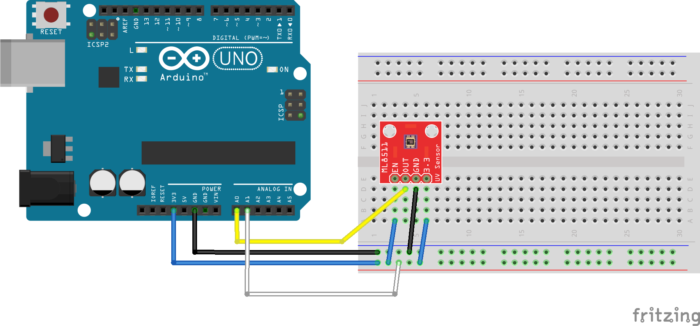

 [](logo-id)

# ADC: analoog naar digitaal[](title-id)

### Inhoud[](toc-id)

- [ADC: analoog naar digitaal](#adc-analoog-naar-digitaal)
    - [Inhoud](#inhoud)
  - [Een introductie](#een-introductie)
  - [GYML8511 UV sensor](#gyml8511-uv-sensor)
  - [De schakeling](#de-schakeling)
    - [ML8511](#ml8511)
    - [GYML8511](#gyml8511)
  - [Arduino voorbeeld code](#arduino-voorbeeld-code)
  - [LDR-NTC](#ldr-ntc)
  - [Referenties](#referenties)

---

**v0.1.1 [](version-id)** Start document voor analoog naar digitaal door HU IICT[](author-id).

---

## Een introductie

Gelukkig is er hardware dat een analoog signaal kan vertalen naar een digitaal signaal. Een dergelijke chip noemen we een *Analog-to-Digital Converter* (ADC). In Arduino’s en in Raspberry Pi’s hebben een aantal pins een ADC ingebouwd. Deze pins heten “analog pins”.

Een ADC wordt gemaakt met onder andere [OpAmps](../../../elektronische-componenten/opamps/README.md). Bij het vertalen van een analoog signaal naar een digitaal signaal zal er altijd informatie verloren gaan. Een analoog signaal kan namelijk een oneindig aantal verschillende waarden aannemen, terwijl een digitaal signaal maar een eindig aantal verschillende waarden kan aannemen. 

  Voorbeeld: Een analoog signaal heeft een waarde tussen de 0V en de 3.3V. Het analoge signaal kan de waarden 0V, 0.1V, 0.2V, 3.2V, 3.3V aannemen. Dit zijn 33 verschillende waarden. Maar het analoge signaal kan ook alle verschillende waarde tussen 0.1V en 0.2V aannemen (0.10V, 0.11V, 0.12V, 0.19V, 0.2V) en ook alle waarden tussen de 0.11V en de 0.12V (0.110V, 0.111V, 0.112V, 0.119V, 0.120V), etc.

Hoeveel verschillende waardes een digitaal signaal kan hebben is afhankelijk van het aantal bits dat het tot zijn beschikking heeft. Ongeacht het altijd bits zijn er altijd minder verschillende digitale waarden, dan verschillende analoge waarden. Een ADC moet dus de verschillende waarden van een analoog signaal opdelen. Hoe kleiner deze delen, hoe beter de resolutie is van de ADC.


In bovenstaand figuur zien we resolutie en de vertaling van een ADC met drie bits afgebeeld. Voor de afbeelding geldt: V<sub>in</sub> is het analoge signaal. V<sub>RefLo</sub> is de laagst mogelijke analoge signaal. E<sub>FSR</sub> is de spreiding die het signaal kan hebben: E<sub>FSR</sub> = V<sub>RefHi</sub> - V<sub>RefLo</sub>, waarbij V<sub>RefHi</sub> de hoogst mogelijke analoge waarde is.

## GYML8511 UV sensor

De module GYML8511 heeft een ingebouwde ultraviolet (UV) licht sensor. Het bereik van de sensor valt tussen de 280 en 390nm (golflengte voor het UVA en UVB spectrum). UV straling is schadelijk voor het menselijk lichaam. Beste resultaten met de UV sensor krijg je buiten met daglicht. De analoge output correspondeert lineair met de UV intensiteit (nW/cm<sup>2</sup>).

    UVB licht kan een positief effect hebben op de groei van planten. Daarnaast wordt UV licht ook gebruikt in laboratoria en ziekenhuizen om te ontsmetten. 

## De schakeling

Omzetting van analoog naar digitaal is afhankelijk van VCC. Maar omdat je voeding kan verschillen kan dit lager of hoger zijn dan 5.0V. Heb je geen stabiele voeding dan kan VCC 0.25V naar boven of beneden afwijken. We gebruiken daarom de onboard 3.3V als referentiespanning.

### ML8511

De EN (Enable) pin en 3V3 sluiten we op de 3.3V pin van de Arduino aan. Deze pin is ook verbonden aan A1. GND naar GND en OUT naar A0 van de Arduino.



### GYML8511

De GYML8511 heeft 5 pins, de pin VIN is voor een interne 'linear regulator' om hogere spanningen nauwkeurig tot 3.3V om te zetten.

| GYML8511 Pin | Omschrijving | Arduino Pin |
| --- | ---          | --- |
| VIN | Spanning invoer naar interne regulator (bv 5V) | +5V |
| 3V3 | Spanning outvoer naar regulator of invoer 3.3V  | A1  |
| GND | Ground (Massa), 0V                            | GND |
| OUT | Output, spanning afhankelijk van UV licht     | A0  |
| EN  | Enable, deze pin schakelt de sensor aan/uit   | 3V3 |

**Let op dat 5V alleen aan VIN komt, anders kan de module kapot gaan!**

De GYML8511 geeft aan OUT een spanning af die afhankelijk is van de sterkte van UV licht die op de sensor valt.

* Spanningen in een elektronische schakeling zijn vaak niet perfekt. Een waarde die eigenlijk van 0.0V tot 3.3V moet lopen gaat feitelijk soms van 0.0V tot 3.1V.
* Bij het meten van spanningen is het daarom belangrijk dat de ADC (Analog-to-Digital Converter) de juiste 'reference' heeft.
* In dit voorbeeld laten we daarom de Arduino naast de spanning aan 'OUT' ook de spanning aan '3V3' (3.3V) van de GYML8511 meten.
* Het meten (de conversie van analoog tot digitaal) levert bij een Arduino Uno of Nano een getal van 0 t/m maximaal 1023 (='10 bits').
* De waarde van de '3V3'-pin gebruiken we als een maximum-referentie voor de digitale waarde van de 'OUT'-pin om de juiste voltage te berekenen.

## Arduino voorbeeld code

```arduino
int UVOUT = A0; //Output from the sensor
int REF_3V3 = A1; //3.3V power on the Arduino board
//code from https://how2electronics.com/uv-sensor-ml8511-arduino-uv-ray-intensity-meter/


void setup()
{
  Serial.begin(9600);

  pinMode(UVOUT, INPUT);
  pinMode(REF_3V3, INPUT);

  Serial.println("MP8511 UV sensor");
}

void loop()
{
  int uvLevel = averageAnalogRead(UVOUT);
  int refLevel = averageAnalogRead(REF_3V3);
  
  //Use the 3.3V power pin as a reference
  float outputVoltage = 3.3 / refLevel * uvLevel;
  
  float uvIntensity = mapfloat(outputVoltage, 0.99, 2.9, 0.0, 15.0);

  Serial.print("MP8511 output: ");
  Serial.print(uvLevel);

  Serial.print(" MP8511 voltage: ");
  Serial.print(outputVoltage);

  Serial.print(" UV Intensity (mW/cm^2): ");
  Serial.print(uvIntensity);
  
  Serial.println();
  
  delay(1000);
}

//Avarge reading from analog pin
int averageAnalogRead(int pinToRead)
{
  byte numberOfReadings = 8;
  unsigned int runningValue = 0; 

  for(int x = 0 ; x < numberOfReadings ; x++)
    runningValue += analogRead(pinToRead);
  runningValue /= numberOfReadings;

  return(runningValue);  
}

//The Arduino Map function but for floats
//From: http://forum.arduino.cc/index.php?topic=3922.0
float mapfloat(float x, float in_min, float in_max, float out_min, float out_max)
{
  return (x - in_min) * (out_max - out_min) / (in_max - in_min) + out_min;
}
```
[Arduino bestand](../ADC/files/GYMP8511/GYMP8511.ino) 

## LDR-NTC

Andere sensoren zoals een lichtgevoelige weerstand (LDR) of een NTC-weerstand om de temperatuur te meten geven ook een analoge waarde die je op bovenstaande manier kunt uitlezen. Zie het voorbeeld met een [LDR](LDR-NTC.md) en [NTC](LDR-NTC.md).

## Referenties

- [Analoog en digitaal](<https://en.wikipedia.org/wiki/Analogue_electronics#Analogue_vs_digital_electronics>)
- [De invloed van UVB licht op planten](<https://www.nature.com/articles/s41438-021-00629-5>)
- [GYML8511 UV Sensor (Sunfounder)](http://wiki.sunfounder.cc/index.php?title=GYML8511_UV_Sensor)
- [UV Sensor ML8511 & Arduino for UV Ray Intensity Meter](https://how2electronics.com/uv-sensor-ml8511-arduino-uv-ray-intensity-meter/)
