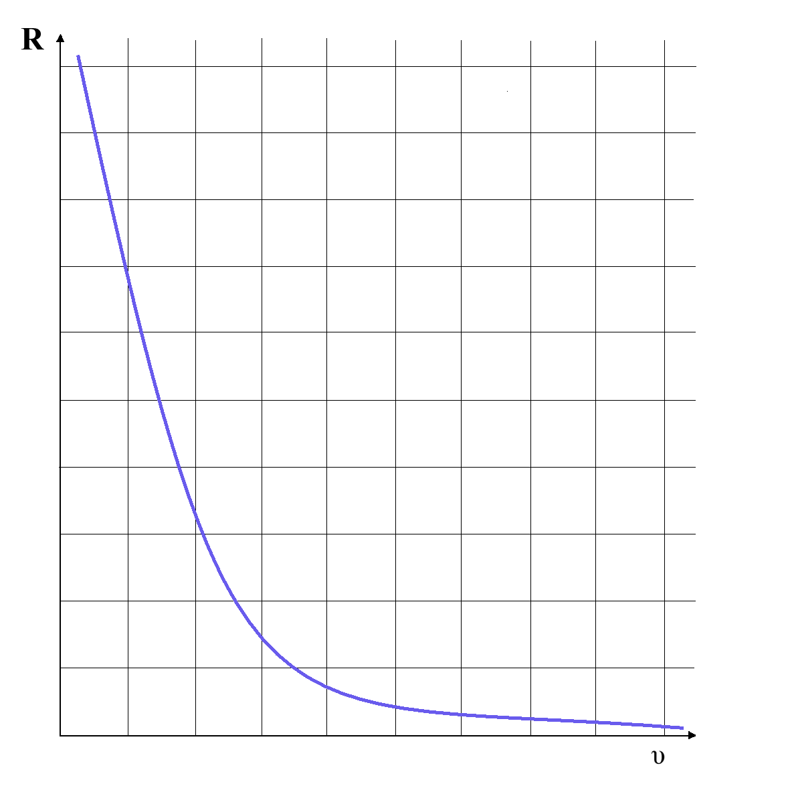
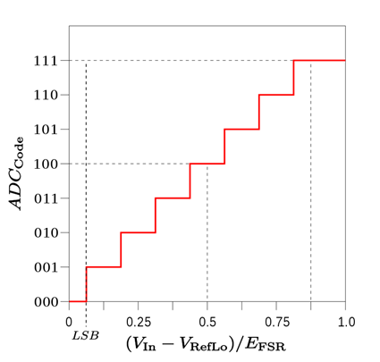

 

# ADC: analoog naar digitaal 

### Inhoud <!-- omit in toc -->

- [ADC: analoog naar digitaal](#adc-analoog-naar-digitaal)
  - [Een introductie](#een-introductie)
  - [Opdracht](#opdracht)
  - [Referenties](#referenties)

---

**v0.1.2 ** Start document voor analoog naar digitaal door HU IICT.

---

## Een introductie

Analoge en digitale signalen worden allebei gebruikt om informatie te verzenden. Het belangrijkste verschil is hoe ze werken: analoge signalen hebben een continue stroom, terwijl digitale signalen bestaan uit losse pulsen. Moderne computers werken echter digitaal hoe kan je dan toch een analoog signaal uitlezen?

Gelukkig is er hardware dat een analoog signaal kan vertalen naar een digitaal signaal. Een dergelijke chip noemen we een *Analog-to-Digital Converter* (ADC). In Arduino’s en in Raspberry Pi’s hebben een aantal pins een ADC ingebouwd. Deze pins heten “analog pins”.

Een ADC wordt gemaakt met onder andere [OpAmps](../../../elektronische-componenten/ic/OpAmp/README.md). Bij het vertalen van een analoog signaal naar een digitaal signaal zal er altijd informatie verloren gaan. Een analoog signaal kan namelijk een oneindig aantal verschillende waarden aannemen, terwijl een digitaal signaal maar een eindig aantal verschillende waarden kan aannemen. 

  Voorbeeld: Een analoog signaal heeft een waarde tussen de 0V en de 3.3V. Het analoge signaal kan de waarden 0V, 0.1V, 0.2V, 3.2V, 3.3V aannemen. Dit zijn 33 verschillende waarden. Maar het analoge signaal kan ook alle verschillende waarde tussen 0.1V en 0.2V aannemen (0.10V, 0.11V, 0.12V, 0.19V, 0.2V) en ook alle waarden tussen de 0.11V en de 0.12V (0.110V, 0.111V, 0.112V, 0.119V, 0.120V), etc.

Hoeveel verschillende waardes een digitaal signaal kan hebben is afhankelijk van het aantal bits dat het tot zijn beschikking heeft. Ongeacht het altijd bits zijn er altijd minder verschillende digitale waarden, dan verschillende analoge waarden. Een ADC moet dus de verschillende waarden van een analoog signaal opdelen. Hoe kleiner deze delen, hoe beter de resolutie is van de ADC.

In bovenstaand figuur zien we resolutie en de vertaling van een ADC met drie bits afgebeeld. Voor de afbeelding geldt: Vin is het analoge signaal. VRefLo is de laagst mogelijke analoge signaal. EFSR is de spreiding die het signaal kan hebben: EFSR = VRefHi - VRefLo, waarbij VRefHi de hoogst mogelijke analoge waarde is.

## Opdracht

Maak een eerste schakeling met een Arduino Uno. Lees een [LDR of NTC](LDR-NTC.md) uit met de serial monitor. Documenteer wat je maakt en ziet. Beschrijf de werking van de sensor die je gebruikt in je elektronische schakeling. Leg dit vast in een Markdown document en plaats dit op je persoonlijke repo. Vraag feedback aan de docent. 

Heb je extra uitdaging nodig maak dan een eigen [UV monitor](YML8511_UV_sensor.md) voor het project.

## Referenties

- [Analoog en digitaal](<https://en.wikipedia.org/wiki/Analogue_electronics#Analogue_vs_digital_electronics>)
