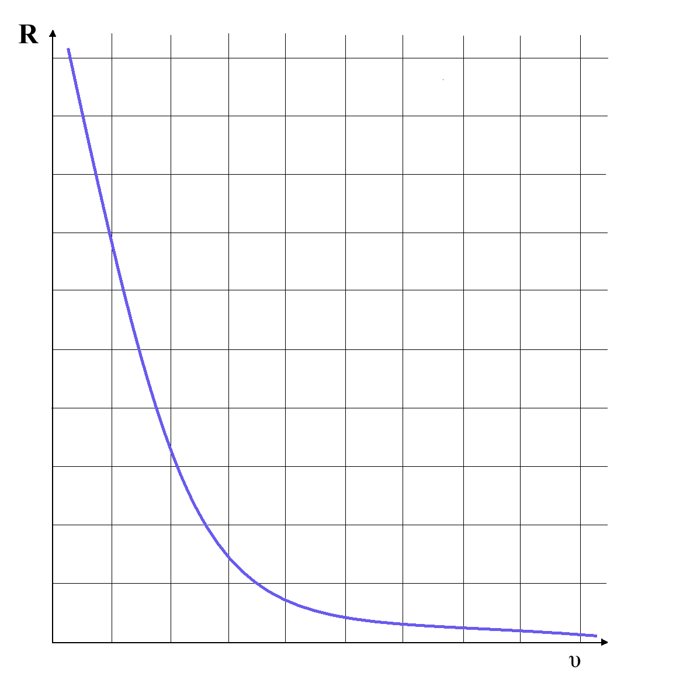
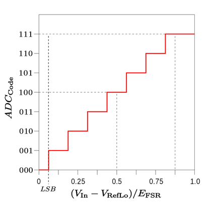

 

# ADC: analoog naar digitaal <!-- omit in toc -->

### Inhoud <!-- omit in toc -->

- [Een introductie](#een-introductie)
- [Opdracht](#opdracht)
- [Referenties](#referenties)

---

**v0.1.2 ** Start document voor analoog naar digitaal door HU IICT.

---

## Een introductie

Analoge en digitale signalen worden allebei gebruikt om informatie te verzenden.
Het belangrijkste verschil is hoe ze werken: analoge signalen hebben een continue stroom, 
terwijl digitale signalen bestaan uit losse pulsen.

Moderne computers werken echter digitaal. Hoe kan je dan toch een analoog signaal uitlezen?

Gelukkig is er hardware dat een analoog signaal kan vertalen naar een digitaal signaal.
Een dergelijke chip noemen we een `Analog-to-Digital Converter (ADC)`.
In Arduino’s en in Raspberry Pi’s hebben een aantal pins een ADC ingebouwd.
Deze pins heten `analog pins`.

Een ADC wordt gemaakt met onder andere [OpAmps](../../../elektronische-componenten/ic/OpAmp/README.md).

Bij het vertalen van een analoog signaal naar een digitaal signaal zal er altijd informatie verloren gaan.

Een analoog signaal kan namelijk een oneindig aantal verschillende waarden aannemen, terwijl een digitaal signaal maar een eindig aantal verschillende waarden kan aannemen.

> Voorbeeld:
>
> Een analoog signaal heeft een waarde tussen de 0V en de 3.3V.
>
> Het analoge signaal kan de waarden 0V, 0.1V, 0.2V, ..., 3.2V, 3.3V aannemen.\
> Dit zijn 34 verschillende waarden.
>
> Maar het analoge signaal kan ook alle verschillende waarde tussen 0.1V en 0.2V aannemen:\
> 0.10V, 0.11V, 0.12V, 0.13V, 0.14V, 0.15V, 0.16V, 0.17V, 0.18V, 0.19V, 0.20V
> 
> En het kan ook alle waarden tussen de 0.11V en de 0.12V aannemen:\
> 0.110V, 0.111V, 0.112V, 0.113V, 0.114V, 0.115V, 0.116, 0.117V, 0.118V, 0.119V, 0.120V
> 
> Zo gaat het verder: ook alle waarden tussen 0.110V en 0.111V, enzofoort !

Hoeveel verschillende waardes een digitaal signaal kan hebben is afhankelijk van het aantal bits dat het tot zijn beschikking heeft. Ongeacht het altijd bits zijn, zijn er altijd minder verschillende digitale waarden dan verschillende analoge waarden. Een ADC moet dus de verschillende waarden van een analoog signaal opdelen. Hoe kleiner deze delen, hoe beter de *resolutie* is van de ADC.

In bovenstaand figuur zien we resolutie en de vertaling van een **ADC met drie bits** afgebeeld.

Voor de afbeelding geldt:

- Vin is het analoge signaal.
- VRefLo is de laagst mogelijke analoge signaal.
- EFSR is de spreiding die het signaal kan hebben:\
  EFSR = VRefHi - VRefLo,\
  waarbij VRefHi de hoogst mogelijke analoge waarde is.

## Kenmerken van een Analog-to-Digital Converter (ADC)

Als je een ADC wil gebruiken is het belangrijk op te letten op deze eigenschappen:

- `Voltage range`: dit geeft aan welke spanning een ADC minimaal en maximaal kan verwerken.

  Bijvoorbeeld kunnen de ADCs van de Arduino UNO een bereik van 0V...5V verwerken.\
  De ADCs van een Raspberry Pi Pico kunnen alleen een bereik van 0V...3,3V verwerken.

  Als je een analog signaal hebt dat grotere waardes kan aannemen, bijvoorbeeld 0V...15V, dan moet je voor zorgen dat de ADC nooit voltages buiten zijn 'voltage range' "ziet", anders kan de ADC kapot gaan (en de hele microcontroller!).

  Als je andersom een analoog signaal wil vertalen naar digitaal dat een heel klein waardebereik heeft, bijvoorbeeld 0,5V...1,2V dan gebruikt dit alleen een klein uittreksel van het meetbereik. Dan is het voor een nauwkeurigere meting aangeraden dit signaal met een analoge versterker over te zetten naar het waardebereik van de ADC (bijvoorbeeld 0,5V...1,2V voor een Arduino UNO overzetten naar 0V...5V).

- `Resolution in bits per sample`: dit geeft aan hoe nauwkeurig de ADC de analoge meetwaardes kan vertalen in getallen.
  
   Van een ADC met "8 bits per sample" kan je een getal van 0..255 uitlezen. We noemen dit dan soms ook een 8-bit-ADC. Van een 10-bit-ADC kan je een getal van 0..1023 uitlezen.

   Bij een 8-bit-ADC heb je dus 256 stappen die je kan onderscheiden, bij een 10-bit-ADC zijn het 1024 stappen.

- `Maximum Sample Frequency` : dit geeft aan hoeveel analoge waardes de ADC per seconde kan vertalen naar een getal. 
  Soms vind je ook een waarde voor de `Maximum conversion time`, dit geeft aan hoeveel tijd nodig is om een analoge waarde te vertalen in een getal. 
  > Als je de ene waarde hebt kan je deze omrekenen in de andere:\
  >
  > Bijvoorbeeld betekent een 'sample frequency' van 20 Hertz \
  > dat per seconde 20 waardes kunnen worden overgezet van analoog naar digitaal.
  >
  > Het overzetten van een waarde vergt dus de 'conversion time' van \
  > $t_{conv} = \frac{1 s}{20} = \frac{1000 ms}{20} = 50 ms$.

## Opdracht

- Maak een eerste schakeling met een Arduino Uno.
- Lees een [LDR of NTC](LDR-NTC.md) uit met de serial monitor.
- Documenteer wat je maakt en ziet.
- Beschrijf de werking van de sensor die je gebruikt in je elektronische schakeling.
- Leg dit vast in een Markdown document en plaats dit op je persoonlijke repo.
- Vraag feedback aan de docent.

Heb je extra uitdaging nodig? Maak dan een eigen [UV monitor](YML8511_UV_sensor.md) voor het project.

## Referenties

- [Analoog en digitaal (Wikipedia)](<https://en.wikipedia.org/wiki/Analogue_electronics#Analogue_vs_digital_electronics>)
- [Analog-to-Digital-Converter (Wikipedia)](https://en.wikipedia.org/wiki/Analog-to-digital_converter)
