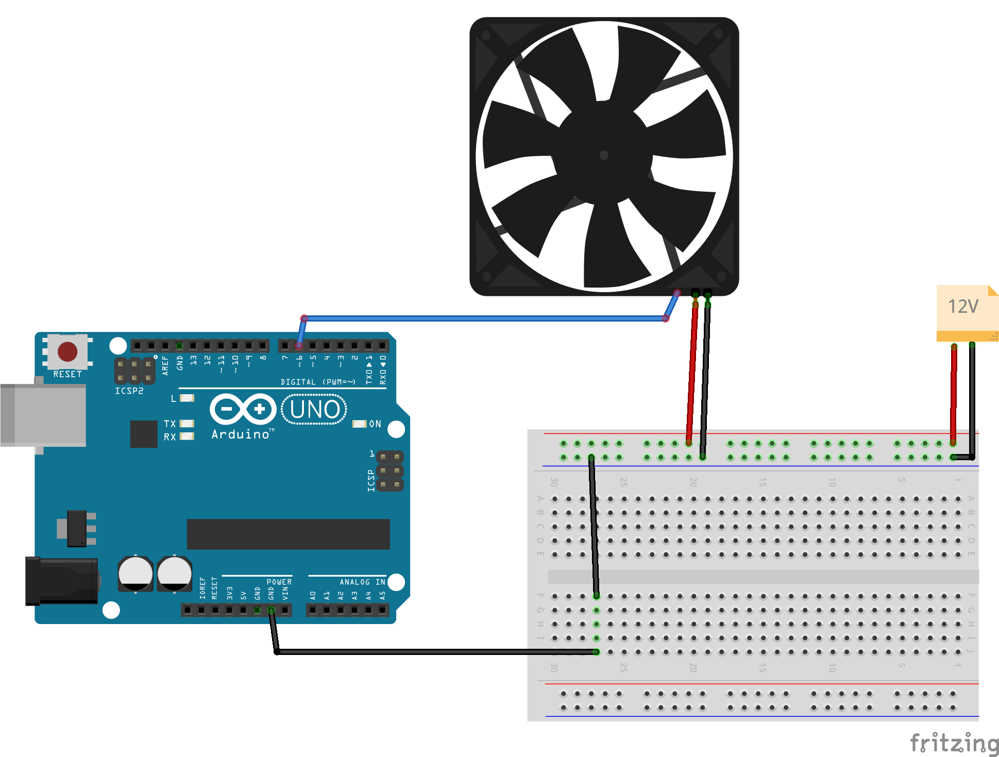

 [](logo-id)

# DAC: digitaal naar analoog[](title-id) <!-- omit in toc -->

### Inhoud[](toc-id) <!-- omit in toc -->

- [Een introductie](#een-introductie)
- [PWM](#pwm)
- [PWM frequency](#pwm-frequency)
- [Duty cycle](#duty-cycle)
- [Titan Silent Fan TFD-8015HH12ZP/W1](#titan-silent-fan-tfd-8015hh12zpw1)
- [De schakeling](#de-schakeling)
- [Arduino voorbeeld code](#arduino-voorbeeld-code)
- [Referenties](#referenties)

---

**v0.1.0 [](version-id)** Start document voor digitaal naar analoog door HU IICT[](author-id).

---

## Een introductie

*Digital-to-Analog Converters* (DAC) hebben net als ADC’s een beperking met betrekking tot de resolutie van het signaal. Afhankelijk van hoeveel bits ze als input hebben kunnen ze een hoeveelheid verschillende analoge signalen maken. Er zijn verschillende types van *Digital-to-Analog Converters*  (DAC). We gaan hier in op *Pulse Width Modulation*  (PWM), omdat dit een techniek is die je als Technische Informaticus nog wel eens zal implementeren. Naast PWM zijn er ook andere type DAC’s.

## PWM

Bij PWM is de output niet direct een analoog signaal. Iets wat andere DAC wel produceren In plaats daarvan stuurt PWM pulsen van digitale signalen. Door deze in lengte te variëren staat er “gemiddeld” een bepaalde analoge waarde op een draad.

## PWM frequency

Dit geeft aan hoeveel PWM pulse per seconde worden verstuurd/ontvangen.

## Duty cycle

De PWM *duty cycle* beschrijft hoe de verhouding is van hoe lang het signaal hoog is en hoe lang het signaal laag is.

De *duty cycle* kan worden aangegeven als een percentage tussen 0% en 100%.  
Soms is in het datasheet van het ontvangende toestel ook een minimaal en maximaal tijd aangegeven.


In bovenstaand figuur zien we drie voorbeelden van duty cycle. PWM is makkelijk zelf te implementeren door snel, in de juiste verhouding, een pin een hoog signaal en daarna weer een laag signaal te laten sturen. Het nadeel hiervan is dat microcontroller dan ondertussen geen andere taken kan uitvoeren. Gelukkig is hier ook specifieke hardware (zoals de TL5002) voor. Op de meeste Arduino’s zijn enkele pins uitgerust met PWM. Voor de meeste Arduino’s zijn dat pin 3, 5, 6, 9, 10 en 11. PWM is erg handig als je bijvoorbeeld een elektromotor of servo wil aansturen.

> PWM wordt al heel lang gebruikt voor het aansturen van computer ventilatoren die nodig zijn om te koelen. Omdat het voltage niet hoeft worden aangepast maar omdat een PWM signaal wordt gestuurd kunnen moederborden goedkoper gemaakt worden (geen extra voltage regulators nodig).

## Titan Silent Fan TFD-8015HH12ZP/W1

Om voor koeling te zorgen maken we gebruik van de Titan Fan. Deze werkt op 12V maar dat kan een Arduino niet leveren. Een externe voeding is daarom nodig.

## De schakeling


De Titan Silent Fan heeft een 4-pin Molex aansluiting met de volgende aansluitingen:

1) **Blauw** voor PWM signaal 5V, 25kHz
2) **Geel** voor Sense (het meten van het aantal RPM)
3) **Rood** voor 12V
4) **Zwart** voor GND

> Draden kunnen van kleur verschillen!
>
> Zo zijn er ook 4-pin aansluitingen met de kleuren
>
> - blauw (PWM)
> - groen (Sense)
> - geel (VDD +5V, +12V of +24V, afhankelijk van het model)
> - zwart (GND).



> **Let op** dat je alleen de GND van de Arduino met GND van de voeding en de Titan Silent Fan verbindt.  
> **Anders kan je de Arduino beschadigen.**

## Arduino voorbeeld code

> Een "4-pin PWM Fan" gebruikt vaak een PWM frequency van 25kHz.  
> Maar de Arduino kan geen zo snelle PWM-pulses leveren (zie analogWrite()).  
> De Titan PWM-Fan die we gebruiken werkt ook met deze (veel lagere) frequentie.

```arduino
// PWM.ino - Pulse Width Modulation example (fan control)
// "Fading in and out" of maximum fan speed.
int delay_ms = 300;  // delay for the main loop
int fan_pin = 6;     // the PWM pin we use (make sure the pin supports PWM if you change this!)
int fan_speed = 0;   // current speed of the fan
int fan_delta = 5;   // amount to change the speed (pos/neg)

void built_in_self_test() {
  // flash built-in LED three times
  pinMode(LED_BUILTIN, OUTPUT);
  for (int i = 0; i < 3; i++) {
    digitalWrite(LED_BUILTIN, HIGH);
    delay(500);
    digitalWrite(LED_BUILTIN, LOW);
    delay(500);
  }
}

void setup() {
  built_in_self_test();
  pinMode(fan_pin, OUTPUT);  // declare PWM pin to be an output
}

void loop() {
  // set the speed of fan by generating a PWM signal
  analogWrite(fan_pin, fan_speed);
  // change the speed for next iteration
  fan_speed = fan_speed + fan_delta;
  // make sure fan_speed does not get lower than 0 or higher than 255
  if (fan_speed < 0) {
    fan_speed = 0;
  } else if (fan_speed > 255) {
    fan_speed = 255;
  }
  // reverse the direction of the fan_delta at the ends of the 'fade'
  if (fan_speed <= 0 || fan_speed >= 255) {
    fan_delta = -fan_delta;
  }
  // wait for 300 milliseconds to see the fade effect
  delay(300);
}
```

[Arduino bestand](../DAC/files/PWM/PWM.ino)

## Referenties

- Analoog en digitaal (<https://en.wikipedia.org/wiki/Analogue_electronics#Analogue_vs_digital_electronics>)
- Pulse-width modulation (<https://en.wikipedia.org/wiki/Pulse-width_modulation>)
- Arduino PWM (<https://docs.arduino.cc/tutorials/generic/secrets-of-arduino-pwm>)
- [Titan TFD-8015HH12ZP_W1 page](https://www.titan-cd.com/en/product/TFD-8015HH12ZP_W1.html)
- [Arduino analogWrite() function](https://docs.arduino.cc/language-reference/en/functions/analog-io/analogWrite/)
- [Arduino PWM pins](https://support.arduino.cc/hc/en-us/articles/9350537961500-Use-PWM-output-with-Arduino) <!-- markdown-link-check-disable-line -->
