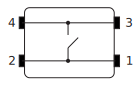
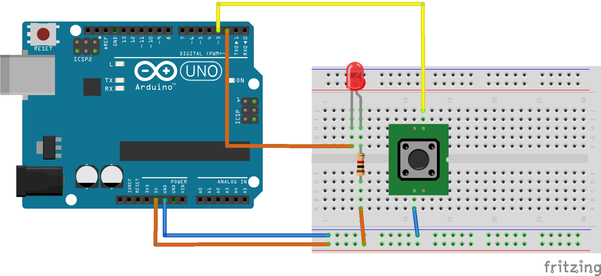

 [](logo-id)

# Digital I/O [](title-id) <!-- omit in toc -->

### Inhoud[](toc-id) <!-- omit in toc -->

- [Basis principe](#basis-principe)
- [Button](#button)
- [LED](#led)
- [De schakeling](#de-schakeling)
- [Arduino voorbeeld code](#arduino-voorbeeld-code)
- [Oefeningen](#oefeningen)
- [Referenties](#referenties)

---

## Basis principe

Als een deur schakelaar sluit, of als we een lampje willen aan/uitzetten, dan hebben we met digitale signalen te maken.
Deze zijn of 'aan' of 'uit'. (Tegenover digitale kunnen [analoge signalen ook tussenstanden](../ADC/README.md) innemen.)

## Button

Als je een button (knop) indrukt dan wordt een contact gesloten.

De Omron B3F-4055 heeft intern de volgende configuratie:



- Zoek deze informatie op in het datasheet van dit component.
- Hoe zou je bovenstaande configuratie kunnen testen? Leg uit.

Wanneer je het knopje indrukt kunnen we dit met een Digital-I/O Pin meten en omzetten in een `0` of `1`.

In de Arduino zijn weerstanden tegen +5V ingebouwd die we met `INPUT_PULLUP` kunnen inschakelen.
Dat bespaart ons de moeite, zelf een weerstand te moeten toevoegen. Het betekent ook dat we deze button tussen pin en massa (GND, Ground) aansluiten om de waarde die we van de pin kunnen lezen van `1` (dat doet de `PULLUP`) naar `0` te wijzigen.

## LED

Een LED ([Light Emitting Diode](../../../elektronische-componenten/LED/README.md)) kunnen we met een digitaal signaal aan- of uitzetten.
Daarbij moeten we opletten dat er niet teveel stroom door de LED gaat. Als het goed is weten we dit principe nog van de Orientatie op Technische Informatica.

- Hoe beperken we de stroom die door de weerstand loopt?

In deze schakeling zijn LED en weerstand tussen +5V en de pin aangesloten. Daardoor licht de LED op als de spanning aan de pin 'laag' is - de LED licht op als we deze pin op '0' zetten, ze gaat uit als we de pin op '1' zetten.

## De schakeling

We tonen in dit voorbeeld een LED en een Button.



## Arduino voorbeeld code

De voorbeeld code leest de toestand van de Button. Zolang deze is ingedrukt laat de code de LED knipperen.

```arduino
// LED-Button.ino - Digital Input/Output example - 2024-02-15-hp
// Tested on Arduino Uno
// [+5V]---[=1kOhm=]---[LED]---[D2]
// [GND]---[Button]---[D3]

const int delaytime_ms = 500;  // delay 1000ms = 1s, 500ms = 0.5s
const int pinLED = 2;          // Pin 2 - Digital Output
const int pinButton = 3;       // Pin 3 - Digital Input

int stateLED = 1;  // start state: LED off

void setup() {
  pinMode(pinButton, INPUT_PULLUP);
  pinMode(pinLED, OUTPUT);
  digitalWrite(pinLED, stateLED);  // LED off (initial)
}

void loop() {
  if (digitalRead(pinButton) == LOW) {
    stateLED = 1 - stateLED;         // reverse LED status
    digitalWrite(pinLED, stateLED);  // LED on or off (stateLED==0 -> ON, stateLED==1 -> OFF)
    delay(delaytime_ms);
  }
}

// EOF
```

[Arduino bestand](LED-Button/LED-Button.ino)

## Oefeningen

- Laat de LED knipperen wanneer je de knop indrukt, bijvoorbeeld 1x per seconde.
- Extra uitdagend: Wanneer je de knop indrukt is deze niet direct hoog of laag door de mechanische constructie.\
  Dit kan je ondervangen door softwarematig een 'debounce delay' toe te voegen. Kan jij dit met software oplossen?

## Referenties

LED Datasheet

- [5mm-LED-Datasheet](5mm-LED-Datasheet.pdf)

Tactile switch

- [Omron B3F-4055](https://omronfs.omron.com/en_US/ecb/products/pdf/en-b3f.pdf)
