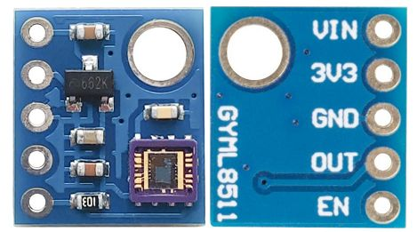

 

# Analoog en digitaal

### Inhoud <!-- omit in toc -->

- [Analoog en digitaal](#analoog-en-digitaal)
    - [Inhoud](#inhoud)
  - [Een introductie](#een-introductie)
  - [Referenties](#referenties)

---

**v0.1.0 ** Start document voor Analoog en Digitaal door HU IICT.

---

## Een introductie

Een andere vorm van communicatie is die tussen [analoge](../analoog-en-digitaal/ADC/README.md) en [digitale](../analoog-en-digitaal/DAC/README.md) systemen. Digitale systemen kennen alleen hoge en lage signalen (1 of 0). Analoge systemen kunnen ook alle mogelijke waarde hebben tussen het hoge signaal en het lage signaal. Een voorbeeld van een analoog systeem is de UV sensor GYML8511. 

Deze sensor heeft maar één output pin. Afhankelijk van het UV licht dat de sensor detecteert geeft de output-pin een waarde tussen GND en VCC. Dit geeft een uitdaging als we het signaal met een computer willen verwerken. Computers zijn immers digitale systemen en kunnen niet omgaan met analoge signalen.

## Referenties

- Analoog en digitaal (<https://en.wikipedia.org/wiki/Analogue_electronics#Analogue_vs_digital_electronics>)