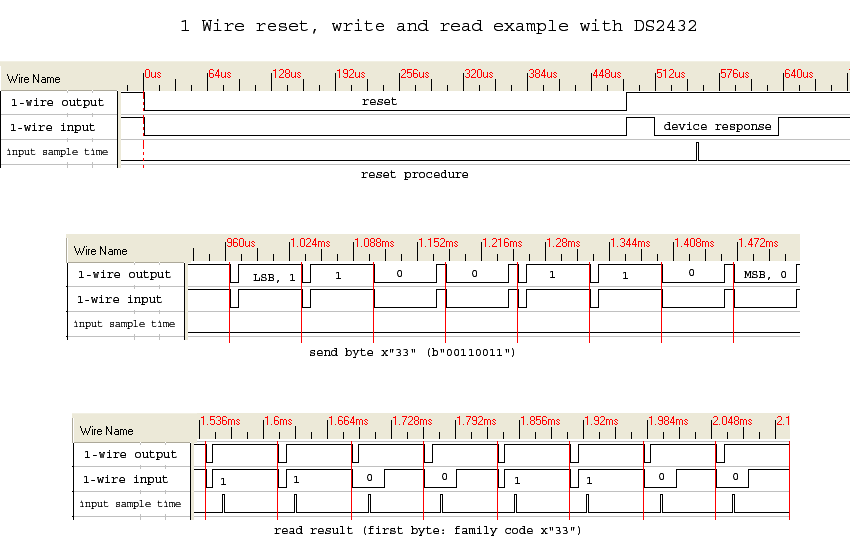

 

# Basis elektronica

### Inhoud

- [Basis elektronica](#basis-elektronica)
    - [Inhoud](#inhoud)
  - [Een introductie](#een-introductie)

---

**v0.1.0 ** Start document voor basis elektronica door HU IICT.

---

## Een introductie

This chapter provides information for dealing with electronic aspects of small intelligent devices. It is definitely not intended to educate the reader to the level of an electronic designer, but it aims to give a common language for communication with a (micro-) electronics specialist, and enough information to make rough calculations of the viability and functional properties of a design.

