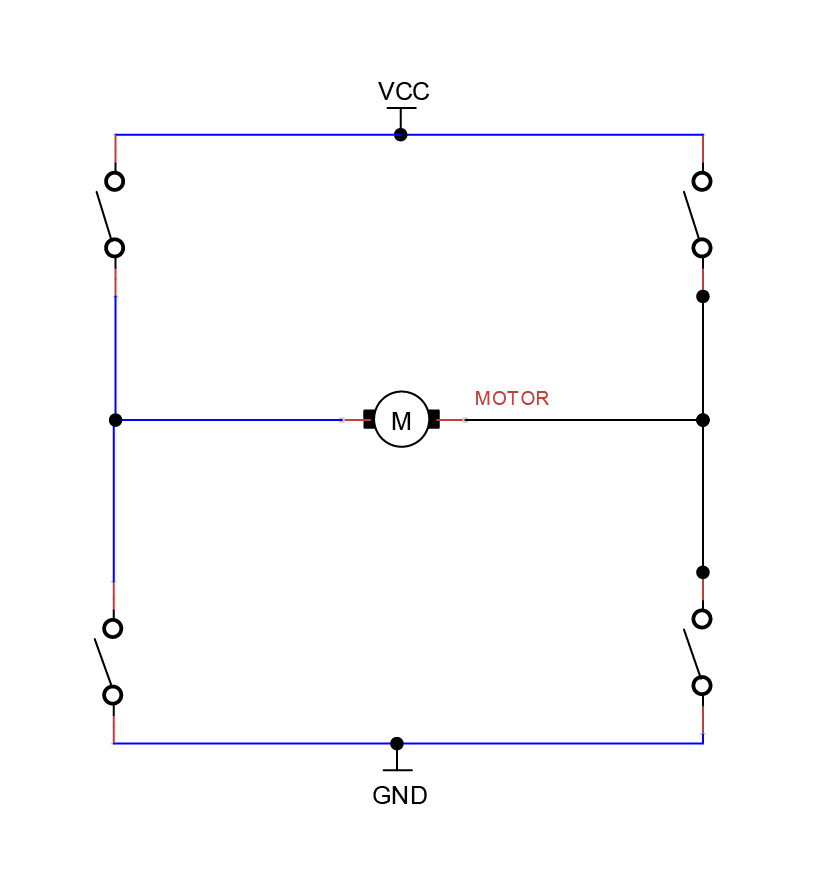
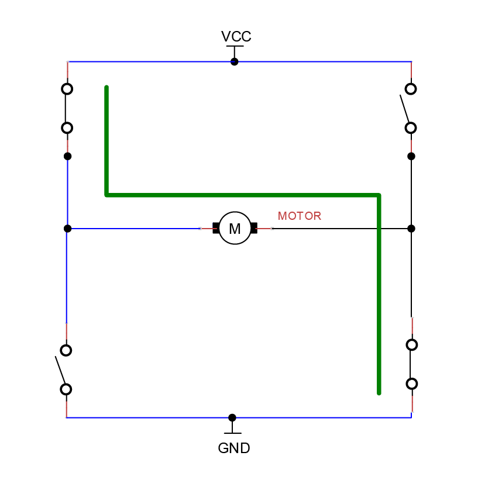
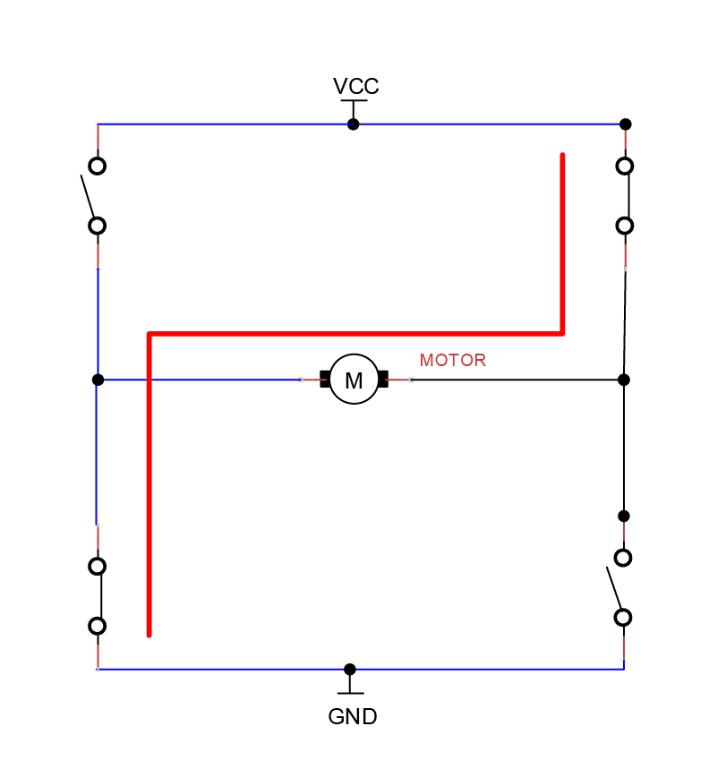
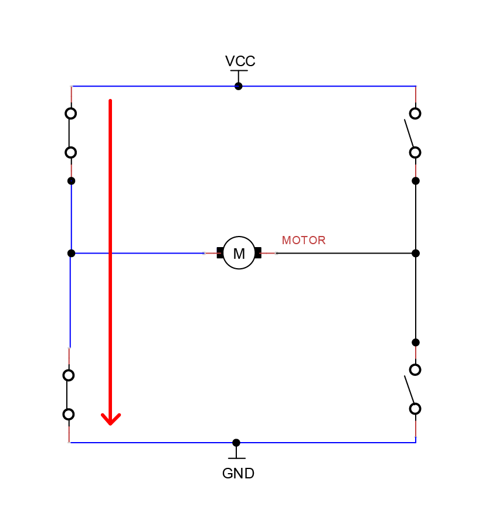
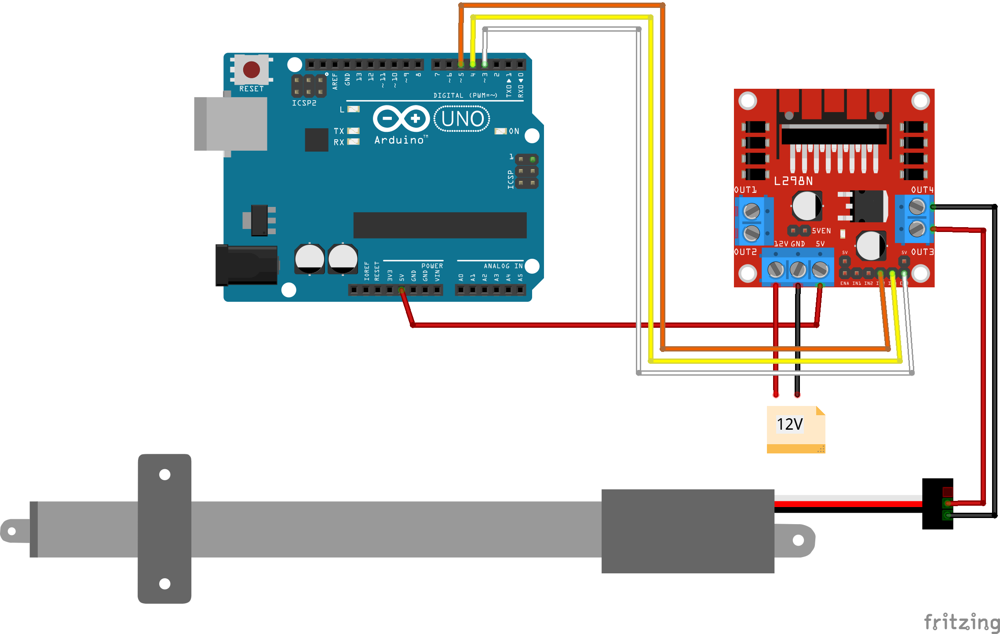

 [](logo-id)

# H-brug[](title-id)

### Inhoud[](toc-id)

- [H-brug](#h-brug)
    - [Inhoud](#inhoud)
  - [Een introductie](#een-introductie)
    - [PWM en Servo motoren](#pwm-en-servo-motoren)
    - [L298N Driver](#l298n-driver)
  - [Arduino example](#arduino-example)

---

**v0.1.0 [](version-id)** Start document voor H-brug door HU IICT[](author-id).

---

## Een introductie

Een H-brug is een circuit dat een voedingsspanning in beide richtingen op een belasting (‘load’) kan aansluiten. Typische toepassingen van een H-brug zijn om een DC-motor vooruit of achteruit te laten rijden. Ze worden veelvuldig gebruikt in robotica en andere gebieden waar motoren worden aangestuurd. 

Het heeft weinig verbeelding nodig waar de naamgeving vandaan komt als je onderstaand schakelschema bekijkt.



Om de gewenste polariteit over de terminals te krijgen dienen de vier schakelaars in verschillende posities te staan.


Er vloeit stroom van links naar rechts door de Motor.


Er vloeit stroom van rechts naar links door de Motor.

Het is goed om te weten dat bij een H-brug het zogenoemde shoot-trough effect kan optreden. Dit kan voorkomen wanneer beide linker of rechter schakelingen zijn gesloten. Dit zorgt voor kortsluiting en kan de aangesloten motor beschadigen. Dit kan gebeuren door een software fout of bijvoorbeeld in een ‘overlap’ van het stuursignaal wanneer de polariteit wordt gewisseld.



Het gebruik van een motor [driver](#l298n-driver) helpt dergelijke problemen te voorkomen.

### PWM en Servo motoren

Servo motoren kunnen aangestuurd worden door een Pulse Width Modulation (PWM) signaal. Dit is een techniek om met behulp van digitale pulsen een analoog circuit aan te sturen. Het wordt bijvoorbeeld ook gebruikt voor het aansturen van RGB LED verlichting. 

Het is een efficiënte aanstuurtechniek omdat de stroomsterkte geregeld kan worden zonder dat er vermogensverlies optreed. We kunnen met een voorschakelweerstand de elektrische stroomsterkte begrenzen zoals we met de potentiometer hebben gezien. Een PWM signaal verlaagt ook de stroomsterkte maar dan door het signaal steeds aan en uit te schakelen. Immers uit de wet van Ohm volgt als we het voltage halveren we de stroomsterkte ook halveren. Wanneer het signaal 50% van de tijd uit is en 50% aan dan is het PWM signaal op 50% van zijn duty cycle.

We kunnen deze tijden variëren. Als we uitgaan van een 5V output en het signaal is 50% aan en 50% uit dan is dit effectief 2.5 Volt. Als we dit verder reduceren naar 25% aan en 75% uit is het signaal op 25% duty cycle en voeden we de load met 1.25 volt. We moduleren de pulse breedte en daar komt de benaming Pulse Width Modulation (PWM) vandaan.

Bij een servo wordt een PWM signaal uitsluitend gebruikt als signaal drager. De mate waarin het signaal aan en uit is heeft betekenis (stuursignaal). De tijd dat het signaal hoog is geeft aan waar de servo naar toe moet en hoe snel.

Zie voor een voorbeeld en uitleg van PWM ook het voorbeeld met het [aansturen van een ventilator](../../communicatie/analoog-en-digitaal/DAC/README.md).

### L298N Driver

Met een H-brug kunnen we het potentiaal omdraaien en met PWM kunnen we de stroomsterkte regelen. Een Motor driver zoals de L298N Driver combineert deze twee mogelijkheden. Dit is een dual motor driver en je kunt dus twee motoren aansturen via [GPIO pinnen](../../communicatie/analoog-en-digitaal/README.md) van de Arduino Uno. Met een 12 volt voeding is de 'voltage drop' ongeveer 2V. Je kunt dan dus niet de volledige snelheid gebruiken van de DC-motor. Tot 12V kan je ook de onboard 5V voltage regulator gebruiken. Zo kan je veilig de 5V logica van de Arduino Uno gebruiken.



## Arduino example

```c++
//L298N driver motor B connected, setup Arduino Pins
const int IN3 = 5;
const int IN4 = 4;
const int ENB = 3;

void setup() {
  //set pin as output
  pinMode(IN3, OUTPUT);
  pinMode(IN4, OUTPUT);
  pinMode(ENB, OUTPUT);
}

void loop() {
  //control speed
  analogWrite(ENB, 125); 
  //control direction
  //one way 
  digitalWrite(IN3, HIGH);
  digitalWrite(IN4, LOW);
  delay(5000);// wait 5 seconds
  //other way
  digitalWrite(IN3, LOW);
  digitalWrite(IN4, HIGH);
  delay(5000);// wait 5 seconds
  //break the motor
  digitalWrite(IN3, LOW);
  digitalWrite(IN4, LOW);
  delay(50000);// wait 50 seconds
}
```