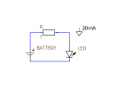

 

# Diode <!-- omit in toc -->

### Inhoud <!-- omit in toc -->

- [Een introductie](#een-introductie)
- [Referenties](#referenties)

---

**v0.1.0 ** Start document voor LED door HU IICT.

---

## Een introductie

A LED (Light Emitting Diode) is a diode-like component that emits light when current flows through it. The color of the light depends on the composition of the LED. The forward voltage of a LED depends on the color. For common red, green or yellow LEDs 2.0 V is a good estimate. The amount of light a LED produces depends on the current. Common LEDs are rated for (can handle) 20 mA, but will light up with only 1 mA. Special low-current LEDs produce light at much lower currents.

The symbol for a LED is a diode with two small arrows that depict the light that the LED can produce. In the diagram below, the battery is 3V and LED current must be 20 mA.

To calculate the resistor value, observe that the voltage over the resistor will be 3V (battery) – 2V (LED) = 1V. Ohm’s law states I = U , which can be rewritten to R = U . Hence the resistor must be 1V / 0.02A = 50 Ω.

The LEDs that you will use are 5 mm or 3 mm diameter colored thingies, with a round top (where it emits the light) and two wires at the other side. There are two ways to identify the connections of a LED: the negative side has a shorter wire, and the rim of the housing is flattened at that side.

Historically, red LEDs were there first ones to be produced and used in consumer products. This established the habit of using a red LED (the only color available) to indicate that a device is active. With the arrival of cheap yellow and green LEDs this is frowned upon, as the red is universally used to signal an abnormal or dangerous situation. Green is now preferred for indicating power. Blue and white LEDs appeared still later, and are still somewhat more expensive than the three older colors.

## Referenties
- LED (<https://nl.wikipedia.org/wiki/Led>)