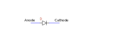
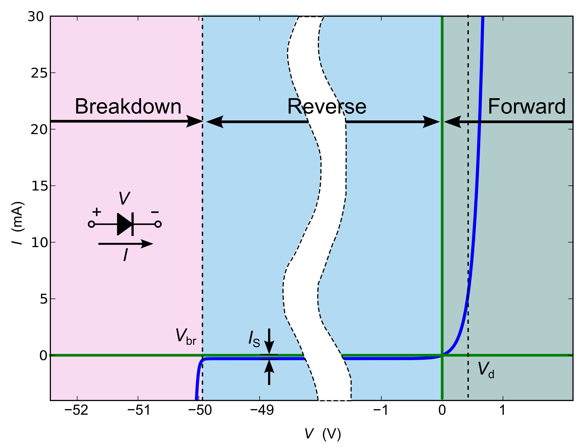

 

# Diode <!-- omit in toc -->

## Inhoud <!-- omit in toc -->

- [The diode (EN)](#the-diode-en)
- [De diode (NL)](#de-diode-nl)
  - [Ventiel](#ventiel)
  - [Diode karakteristiek](#diode-karakteristiek)
- [Referenties](#referenties)

---

**v0.1.0 ** Start document voor Diode door HU IICT.

---

## The diode (EN)

A diode is a component that has a low resistance when a voltage is applied to it in one direction, but a high resistance when the voltage is applied to it in the other direction. Its symbol is like an arrow, pointing in the direction in which the diode will conduct current.

For calculation purposes, you can assume that the ‘forward’ resistance is such that the voltage across the diode is 0.6V, and the ‘reverse’ resistance is infinite. When the voltage is less than 0.6V, you can assume that diode does not conduct (has infinite resistance).

The circuit shows a voltage source, two diodes and two resistors. The left diode is connected in reverse, hence no current flows through that diode and its resistor. The right diode is forward connected with a voltage > 0.6V, hence current flows through it. The diode ‘claims’ 0.6 V, hence 5V – 0.6V = 4.4V remains for the resistor. The current through the resistor (and through the diode) will be 4.4 V / 1000 Ω = 0.0044 A = 4.4 mA.

The diodes that you might use are small cylindrical objects, which an indicator band at the side where the symbol points to.

Note that connecting a diode directly to a voltage source (of more than 0.6V) is not a good idea: the diode will try to conduct as much current as needed to keep the voltage across its terminals down to 0.6V, while at the same time the voltage source will try to supply as much current as needed to keep that voltage at let’s say 10V. Something will have to give, in practice often the diode. If you watch this process (from a safe distance, with goggles, etc.) you might see some smoke (or even flames) escape from a puncture in the diode, and your diode is no longer functional. The same effect can be observed with other components that are grossly misused. From this observation comes the saying that “electronic components run on magic smoke”, because, if you let it escape, the component won’t work anymore. BTW: don’t try this at home. Or at least not **in** your home. And from a safe distance.

## De diode (NL)

De diode is opgebouwd uit een stapeling van twee lagen silicium. De eerste laag heeft een “ingebakken tekort” aan elektronen: een P-laag (P van positief). Die kant van de diode wordt de anode genoemd. In het symbool van de diode is dat de kant van het driehoekje. De tweede laag heeft een “ingebakken overschot” aan elektronen: een N-laag (N van negatief). Die kant van de diode wordt de kathode genoemd. In het symbool van de diode is dat de kant van het streepje.

### Ventiel

Je kunt een diode zien als een soort ventiel. Als je hem voorwaarts biased, dat wil zeggen als je op de anode een spanning zet die hoger is dan op de kathode, dan gaat er een stroom lopen. Bij praktische stromen komt de voorwaarts-bias-spanning op pak hem beet rond de 0.7V uit. Als je de diode ***reverse*** biased, dat wel zeggen als je op de anode een spanning zet die lager is dan op de kathode, dan kan er (vrijwel) geen stroom lopen. Pas op er is een uitzondering: als de reverse-spanning te hoog wordt (groter dan de ***zener breakdown spanning***), “slaat hij door”, en loopt er toch een grote stroom.

### Diode karakteristiek

Boven beschreven ventiel gedrag is een vereenvoudigde benadering/gevolg van de diode-karakteristiek, die wordt gegeven door onderstaande formule. In die formule is te zien dat je de diode ook kunt zien als een niet-lineaire weerstand: als je de spanning Vd laat toenemen, neemt de stroom Id door de diode exponentieel toe.

$$
I_D = I_S(qV_D/e^{nk}r-1))
$$

Legenda:
Is = diode-lekstroom, dat wil zeggen de stroom die hij lekt als hij reverse
gebiased is.
q = de lading van het electron : 1,610.10-19 Coulomb.
k = de konstante van Bolzmann : 1.38.10-23 Joule per Kelvin T = de absolute temperatuur in Kelvin
n = idealiteits-constante (productie-afhankelijk, tussen 1 en 2. In het ideale geval, en voor dit vak mag je aannemen dat hij gelijk aan 1 is).

## Referenties

- Diode (<https://nl.wikipedia.org/wiki/Diode>)
