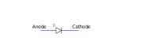
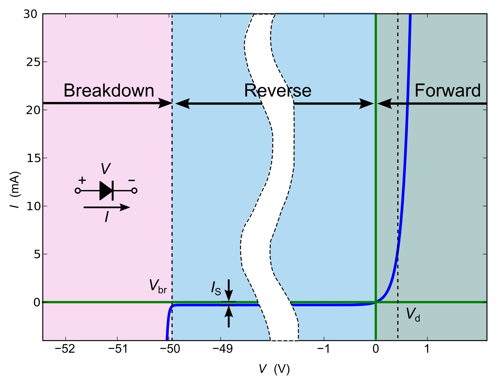

 

# OpAmp

### Inhoud

- [OpAmp](#opamp)
    - [Inhoud](#inhoud)
  - [Een introductie](#een-introductie)
    - [Buffer (spanningsvolger)](#buffer-spanningsvolger)
    - [Geïnverteerde Buffer (Geinverteerde spanningsvolger)](#geïnverteerde-buffer-geinverteerde-spanningsvolger)
    - [Geïnverteerde versterker](#geïnverteerde-versterker)
    - [Versterker](#versterker)
    - [Comparator](#comparator)
    - [De diode](#de-diode)
    - [Ventiel](#ventiel)
    - [Diode karakteristiek](#diode-karakteristiek)
  - [Referenties](#referenties)

---

**v0.1.0 ** Start document voor OpAmp door HU IICT.

---

## Een introductie

Een OpAmp is een geïntegreerd circuit (IC of chip) bestaand uit een groot aantal transistoren. Het symbool van een OpAmp wordt gegeven door een driehoek met 2 ingangen en 1 uitgang.

De positieve voedingsspanning wordt aangesloten op +Vss. De negatieve voedingsspanning (of in het geval van een single-supply opamp, de aarde) wordt aangesloten op –Vss. Vaak worden in schema’s de voedingslijnen weggelaten (maar dan zijn ze nog steeds wel aangesloten, anders werkt hij niet):

De OpAmp werkt als volgt:
1.	De OpAmp kijkt naar het verschil tussen de + en de – ingang.
2.	Dat verschil versterkt hij met een factor van 1 miljoen of meer (afhankelijk van de OpAmp) en zet dat signaal op de uitgang.
3.	De ingangsweerstand van de OpAmp is zo hoog dat er normaal gesproken geen stroom in de + en – ingang loopt.
Door de OpAmp op verschillende manieren aan te sluiten kunnen verschillende functionaliteiten gemaakt worden (bv een versterker, comperator). 

###	Buffer (spanningsvolger)
Indien de uitgang van de OpAmp aangesloten wordt op de – ingang van de OpAmp en het ingangssignaal (Uin) op de + ingang is er sprake van een Buffer of spanningsvolger (follower).

Voor deze schakeling geldt dat:

$$
U_{uit} = U_{in}
$$

Wat is het nut van deze schakeling? Stel dat er een sensor is met een hoge bronweerstand. Aangezien de ingangsweerstand van de OpAmp zeer hoog is kan hij zonder problemen op de sensor aangesloten worden. De uitgang van de OpAmp heeft een lage bronweerstand, dus daar kunnen zonder problemen ADC’s of multimeters op aangesloten worden.

### Geïnverteerde Buffer (Geinverteerde spanningsvolger)

Indien de OpAmp via onderstaand schema wordt aangesloten is er sprake van een geinverteerde buffer of spanningsvolger (inverted follower).

Voor deze schakeling geldt dat:

$$
U_{uit} = −U_{in}
$$

Wat is het nut van deze schakeling? Ook deze volgt de ingangsspanning, echter dan wel geïnverteerd (min wordt plus, en plus wordt min).

### Geïnverteerde versterker

Indien de rechter weerstand uit voorgaand schema vervangen wordt door een andere weerstand is het mogelijk een geinverteerde versterker (inverted amplifier) te bouwen.

Voor deze schakeling geldt dat:

$$
U_{uit} = −U_{in} * R_2/R_1
$$

Wat is het nut van deze schakeling? Hij versterkt (weliswaar geïnverteerd) de spanning. De versterkingsfactor wordt gegeven door 

$$
-R_2 / R_1
$$

### Versterker

Indien de OpAmp via onderstaand schema wordt aangesloten is er sprake van een versterker (amplifier).

Voor deze schakeling geldt dat:

$$
U_{uit} = U_{in} * ( 1+ R_1/R_2)
$$

Wat is het nut van deze schakeling? Hij versterkt de spanning. De versterkings- factor wordt gegeven door 

$$
( 1+ R_1/R_2)
$$

### Comparator

Indien de OpAmp via onderstaand schema wordt aangesloten is er sprake van een comparator (vergelijker).

Indien U2 groter is dan U1 zal Uuit naar de positieve voedingsspanning gaan. Indien U1 groter is zal Uuit naar de negatieve voedingsspanning gaan. Wat  is het nut van deze schakeling? Twee spanningen kunnen ermee vergeleken worden. De uitgang van de OpAmp zal hoog of laag worden, afhankelijk van welke van de 2 spanningen groter is.

### De diode

De diode is opgebouwd uit een stapeling van twee lagen silicium. De eerste laag heeft een “ingebakken tekort” aan elektronen: een P-laag (P van positief). Die kant van de diode wordt de anode genoemd. In het symbool van de diode is dat de kant van het driehoekje. De tweede laag heeft een “ingebakken overschot” aan elektronen: een N-laag (N van negatief). Die kant van de [diode](../../diode/README.md) wordt de kathode genoemd. In het symbool van de diode is dat de kant van het streepje.

### Ventiel
Je kunt een diode zien als een soort ventiel. Als je hem voorwaarts biased, dat wil zeggen als je op de anode een spanning zet die hoger is dan op de kathode, dan gaat er een stroom lopen. Bij praktische stromen komt de voorwaarts-bias-spanning op pak hem beet rond de 0.7V uit. Als je de diode ***reverse*** biased, dat wel zeggen als je op de anode een spanning zet die lager is dan op de kathode, dan kan er (vrijwel) geen stroom lopen. Pas op er is een uitzondering: als de reverse-spanning te hoog wordt (groter dan de ***zener breakdown spanning***), “slaat hij door”, en loopt er toch een grote stroom.

###	Diode karakteristiek
Boven beschreven ventiel gedrag is een vereenvoudigde benadering/gevolg van de diode-karakteristiek, die wordt gegeven door onderstaande formule. In die formule is te zien dat je de diode ook kunt zien als een niet-lineaire weerstand: als je de spanning Vd laat toenemen, neemt de stroom Id door de diode exponentieel toe.

$$
I_D = I_S(qV_D/e^{nk}r-1))
$$

Legenda:
Is = diode-lekstroom, dat wil zeggen de stroom die hij lekt als hij reverse
gebiased is.
q = de lading van het electron : 1,610.10-19 Coulomb.
k = de konstante van Bolzmann : 1.38.10-23 Joule per Kelvin T = de absolute temperatuur in Kelvin
n = idealiteits-constante (productie-afhankelijk, tussen 1 en 2. In het ideale geval, en voor dit vak mag je aannemen dat hij gelijk aan 1 is).

## Referenties
- Diode (<https://nl.wikipedia.org/wiki/Diode>)
