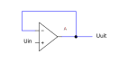

 

# OpAmp

### Inhoud

- [OpAmp](#opamp)
  - [Inhoud](#inhoud)
  - [Een introductie](#een-introductie)
    - [Buffer (spanningsvolger)](#buffer-spanningsvolger)
    - [Geïnverteerde Buffer (Geinverteerde spanningsvolger)](#geïnverteerde-buffer-geinverteerde-spanningsvolger)
    - [Geïnverteerde versterker](#geïnverteerde-versterker)
    - [Versterker](#versterker)
    - [Comparator](#comparator)
  - [Referenties](#referenties)

---

**v0.1.0 ** Start document voor OpAmp door HU IICT.

---

## Een introductie

Een OpAmp (**Op**erational **Amp**lifier, operationele versterker) is een geïntegreerde schakeling (Integrated Circuit, IC of chip), bestaand uit een groot aantal transistoren. OpAmps hebben een zeer hoge versterkingsfactor (instelbaar). Het symbool van een OpAmp in een schakelschema is een driehoek met 2 ingangen en 1 uitgang.

De positieve voedingsspanning wordt aangesloten op +Vss. De negatieve voedingsspanning (of in het geval van een single-supply opamp, de aarde) wordt aangesloten op –Vss. Vaak worden in schema’s de voedingslijnen weggelaten (maar dan zijn ze nog steeds wel aangesloten, anders werkt hij niet):

De OpAmp werkt als volgt:

1. De OpAmp kijkt naar het verschil tussen de + en de – ingang.
2. Dat verschil versterkt hij met een factor van 1 miljoen of meer (afhankelijk van de OpAmp) en zet dat signaal op de uitgang.
3. De ingangsweerstand van de OpAmp is zo hoog dat er normaal gesproken geen stroom in de + en – ingang loopt.
Door de OpAmp op verschillende manieren aan te sluiten kunnen verschillende functionaliteiten gemaakt worden (bv een versterker, comperator).

### Buffer (spanningsvolger)

Indien de uitgang van de OpAmp aangesloten wordt op de – ingang van de OpAmp en het ingangssignaal (Uin) op de + ingang is er sprake van een Buffer of spanningsvolger (follower).

Voor deze schakeling geldt dat:

$$
U_{uit} = U_{in}
$$

Wat is het nut van deze schakeling? Stel dat er een sensor is met een hoge bronweerstand. Aangezien de ingangsweerstand van de OpAmp zeer hoog is kan hij zonder problemen op de sensor aangesloten worden. De uitgang van de OpAmp heeft een lage bronweerstand, dus daar kunnen zonder problemen ADC’s of multimeters op aangesloten worden.

### Geïnverteerde Buffer (Geinverteerde spanningsvolger)

Indien de OpAmp via onderstaand schema wordt aangesloten is er sprake van een geinverteerde buffer of spanningsvolger (inverted follower).

Voor deze schakeling geldt dat:

$$
U_{uit} = −U_{in}
$$

Wat is het nut van deze schakeling? Ook deze volgt de ingangsspanning, echter dan wel geïnverteerd (min wordt plus, en plus wordt min).

### Geïnverteerde versterker

Indien de rechter weerstand uit voorgaand schema vervangen wordt door een andere weerstand is het mogelijk een geinverteerde versterker (inverted amplifier) te bouwen.

Voor deze schakeling geldt dat:

$$
U_{uit} = −U_{in} * R_2/R_1
$$

Wat is het nut van deze schakeling? Hij versterkt (weliswaar geïnverteerd) de spanning. De versterkingsfactor wordt gegeven door

$$
-R_2 / R_1
$$

### Versterker

Indien de OpAmp via onderstaand schema wordt aangesloten is er sprake van een versterker (amplifier).

Voor deze schakeling geldt dat:

$$
U_{uit} = U_{in} * ( 1+ R_1/R_2)
$$

Wat is het nut van deze schakeling? Hij versterkt de spanning. De versterkings- factor wordt gegeven door

$$
( 1+ R_1/R_2)
$$

### Comparator

Indien de OpAmp via onderstaand schema wordt aangesloten is er sprake van een comparator (vergelijker).

Indien U2 groter is dan U1 zal Uuit naar de positieve voedingsspanning gaan. Indien U1 groter is zal Uuit naar de negatieve voedingsspanning gaan. Wat  is het nut van deze schakeling? Twee spanningen kunnen ermee vergeleken worden. De uitgang van de OpAmp zal hoog of laag worden, afhankelijk van welke van de 2 spanningen groter is.

## Referenties

- [LM324 product info (Texas Instruments)](https://www.ti.com/product/LM324)
