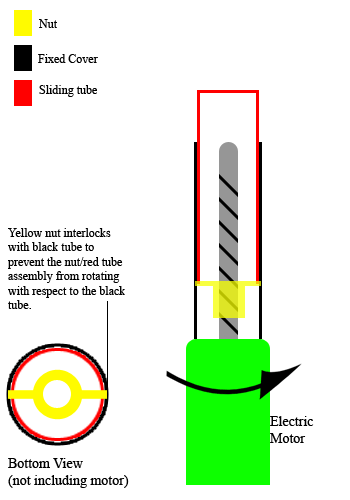
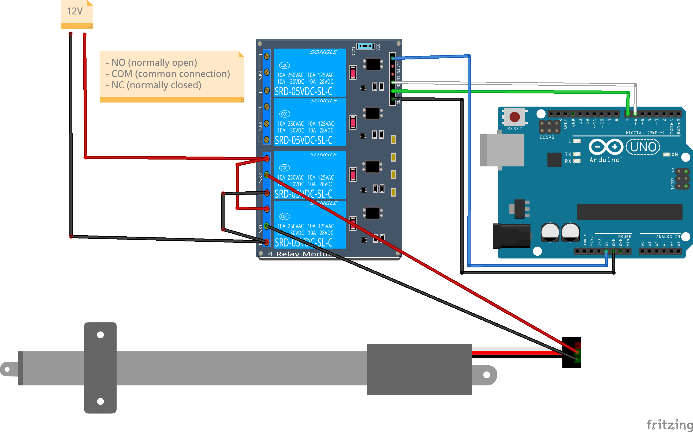

 [](logo-id)

# Diode[](title-id)

### Inhoud[](toc-id)

- [Diode](#diode)
    - [Inhoud](#inhoud)
  - [Een introductie](#een-introductie)
  - [5V relais to drive 12V Linear actuator](#5v-relais-to-drive-12v-linear-actuator)
  - [Duty Cycle](#duty-cycle)
  - [Arduino example](#arduino-example)
  - [Referenties](#referenties)

---

**v0.1.0 [](version-id)** Start document voor lineaire actuator door HU IICT[](author-id).

---

## Een introductie

Electric Linear Actuators are a type of actuator that converts energy and signals into a linear motion. Mechanical linear actuators typically operate by conversion of rotary motion into linear motion. This linear motion is then used to tilt, lift, push or pull an object where force is required.

## 5V relais to drive 12V Linear actuator

Linear actuators typically operate on higher voltages. We use a 5V relais to operate a 12V relais from an Arduino UNO. We actually use two relais to switch the polarity and drive de linear actuator up and down.



## Duty Cycle

Many linear actuators have a duty cycle. To limit wear an tear you should obey them. When the Duty Cycle is 10% it means the possibility of continuous operation for one minute out of every ten minutes.

## Arduino example

```
//assign relay INx pin to arduino pin
const int forwards = 7;
const int backwards = 6;

void setup() {
  //set pin as output
  pinMode(forwards, OUTPUT);
  pinMode(backwards, OUTPUT);
}

void loop() {
  //Activate the relay one direction
  digitalWrite(forwards, LOW);
  digitalWrite(backwards, HIGH);
  delay(2000); // wait 2 seconds
  //Deactivate both relays to brake the motor
  digitalWrite(forwards, HIGH);
  digitalWrite(backwards, HIGH);
  delay(20000);// wait 20 seconds
  //Activate the relay the other direction
  digitalWrite(forwards, HIGH);
  digitalWrite(backwards, LOW);
  delay(2000);// wait 2 seconds
  //Deactivate both relays to brake the motor
  digitalWrite(forwards, HIGH);
  digitalWrite(backwards, HIGH);
  delay(20000);// wait 20 seconds
}
```

## Referenties
- Linear actuator (<https://en.wikipedia.org/wiki/Linear_actuator>)