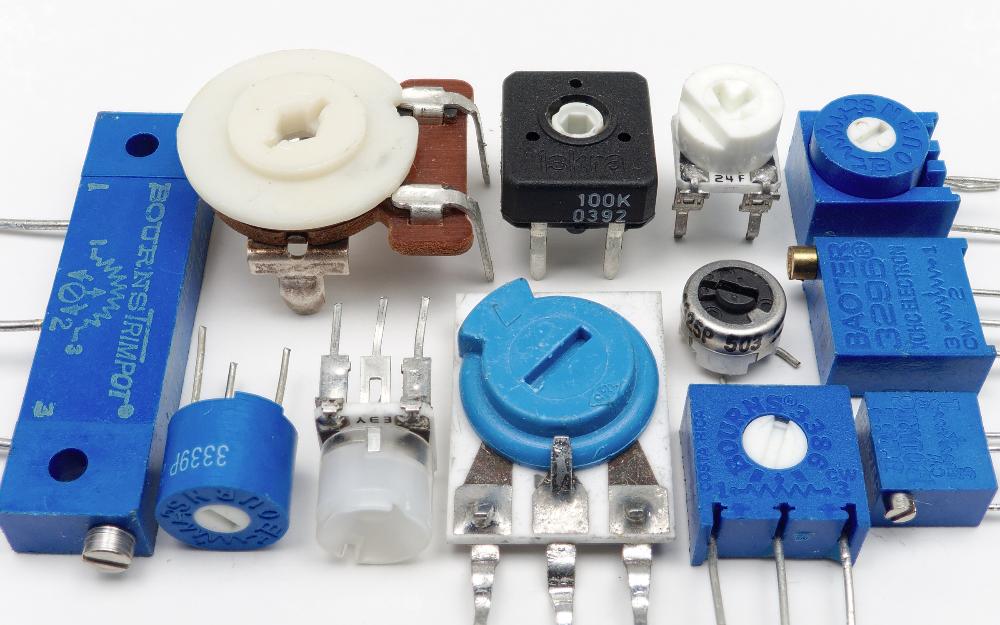

 

# Potentiometer

### Inhoud

- [Potentiometer](#potentiometer)
    - [Inhoud](#inhoud)
  - [Een introductie](#een-introductie)
  - [Referenties](#referenties)

---

**v0.1.0 ** Start document voor Potentiometer door HU IICT.

---

## Een introductie

A potentiometer is a resistor with a third wire that can ‘slide’ across the body of the resistor. When a voltage is applied to the two outer wires, the voltage on the third wire varies from 0 to the full voltage depending on the position of the third wire. The symbol for a potentiometer is a resistor, with a third wire added that either points to or is drawn over the rectangle.

The potentiometers that you are likely to encounter fall in two categories. Front-panel mounted potentiometers have a shaft on which a knob can be fitted. The shaft rotates the third connection over the circular resistor body. They are commonly used to provide human input to a circuit, for instance on an old-style audio set. 

A variation is the linear version or slider, which is typically found in studio audio equipment.

The other common version of the potentiometer is the trim versions, is meant to be set once (or very rarely). It is often mounted directly on the PCB and a screwdriver must be used to turn it. For the simple (cheap) version the rotation is restricted to about 270 degrees, so it is difficult to set it very accurately. The (more expensive) multi-turn trimmer allows for more accurate positioning.

A typical use would be to calibrate a measurement instrument, for instance a scale: one trimmer is used to set the scale to read 0 when no load is present, and another to set the correct reading for a known weight.

## Referenties
- Potentiometer (<https://nl.wikipedia.org/wiki/Potentiometer>)

