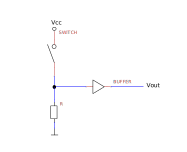

 

# Pul-up & Pull-down resistor

### Inhoud

- [Pul-up \& Pull-down resistor](#pul-up--pull-down-resistor)
    - [Inhoud](#inhoud)
  - [Een introductie](#een-introductie)
  - [Referenties](#referenties)

---

**v0.1.0 ** Start document voor Pul-up & Pull-down resistor door HU IICT.

---

## Een introductie

In this course we will work with logic circuits and micro-controllers such as the Arduino. These will interpret voltages into logical 0 (mostly 0V) or logical 1 (mostly 3.3V or 5V). An common mistake is to think unconnected inputs have a voltage of 0, but just because you have nothing at all connected to an input pin doesn’t mean it is a logical zero! An unconnected input is said to be ***floating***. As its voltage (and its logical interpretation) can be anything.

When you are connecting a button you have be careful not to create a wire that is floating. Putting a button between two wires will result in that one wire is floating when the button isn’t pressed. The button will work fine when it is pressed: the two wires are connected and there is a defined voltage. But an unpressed button will disconnect the two wires. One of the wires will be no longer connected to the power source or the ground, resulting in a floating wire. The solution for this problem can be found in pull-up and pull-down resistors.

These are not special [resistors](../../basis-elektronica/README.md#resistance), but these are ways to connect a resistor and a button (or transistor) in way to avoid a floating state.

The following figers show how to connect a pull-up and a pull-down resistor. The two differ in their behavior. The pull-up resistor will give a high output when the button is not pressed and a low voltage when the button is pressed. 

The pull-down resistor has a low voltage output when the button is not pressed and a high voltage output when the button is pressed.

## Referenties
- Pull-up resistor (<https://en.wikipedia.org/wiki/Pull-up_resistor>)