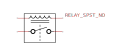

 

# Relais and Solid-state relais <!-- omit in toc -->

### Inhoud <!-- omit in toc -->

- [Een introductie](#een-introductie)
- [Referenties](#referenties)

---

**v0.1.0 ** Start document voor Relias & SSR door HU IICT.

---

## Een introductie

A relais is a switch that is controlled by the current through a coil. It can be used to switch a large current, and to keep that switched current (and more important, voltage) isolated from the so-called low-voltage part of the circuit. The circle-with-cross symbol is a lamp. For reasons that will not be explained here, there must always be a seemingly useless diode across the relais coil.

A relais is a mechanical component, and as such it is slow, susceptible to wear, and it can be damaged by shock and vibration. A solid-state relais (SSR) is not a relais, but a dedicated component for isolated switching of mains (AC). It is (for the same voltage and current) more expensive than a normal relais, but it doesn’t have its disadvantages. The low-voltage side of an SSR is for all practical purposes LED.

## Referenties

- Relais (<https://en.wikipedia.org/wiki/Relay>)