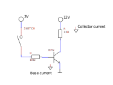
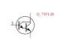

 

# Transistor <!-- omit in toc -->

### Inhoud <!-- omit in toc -->

- [Een introductie](#een-introductie)
- [Referenties](#referenties)

---

**v0.1.0 ** Start document voor Transistor door HU IICT.

---

## Een introductie

A transistor is a component that can be used as a switch that is controlled by small control current. A transistor has 3 connections called base, collector and emitter. In its simple use, one pin is connected to the ground (most negative voltage). Another terminal is used to receive the control current (though a diode), and the third is the switch (the other side of the switch is connected to the ground). When no current flows through the ‘base’ diode, the switch is open. When a (small) current flows through the base the switch is closed.

The ratio of the base current and the current trough the switch (the collector current) is limited by the amplification factor (often called Beta) of the transistor. A typical Beta is 100.

The circuit shows how a transistor is typically used. The 3V supply, switch and transistor cause a small base current when the switch is closed. (Why is the resistor needed?) When it is, a much larger current from the 12V supply flows through the 10 Ω resistor and the transistor.

When the ratio between the available base current and the collector current that must be switched is very high, a Darlington transistor can be used. This is a combination of two transistors (in one component), that has a Beta of for instance 10’000. Its symbol is a combination of two transistor symbols. The (optional) circle around a transistor can be used to emphasize that it is a separate component (as opposed to one of the many transistors in a chip).

## Referenties

- Relais (<https://en.wikipedia.org/wiki/Relay>)