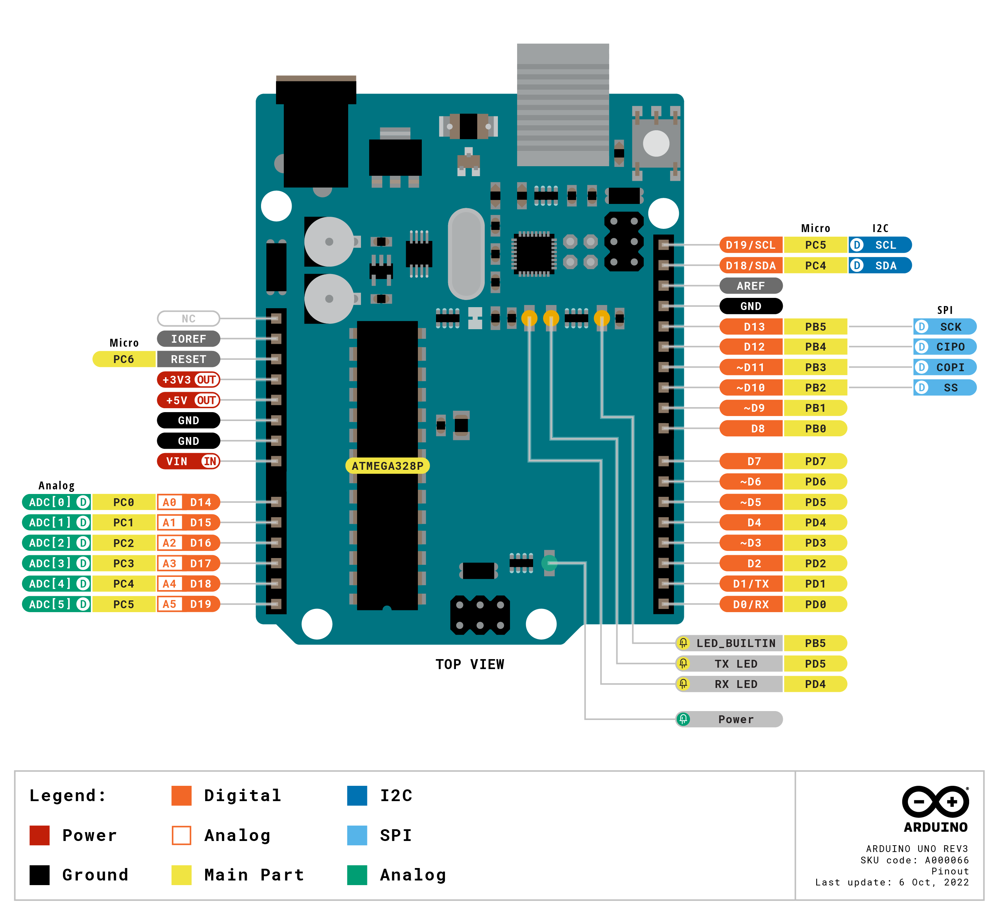

 [](logo-id)

# Microcontroller: Arduino UNO[](title-id) <!-- omit in toc -->

### Inhoud[](toc-id) <!-- omit in toc -->

- [Een introductie](#een-introductie)
- [Arduino IDE](#arduino-ide)
- [Arduino UNO](#arduino-uno)
- [Digitale en Analoge pinnen](#digitale-en-analoge-pinnen)
- [Analoog naar Digitaal Converter](#analoog-naar-digitaal-converter)
- [Arduino voorbeeld code](#arduino-voorbeeld-code)
- [Referenties](#referenties)

---

**v0.1.1 [](version-id)** Start document Arduino UNO microcontroller door HU IICT[](author-id).

---

## Een introductie

Een microcontroller is een geïntegreerde schakeling. De CPU, RAM en ROM zijn hierbij geïntegreerd. Microcontrollers zijn niet weg te denken uit moderne apparatuur. Om te leren programmeren en het maken van prototypes zijn deze ook erg geschikt. Door het gebruik van sensoren en actoren kan je complexe projecten maken. Een microcontroller beschikt niet over een besturingssysteem zoals Windows of Unix. Het programmeren van een microcontroller omvat in het algemeen de volgende stappen: 
1) Het schrijven van de applicatie programmacode 
2) Het compileren van de applicatie naar een .hex bestand. 
3) Het gebruik van een ‘programmer’ om de applicatie naar de doel-microcontroller te uploaden. 

## Arduino IDE

De Arduino IDE heeft deze stappen een stuk eenvoudiger gemaakt zodat we ons kunnen concentreren op het maken van het prototype. Je programma code blijft op je computer beschikbaar waardoor de kans klein is dat deze verloren gaat tijdens het ontwikkelproces. Daarnaast is het gebruik van Arduino hardware relatief goedkoop en daardoor beschikbaar voor een grote gebruikersgroep.

## Arduino UNO

Er zijn verschillende Arduino smaken. De Arduino Uno is één van de meest gangbare versies. Deze heeft een USB interface, 14 digitale I/O pinnen (6 pinnen kunnen worden gebruikt voor PWM aansturing), 6 analoge pinnen en een Atmega328 microcontroller.



Figuur 1. PCB en pin layout Arduino Uno

## Digitale en Analoge pinnen

Het gebruik van de verschillende pinnen kan in het begin verwarrend zijn. Er zijn zowel digitale als analoge pinnen en deze kunnen meerdere functies hebben. Voor digitale functies zoals digitalWrite(), pinMode(), digitalRead() en analogWrite() gebruik je digitale pinnen en voor analoge functies zoals analogRead() gebruik je een analoog pin nummer. Arduino analoog pin 0 is niet hetzelfde als Arduino digitaal pin 0. Kijk voor de benaming van de pinnen op het Arduino PCB. Als we het hebben over Arduino analoog pin 2 komt dit overeen met pin 25 van de AVR microcontroller. 

Een aantal digitale pinnen zijn gemarkeerd met een tilde (~) om aan te geven dat ze een PWM (Pulse Wide Modulation) signaal ondersteunen, alleen voor deze pinnen werkt de digital functie analogWrite(). De naamgeving van de deze functie kan verwarrend zijn dit is dus GEEN analoge functie. Voor de analoge pinnen A0-A5 kan je zowel analoge als digitale functies gebruiken. digitalWrite(A0, HIGH) set A0 pin hoog.

Het eenvoudigste om verwarring te voorkomen is om de pin naamgeving aan te houden zoals je deze terug kan vinden op de PCB. Gebruik numerieke aanduiding voor digitale pinnen en A0 … A5 voor analoge pinnen. 

Er zijn nog een aantal pinnen die je in een later stadium kunt gebruiken voor de volgende specifieke functies:
-	Serial Pin 0 (Rx) en Pin 1 (Tx): Rx en Tx pinnen worden gebruikt voor het zenden en ontvangen van TTL seriële data.
-	Externe interrupt Pin 2 en Pin 3: Voor het generen van een interrupt.
-	PWM Pin 3, 5, 6, 9 en 11: Zoals eerder beschreven gebruikt voor het genereren van een 8-bit PWM signaal.
-	SPI Pin 10 (SS), 11 (MOSI), 12 (MISO) en 13 (SCK): Voor SPI communicatie.
-	LED pin 13: Een ingebouwde LED, wanneer pin 13 hoog is gaat de LED aan.


## Analoog naar Digitaal Converter

Een groot voordeel voor het aansluiten van verschillende sensoren is dat dit kan op 3.3V of 5V. Naast digitale sensoren kunnen met behulp van de ingebouwde 10-bit analoog naar digitaal converter (ADC) ook analoge sensoren worden uitgelezen. Het verschil tussen analoge en digitale sensoren is dat een analoge sensor metingen verzamelt over een reeks waarden. Een digitale sensor leest alleen een HOOG of LAAG signaal.

Door de 10 bit resolutie van de ADC kan een analoog signaal verdeeld worden in 1023 (2^10 = 1024) discrete stapjes van 0 tot de gebruikte spanning 3,3V of 5V. Dit levert dan bij 5 Volt een resolutie tussen metingen van 5V/1024 = 4,9mV per eenheid op.

## Arduino voorbeeld code

```arduino
void setup() {
  // put your setup code here, to run once:
  Serial.begin(9600);
}

void loop() {
  // put your main code here, to run repeatedly:
  Serial.println("Hello World!");
  delay(1000);
}
```
[Arduino bestand](../Arduino-UNO/files/hello_world/hello_world.ino) 

## Referenties

- Arduino (<https://nl.wikipedia.org/wiki/Arduino_(computerplatform)>)
- Arduino Uno Rev3 (<https://www.arduino.cc/en/hardware>)