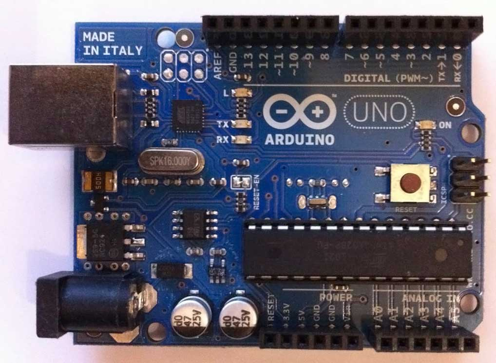

) 

# Microcontroller

### Inhoud

- [Microcontroller](#microcontroller)
    - [Inhoud](#inhoud)
  - [Een introductie](#een-introductie)

---

**v0.0.1 ** Start document Microcontroller door HU IICT.

---

## Een introductie

A micro-controller is a chip (integrated circuit) that combines the essential elements of a computer (CPU, RAM memory, ROM memory, and I/O) on a single chip. The range micro-controllers extends from very small and inexpensive ones, with for instance 32 bytes of RAM and 1kb of ROM running at 1 MIPS (Million Instructions Per Second), up to expensive and powerful chips with 100kb’s of RAM running at up to 1000 MIPS.

The small chips can be found in very simple devices like a radio controlled toy car, a melody birthday card, or a flashlight that has a blink function. The powerful ones are used to control industrial processes, airplanes, or the motor of a modern car. The ‘seriousness’ of micro-controller applications and embedded systems in general varies widely, from toys and gift-cards to airplanes and nuclear power stations.

Besides cost a major driver for using a small micro-controller instead of a bigger one (or even a computer system built from separate components) is power. Modern intelligent devices, especially sensors, are often powered by a battery or another low-power source. The price (or weight, volume, etc.) of the power source is often the major design and cost driver of the product. A small micro-controller can typically be put in a (very) low power mode, waking up (and consuming significant power) only let’s say for 10 seconds each hour. This is the way remote sensors can work for a year or longer on a battery.

The [Arduino Uno](../microcontroller/Arduino-UNO/README.md) is a single-board computer with an ATmega328P micro-controller, the components required for this chip to run, and an USB-to-serial chip for communication with a PC (using a virtual serial port on the PC). The ATmega chip can be programmed directly using a programmer like the USBasp, but the normal way to download an application to the chip is to use the USB-serial interface and the Arduino-specific bootloader that is pre-loaded in the chip. The ATmega328P is a small and cheap micro-controller, with 2 Kb RAM and 32 Kb FLASH ROM. 

By itself, an Arduino Uno is almost useless: it has one on-board LED  and its serial connection to the PC, so you can use it to blink the LED or to say “Hello world”. To do something more the Uno has four so-called header strips that provide access to the power and GPIO pins of the micro-controller. You can use these strips to make connections to external hardware using for instance jumper wires and a (solderless) breadboard.

The original Arduino, the Arduino Uno, was first designed around 2005, and it uses a micro-controller that was popular, cheap, and moderately powerful at that time. Since that time the price more powerful micro-controllers has dropped significantly, and alternatives to the original Arduino have been developed.
The Arduino Mega 2550 uses a micro-controller from the same family as the Uno, but the chip has more RAM, FLASH, and GPIO pins. The board is larger, mainly to accommodate the extra pin headers. The Mega headers are a superset of the Uno headers, hence Uno shields can be used on a Mega.

The Arduino Due uses a much more powerful Cortex micro-controller with much more RAM and FLASH than the Mega. The board uses the same headers as the Mega, but as the Cortex chip runs on 3.3V (instead of the 5V of most other Arduino’s) not all shields are directly compatible with the Due. On the other hand, many modern peripheral chips (sensor etc.) run on 3.3V, so they are actually easier to use with a Due than with a 5V Arduino.

The Arduino Nano is a development in the other direction: it uses the same micro-controller as the Uno, but reduces the board to the minimum and omits some components (power regulator) to reduce the price.

The Arduino Micro is an even more reduced version of the Uno: compared to the Nano it omits the USB interface, hence it must be programmed using an external USB-to-serial converter. 

    Beware: The Nano and Micro are sometimes sold without the Arduino bootloader pre-programmed. In that case you must use a programmer gadget to download the bootloader first, or forgo the bootloader and load your application directly. Fortunately, a programming gadget for these chips (USBasp) is quite cheap.