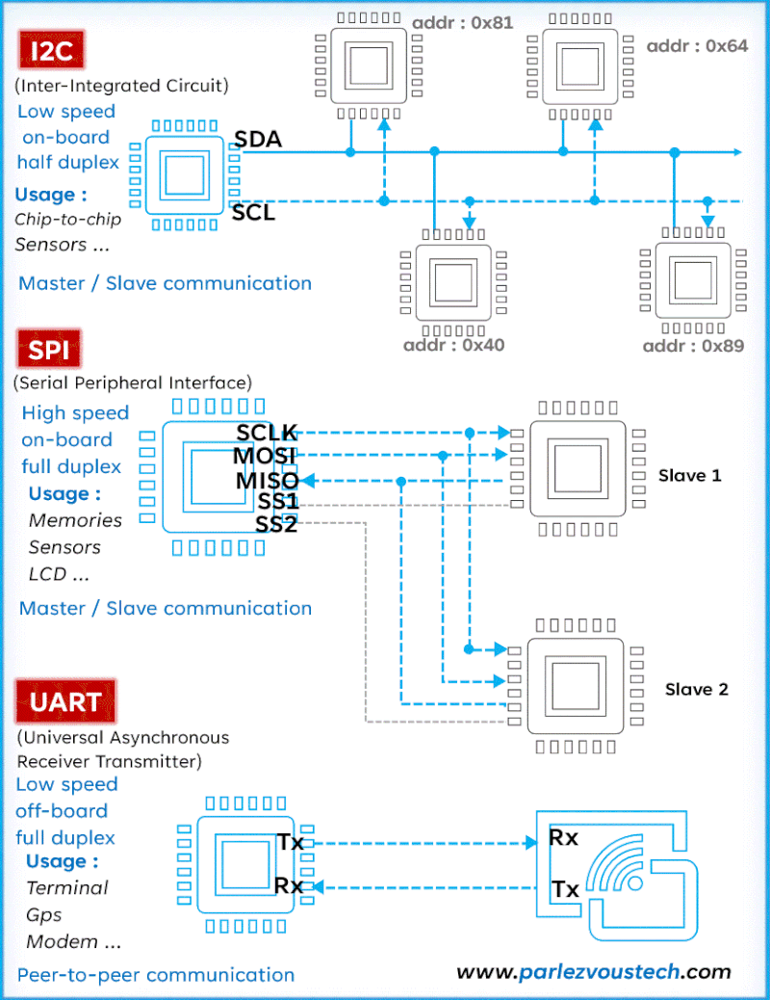

# Source / Terms of Use

## overview-i2c-spi-uart-communication.gif

- Original source: LinkedIn
- Original name: f709b0a3-d351-4e64-8017-781a31ff8ce7.gif

```text
From: ParlezVous Tech <parlezvoustech@gmail.com>
Sent: Wednesday, 18 February 2026 11:51
To: Hagen Patzke <hagen.patzke@hu.nl>
Subject: Re: Inquiry: I2C/SPI/UART communication animation use for teaching
 
LET OP: Deze e-mail komt van een afzender buiten de HU. Klik niet op links en bijlagen als de afzender niet bekend of vertrouwd is. Caution: This email is from a sender outside HU. Do not click on links and attachments if the sender is not known or trusted.

Dear Hagen,

Thank you very much for your message.
It truly means a lot to me that you found the animation useful and that you would like to use it with your students.

You absolutely have my permission to include the animation in your teaching material for your IT Bachelor students.

Thank you as well for proposing to keep the file unchanged and to add a footer mentioning the source. That is perfectly fine.
You can reference it as:
“Animation by Samba Ndome - ParlezVousTech”

I’m really honored that it will be used at the University of Applied Sciences Utrecht.
If in the future you need additional visuals or custom material on embedded systems or communication protocols, feel free to reach out.

Best regards,

Samba Ndome
ndometech@gmail.com 
https://www.linkedin.com/in/samba-ndome
Embedded & IoT Engineer
www.parlezvoustech.com
```

## Overzicht I2C, SPI en UART

*(Klik op het beeld om de animatie te tonen als deze niet automatisch start.)*\
\
***Animation by Samba Ndome - ParlezVousTech***
