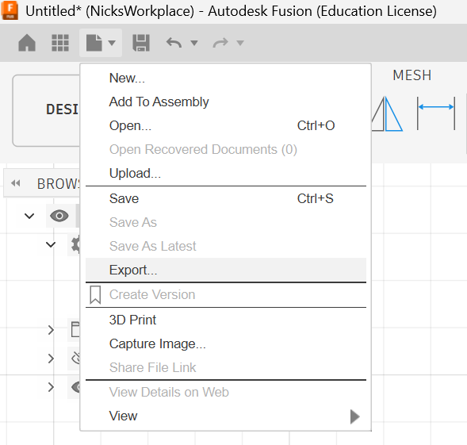
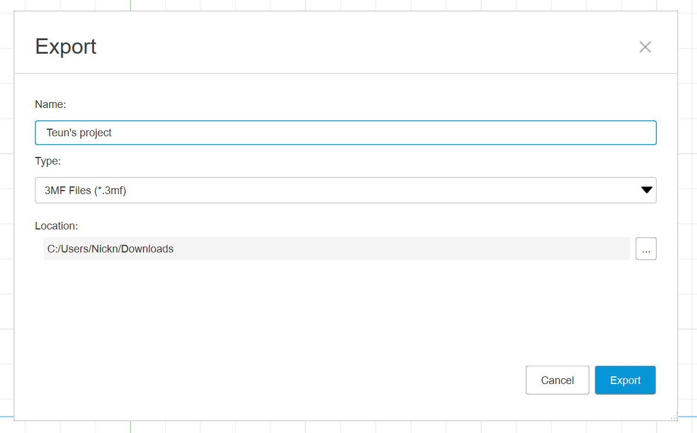
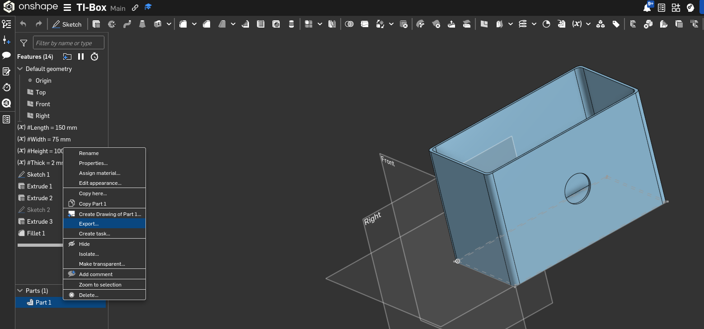
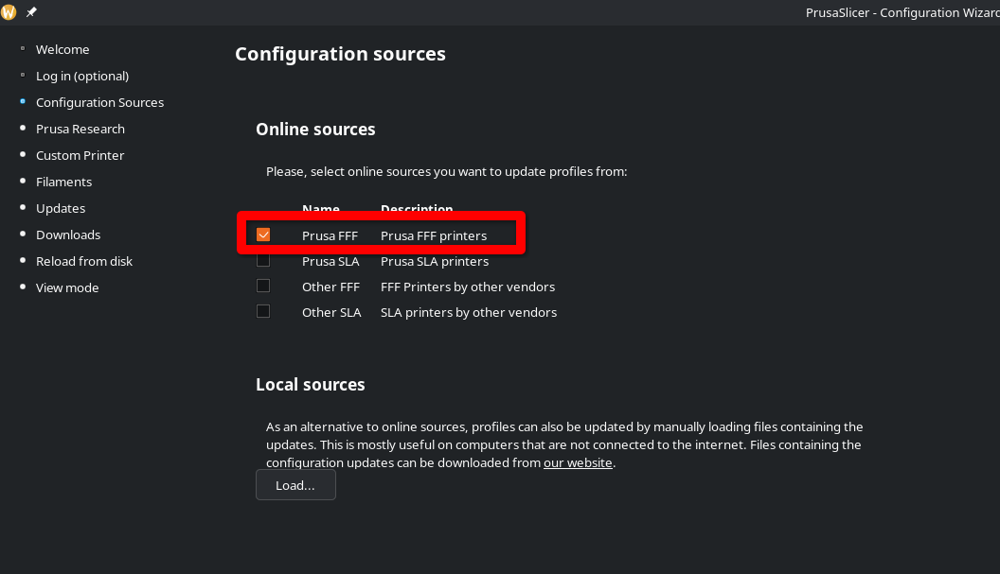
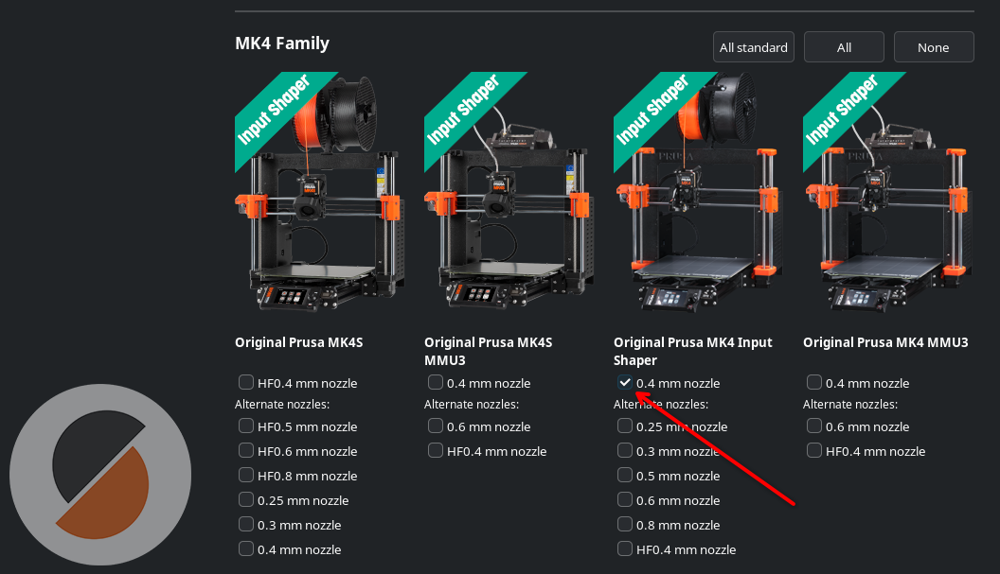
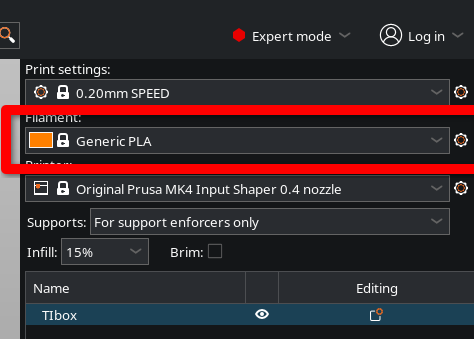
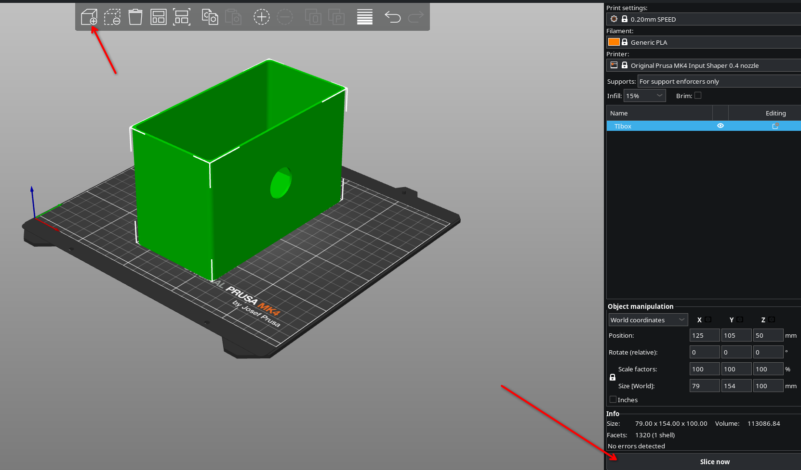
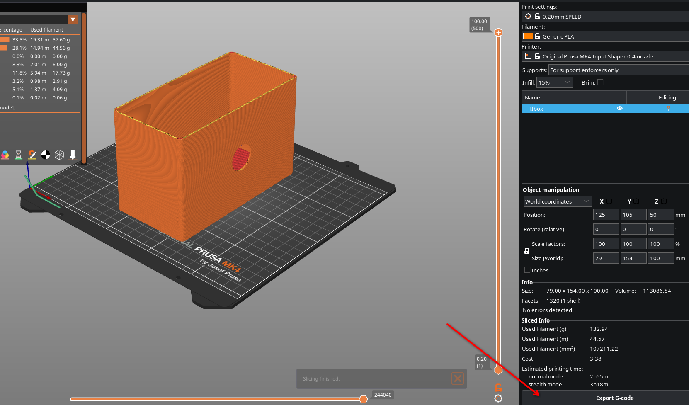

 

# 3D Printen <!-- omit in toc -->

### Inhoud <!-- omit in toc -->

- [Een introductie](#een-introductie)
- [De basis van Fusion 360](#de-basis-van-fusion-360)
- [Gebruik van bestaande modellen](#gebruik-van-bestaande-modellen)
  - [Bekende dimensies](#bekende-dimensies)
  - [Onbekende dimensies](#onbekende-dimensies)
- [bronnen](#bronnen)

---

**v0.1.0 ** Start document voor 3D modelleren uitleg en voorbeelden door HU IICT.

---

## An introduction

For 3D printing you require two things. first you need a model to print in either .3fm, .obj or .stl format. .3fm is the most common and we will use that format in this instruction. Secondly you need a slicer to prepare your model for 3D printing. In this tutorial we will use Prusa Slicer. You can download the tool here:  
https://www.prusa3d.com/p/prusaslicer/

## Exporting your model
To start 3D printing we first need a model to print. You can download a standard model from makerworld, printables etc. or you can export you own from, for example, Fusion or On shape. To export from fusion you go to the export button under file:

Ans select .3mf as target:

In On Shape select the model (or models) that you want you export and press the right mouse button/export.

## Prusa slicer
Now you have a model you have to slice it for a 3D printer. The tool we are using is prusa slicer. When you have downloaded and extracted the .zip you can launch the application. A wizzard will pop up on first start or you can open it through the configuration tab. You can skip most steps and do not require an account. You do have to select the proper material type:

Ans select the correct printer model:

You may have to scroll down to find the correct type. Only add this type leave the rest unchecked! Press finish and you are ready to slice your first model. There is only extra check that needs to be done. Check if the filament is set to PLA. By default it is ussualy PETG. You can check it in the top right corner. The settings should be:

Now you can add a model through the add button and slice it with the slice buton. 

After this you can export the result and save it to the usb stick from the printer.

Put to stick in the printer and start the print. 

## Sources

