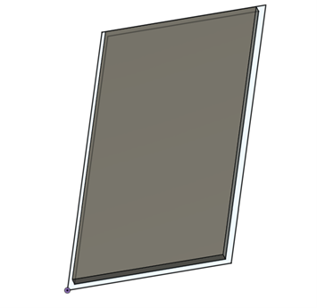
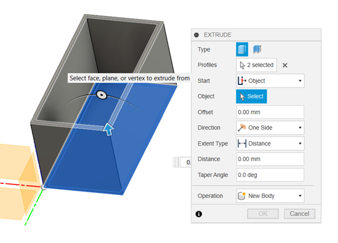

 

# 3D Modelleren

### Inhoud

- [3D Modelleren](#3d-modelleren)
    - [Inhoud](#inhoud)
  - [Een introductie](#een-introductie)
  - [De basis van Fusion 360](#de-basis-van-fusion-360)
  - [Gebruik van bestaande modellen](#gebruik-van-bestaande-modellen)
    - [Bekende dimensies](#bekende-dimensies)
    - [Onbekende dimensies](#onbekende-dimensies)
  - [bronnen](#bronnen)

---

**v0.1.0 ** Start document voor 3D modelleren uitleg en voorbeelden door HU IICT.

---

## Een introductie

Er zijn veel 3d modelleer programma’s die je kan gebruiken om objecten te maken voor 3d printen of lasersnijden. Voor deze instructie gebruiken we Fusion 360 van Autodesk. Deze software heeft mogelijkheden voor zowel platte materialen als ook voor 3D objecten modelleren. We richten ons nu met name op 3d modellen, maar met deze instructie kunnen even goed ook platte tekeningen worden gemaakt om als basis te fungeren voor een vector bestand dat kan worden geïnterpreteerd door een laser programma. 

## De basis van Fusion 360
Als je Fusion opent krijg je eerst een leeg scherm te zien met een aantal knoppen.

Het is belangrijk om eerst op te slaan (rode kader). Hierdoor worden extra mogelijkheden geactiveerd en wordt je tijdlijn goed opgeslagen. In het groene kader zie je een kubus staan en daaraan kan je zien hoe je naar je tekening aan het kijken bent. Om een tekening te starten begin je altijd met een platte schets. Deze kan je oproepen door op het schets knopje te drukken (blauwe kader).
Het scherm veranderd dan in een grid met een beeld van de X, Y en Z assen zoals die zijn weergegeven op de kubus:

Hierbij is X rood, Y groen en Z blauw. Voor je schets moet je een van deze vlakken selecteren om te starten. Welk vlak je kiest is grotendeels afhankelijk van wat je wil maken. Voor deze instructie maken we een simpel doosje met een deksel. We willen daarbij boven op het doosje kijken en selecteren het vlak tussen groen en rood. Het beeld veranderd nu en daarmee zit je in de 2D schets modus:

Dat zien we ook aan de veranderde knoppenbalk:

We kunnen nu met de knoppen onder create direct beginnen met tekenen. Echter is het vaak verstandig om eerst na te denken over welke dimensies je wil. Deze hebben vaak een verhouding tot elkaar. Bijvoorbeeld dat de breedte twee keer de lengte is. Of dat bijvoorbeeld een gat altijd in het midden van een plaat moet komen ongeacht hoe groot de plaat is. Dit kan je vastleggen door in het modify menu op change parameters te drukken. In het parameter menu kan je vervolgens eigenschappen aanmaken die je bij je model wil gebruiken. Je kan hiervoor harde waarden gebruiken of formules schrijven:

Als we vervolgens nu in de tekening bijvoorbeeld een rechthoek maken kunnen we deze eigenschappen gebruiken. 

Het voordeel hierbij is dat je bij complexe modellen snel het hele model kan aanpassen zonder dat verhoudingen in gevaar komen. Het loont echt om hiervan tevoren over na te denken. Aan de prefix fx: kan je zien dat het gaat om een user variabele. Als als je de dimensie opent dan zie je de naam weer van de parameter. Als we dit 3d zouden maken dan hebben we alleen een blok. Om een doosje te krijgen moeten we dus eerst aangeven wat de wanden zijn. We kunnen een nieuwe user variabele maken of direct een afgeleide doen door het knopje offset te gebruiken. De letters die achter de items zijn staan voor de short cuts die je kan gebruiken:

Als je op offset drukt dan krijg je de mogelijkheid om een object te selecteren:

en vervolgens hoeveel dit moet zijn. Met negatieve waarden ga je naar binnen met positieve naarbuiten:

We hebben hiermee de basis voor ons doosje gemaakt en kunnen dit gaan uittrekken. Om naar de 3D omgeving te gaan kan je op finish sketch drukken in de rechterbovenhoek:

Om van de platte schets een 3D object maken kan je op extrude klikken in het create menu of op e drukken.

Ook hier kan je weer gebruik maken van de eigenschappen die we hebben aangemaakt of kan je weer extra toevoegen. In dit geval gaan we de binnenkant 2mm uit trekken zonder gebruik te maken van de parameters. 

Hiervoor moeten we eerst weer het profiel selecteren en zie je ook dat er een nieuw 3d object zal worden gemaakt. Als je nu op oké drukt kan je met shift + middelste muisknop in 3D draaien en zie je wat je hebt gemaakt:

Nu moeten we ook nog wanden aanmaken. We zien de schets lijn nog om het object heen, maar het kan zijn dat deze automatisch wordt uitgeschakeld na de eerste extrusie je kan hem weer aanzetten aan de linker kant onder sketches. Om de wanden te maken selecteer je weer extrude, selecteer je het profiel wat je wil uitrekken en geef je aan hoeveel. 

Je kan hierbij weer gebruik maken van de user parameters. Je hoeft daar geen nieuwe aan te maken. Als alle kanten aan een andere extrusie zijn verbonden zal Fusion proberen met Join beide aan elkaar te maken en zodoende een object te maken. We hebben nu een doosje, maar hert kan zijn dat je ook een deksel wil. We kunnen hiervoor dezelfde schets gebruik. Echter doen we nu de extrude vanaf een ander object:

Het kan hiervoor handig zijn om aan de linker kant even de body uit te zetten zodat je de schets weer kan zien. Let er op dat je dan wel de operation op New Body zet in plaats van Join. Eventueel kan je nog een extrude doen van het middendeel naar beneden zodat er een randje aan zit. 

Elke kant van het doosje kan je ook weer selecteren om schetsen op te maken. Let er wel op dat als je dit doet en je verandert het doosje dit ook effect kan hebben op deze schetsen. Je kan deze schetsen gebruiken om bijvoorbeeld een gat te maken in het model. Of letters aan te brengen. Beide kunnen worden gemaakt met het extrude commando. Als je namenlijk een extrude door een body doet kan je aangeven dat de operation Cut moet zijn. Dan wordt het profiel van de body afgehaald. Met het filet command kunnen we de scherpe hoeken wat ronder maken:

Er zijn uiteraard veel meer mogelijkheden. Bij de bronnen staan er linkjes naar filmpjes die in detail voorbeelden van het gebruik weergeven.

## Gebruik van bestaande modellen
Een doosje maak je natuurlijk voor een object wat je erin wil stoppen. Bijvoorbeeld een behuizing voor een microcontroller of een sensor. Hierbij weet je soms hoe groot iets is en soms niet. Er volgen nu drie mogelijke manieren om hiermee om te gaan in fusion.

### Bekende dimensies
Bij veel objecten die je gebruikt zijn er al tekeningen die je kan gebruiken. Om een voorbeeld te geven zou er bijvorbeeld en behuizing kunnen worden gemaakt voor de Arduino Uno. Als we zoeken op Arduino Uno dimensons dan vinden we bijvoorbeeld deze tekening:

[1]

In het voorgaande hoofdstuk is al beschreven hoe we de dimensies van het doosje kunnen beinvloeden met user parameters. We kunnen de dimensies op de tekening Overnemen en gebruiken om bijvoorbeeld gaten te maken voor de usb poorten en dergelijke. Ook staan de locaties van montage gaten op de tekening. In fusion kunnen we hiervor standofs modelleren zodat het model kan worden vast geschroeft. Het enige wat hiervor nodig is het aanpassen van de schets. Met het dimension (d) commando kan je aangeven hoever een object moet worden geplaatst vanaf een ander object. Uiteraard is het verstandig om hier user parameters voor te gebruiken!

Een tweede optie is om een volledig 3d model te importeren. Hiervoor kan je een account aanmaken bij bijvoorbeeld grabcad of kan je gebruik maken van de import functie van fusion:

Als je bijvoorbeeld schroeven of iets dergelijks zoekt kan je deze zoeken bij McMaster (groene kader). 3D modellen van componenten kan je vinden bij TraceParts (blauwe kader). Er zijn meer mogelijkheden en in principe kan je elk model waarvan je een DXF (platte tekening) of Mesh (3D object) hebt direct importeren en gebruiken. 

### Onbekende dimensies
We gaan een voorbeeld uitwerken met de linear actuator:

Om het in de kas te kunnen gaan verwerken moet er een steun beugel komen die 3d geprint kan worden. Als uitgangspunt gebruiken we in dit geval de onderkant. Om het na te kunnen tekenen maken we gebruik van een foto van de onderkant met een maat aanduiding erbij. 

In Fusion360 kunnen we deze maataanduiding gebruiken om aan te geven hoe groot het object is. In Fusion doe je eerst insert canvas:

Vervolgens kan je met calibrate aangeven hoe groot een centimeter op de foto is. Het maakt niet uit hoeveel centimeter het is. Het kan zelfs direct op het object. Als je maar aangeeft welke maat hoort bij iets op de foto. De foto word dan automatisch vergoot.

Hierna begin je met het maken van een platte 2d schets. Dit kan direct op de foto.

Het kan handig zijn om bij iets wat kritiek is eerst een klein object te maken. Zoals in dit geval de houder die om de actuator komt:

## bronnen
[1] https://www.krekr.nl/content/arduino-uno-technical-drawing/

[2] https://www.youtube.com/watch?v=y8keHm9lyVo&t=806s

[3] https://www.youtube.com/watch?v=BLC-O_lTv_E

[4] https://www.youtube.com/watch?v=A5bc9c3S12g&list=RDQM86i-42H4_FU&start_radio=1

