/img 

# 3D Modelleren <!-- omit in toc -->

### Inhoud <!-- omit in toc -->

- [Een introductie](#een-introductie)
- [De basis van Fusion 360](#de-basis-van-fusion-360)
- [Gebruik van bestaande modellen](#gebruik-van-bestaande-modellen)
  - [Bekende dimensies](#bekende-dimensies)
  - [Onbekende dimensies](#onbekende-dimensies)
- [bronnen](#bronnen)

---

**v0.1.0 ** Start document voor 3D modelleren uitleg en voorbeelden door HU IICT.

---

## An introduction

There are many 3D modeling programs you can use to create objects for 3D printing or laser cutting. For this instruction we use Fusion 360 from Autodesk. This software has capabilities for both flat materials and 3D object modeling. We will mainly focus on 3D models, but with this instruction you can just as easily create flat drawings to serve as a basis for a vector file that can be interpreted by a laser program. 

## The basics of Fusion 360
When you open Fusion you will first see an empty screen with a number of buttons.

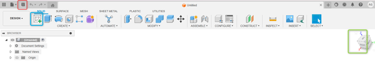

It is important to save first (red frame). This activates additional options and ensures your timeline is properly stored. In the green frame you see a cube, and from it you can tell how you are viewing your drawing. To start a drawing you always begin with a flat sketch. You can open this by pressing the sketch button (blue frame).
The screen then changes into a grid with an image of the X, Y and Z axes as shown on the cube:

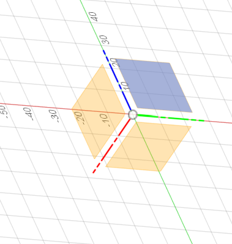

Here X is red, Y is green and Z is blue. For your sketch you must select one of these planes to start. Which plane you choose largely depends on what you want to make. For this instruction we will make a simple box with a lid. We want to look at the box from the top and select the plane between green and red. The view now changes and you are in 2D sketch mode:

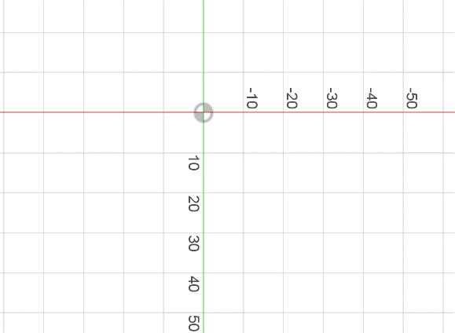

We can also see this from the changed toolbar:

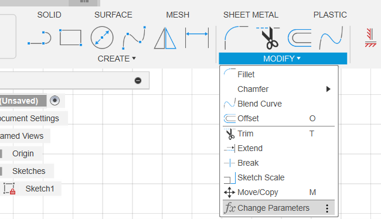

We can now immediately start drawing using the buttons under create. However, it is often wise to first think about which dimensions you want. These often have a relationship with each other. For example, the width being twice the length. Or that a hole should always be in the center of a plate regardless of the size of the plate. You can define this by going to the modify menu and clicking change parameters. In the parameter menu you can then create properties that you want to use in your model. You can use fixed values or write formulas:

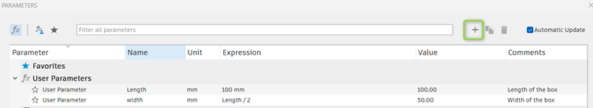

If we now create a rectangle in the drawing, for example, we can use these properties. 

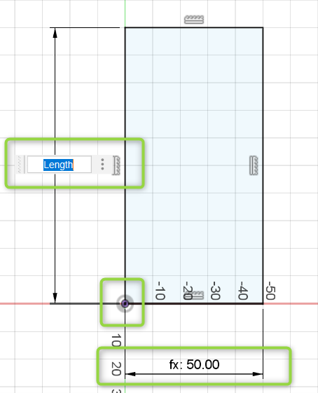

The advantage is that with complex models you can quickly adjust the entire model without putting proportions at risk. It really pays off to think about this in advance. You can recognize a user variable by the prefix fx:. When you open the dimension you will see the name of the parameter again. If we would make this 3D, we would only have a block. To create a box we must first define what the walls are. We can create a new user variable or directly create an offset using the offset button. The letters behind the items represent the shortcuts you can use:

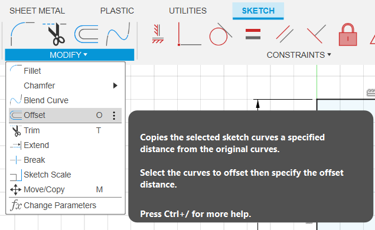

If you press offset you get the option to select an object:

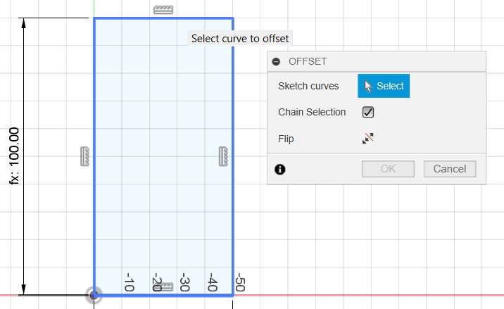

and then specify how much. With negative values you go inward, with positive outward:

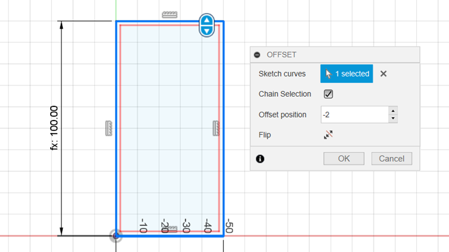

With this we have created the base for our box and we can start extruding it. To go to the 3D environment you can press finish sketch in the top right corner:

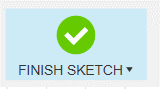

To turn the flat sketch into a 3D object you can click extrude in the create menu or press e.

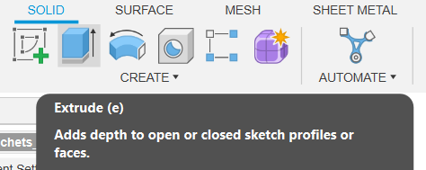

Here you can again use the properties we created or add new ones. In this case we will extrude the inside 2mm without using parameters. 

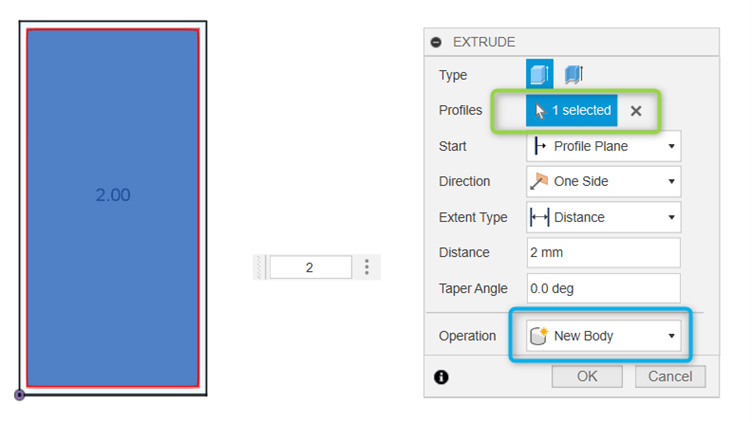

For this you first need to select the profile and you will also see that a new 3D object will be created. If you now press ok you can rotate in 3D with shift + middle mouse button and see what you have made:

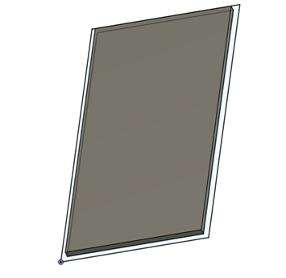

Now we also need to create walls. We still see the sketch line around the object, but it may be automatically turned off after the first extrusion; you can turn it back on on the left side under sketches. To create the walls, select extrude again, select the profile you want to extrude and specify how much. 

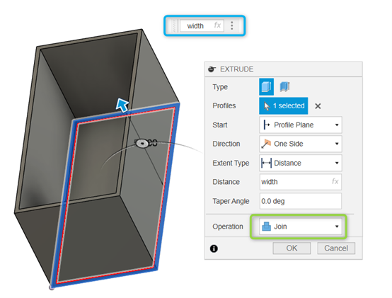

You can again use the user parameters here. You do not need to create new ones. If all sides are connected to another extrusion, Fusion will try to join them together and thus create a single object. We now have a box, but you may also want a lid. We can use the same sketch for this. However, we now extrude from another object:

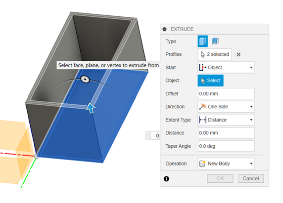

It can be useful to temporarily hide the body on the left so you can see the sketch again. Make sure you set the operation to New Body instead of Join. Optionally you can extrude the middle part downward to create a small edge. 

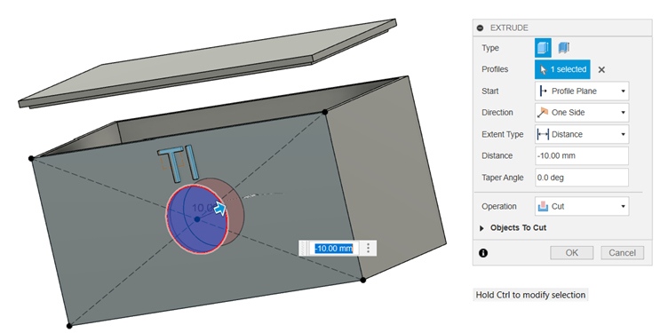

Each side of the box can also be selected to create sketches. Keep in mind that if you do this and later change the box, it can affect these sketches. You can use these sketches to create, for example, a hole in the model or add text. Both can be made using the extrude command. If you extrude through a body, you can set the operation to Cut, which removes the profile from the body. With the fillet command we can make sharp edges more rounded:

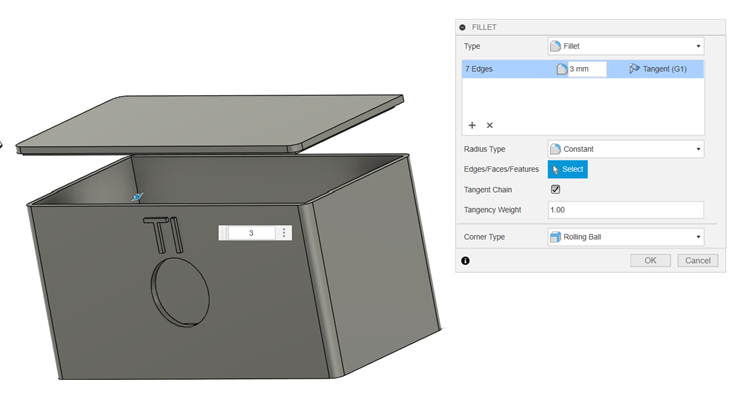

There are of course many more possibilities. In the sources you will find links to videos that explain examples of usage in more detail. This is only a selection; there is much more available, and if you have specific challenges there is definitely something out there for it. Also take a look at the different options available when creating the 2D sketch and the 3D object. 

## Use of existing models
You usually make a box for an object you want to put inside it, for example a housing for a microcontroller or a sensor. Sometimes you know the dimensions of the object and sometimes you do not. Below are three possible ways to handle this in Fusion.

### Known dimensions
For many objects you use, drawings are already available. As an example, you could create a housing for the Arduino Uno. If we search for Arduino Uno dimensions, we might find a drawing like this:

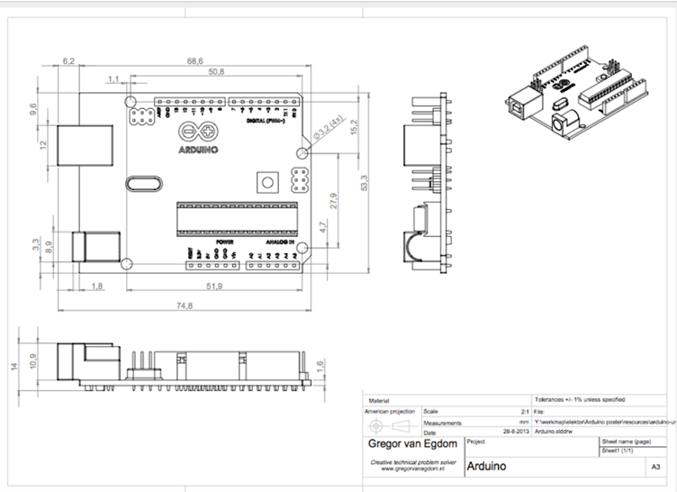
[1]

In the previous chapter it was already described how we can influence the dimensions of the box using user parameters. We can copy the dimensions from the drawing and use them, for example, to create holes for USB ports and similar features. The locations of mounting holes are also shown in the drawing. In Fusion we can model standoffs so the model can be screwed in place. The only thing needed is adjusting the sketch. With the dimension (d) command you can specify how far an object should be placed from another object. Of course it is wise to use user parameters for this!

A second option is to import a complete 3D model. For this you can create an account on, for example, GrabCAD or use the import function of Fusion:

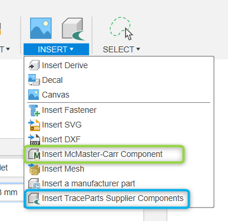

If you are looking for screws or similar items, you can search for them in McMaster (green frame). 3D models of components can be found in TraceParts (blue frame). There are more options, and in principle you can import and use any model for which you have a DXF (flat drawing) or Mesh (3D object). 

### Unknown dimensions
We will work out an example with the linear actuator:

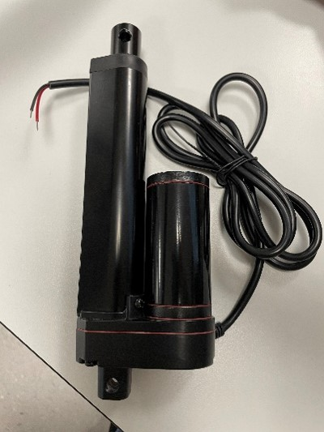

To be able to integrate it into the greenhouse, a support bracket must be made that can be 3D printed. In this case we use the bottom as a starting point. To trace it, we use a photo of the bottom with a dimension indicated. 

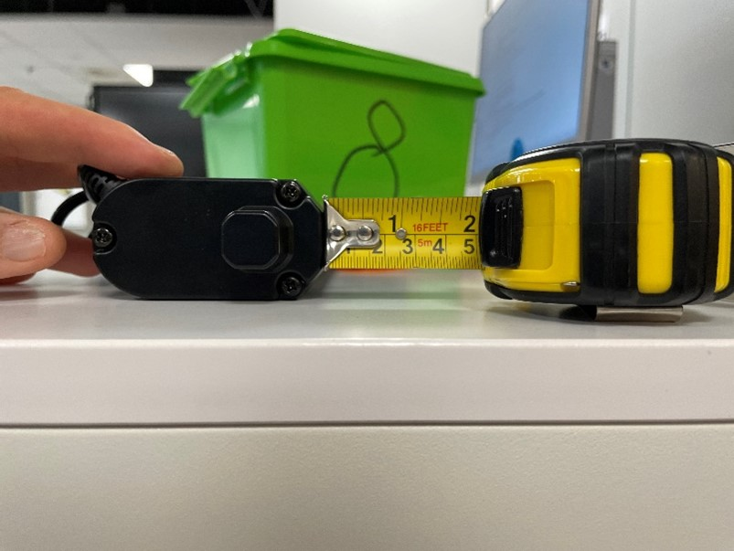

In Fusion360 we can use this dimension to indicate how large the object is. In Fusion you first use insert canvas:

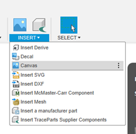

Then you can use calibrate to indicate how large a centimeter is in the photo. It does not matter how many centimeters it is. It can even be directly on the object. As long as you indicate which measurement corresponds to something in the photo. The photo will then automatically be scaled.

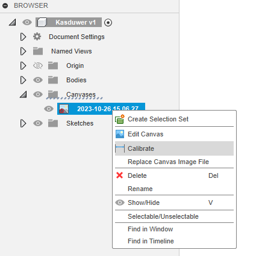

After this you start creating a flat 2D sketch. This can be done directly on the photo.

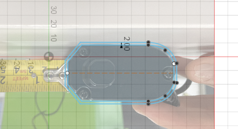

It can be useful to first create a small object for something critical. Such as in this case the holder that fits around the actuator:

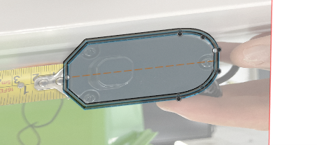

## Sources
[1] https://www.krekr.nl/content/arduino-uno-technical-drawing/

[2] https://www.youtube.com/watch?v=y8keHm9lyVo&t=806s

[3] https://www.youtube.com/watch?v=BLC-O_lTv_E

[4] https://www.youtube.com/watch?v=A5bc9c3S12g&list=RDQM86i-42H4_FU&start_radio=1